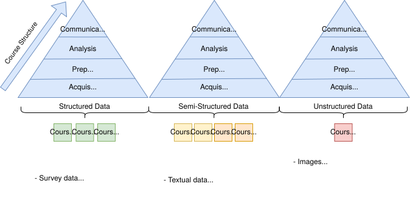
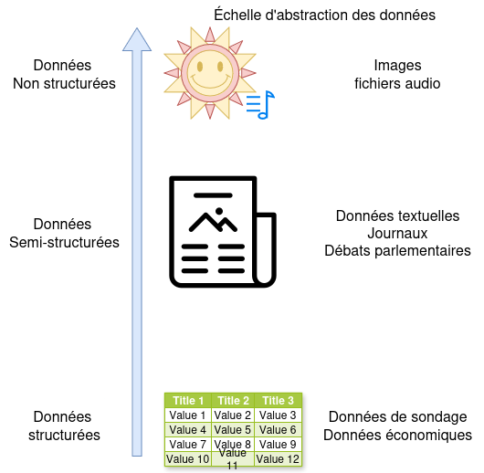

# Semester Review {background-color="#40666e"}

## Course Structure

::: {.r-stack}

{.fragment}

:::

## The Semester's Journey {.smaller}

1. **Introduction to Big Data**: seeing digital traces as research data
2. **Introduction to R**: objects, functions, graphics, and basic statistics
3. **Terminal, Git, GitHub, and Quarto**: working cleanly and reproducibly
4. **Tidy data and surveys**: structuring, cleaning, representing, and weighting
5. **Latent measures**: building good indicators for abstract concepts
6. **Text analysis**: pipeline, regex, dictionaries, and classification
7. **Web scraping**: navigating, crawling, extracting, and cleaning web data
8. **LLM**: understanding, using, and automating tasks with APIs
9. **Agentic AI**: making a LLM act with tools and connected sources

## The Course's Common Thread {.smaller}

:::: {.columns}

::: {.column width="50%"}

:::

::: {.column width="50%"}

Our work this semester has been to transform data produced for other purposes into usable research material.

- observe available data
- structure them
- clean them
- analyze them
- interpret the results

:::

::::

# Foundations {background-color="#40666e"}

## The Toolbox {.smaller}

:::: {.columns}

::: {.column width="50%"}

**Produce and analyze**

- `R`
- Positron
- tidyverse packages
- visualization and simple models

**Working cleanly**

- terminal
- Git
- GitHub
- Quarto

:::

::: {.column width="50%"}

{width="35%"}

{width="90%"}

:::

::::

## Tidy Data and Cleaning {.smaller}

- One variable per column
- One observation per row
- One observational unit per table
- Standardizing the cleaning process makes analysis simpler

# Structured Data {background-color="#40666e"}

## Surveys {.smaller}

- asking instead of observing
- formulating questions carefully
- thinking about sampling and non-response
- checking representativeness
- weighting when the sample deviates from the population

## Latent Measures {.smaller}

:::: {.columns}

::: {.column width="55%"}

- many important concepts are not directly observable
- we need to construct a scale from multiple indicators
- a good measure must be reliable and valid
- factor analysis helps to see if items hang together

:::

::: {.column width="45%"}
{width="95%"}
:::

::::

# Unstructured Data {background-color="#40666e"}

## Text Analysis {.smaller}

:::: {.columns}

::: {.column width="50%"}

- stopwords
- regex
- dictionaries
- sentiment analysis
- classification and summarization

:::

::: {.column width="50%"}

:::

::::

## Web Scraping {.smaller}

:::: {.columns}

::: {.column width="55%"}

- understanding the difference between the web and the internet
- reading a URL
- distinguishing between HTML, JSON, and APIs
- observing source code and the network tab
- extracting, cleaning, and organizing data
:::

::: {.column width="45%"}

:::

::::

# AI and Automation {background-color="#40666e"}

## What LLMs Are {.smaller}

:::: {.columns}

::: {.column width="55%"}

- models trained on huge volumes of text
- useful for generating, transforming, classifying, and summarizing

**But**

- data bias
- partial opacity of reasoning

:::

::: {.column width="45%"}

:::

::::

## Using LLMs in Research {.smaller}

1. Accessing models via API
2. Writing a clear prompt
3. Having the model process a table row by row
4. Automating with loops
5. Saving results incrementally
6. Verifying critical responses

## Agentic AI {.smaller}

:::: {.columns}

::: {.column width="45%"}

A LLM alone produces text.

An agent combines:

- a goal
- autonomy
- tools
- observable actions

:::

::: {.column width="55%"}

:::

::::

## MCP {.smaller}

:::: {.columns}

::: {.column width="48%"}

- connecting tools and services to the model
- fetching information from GitHub, Notion, Drive, or the terminal
- moving from simple conversation to task execution
- opening the door to more integrated research workflows

:::

::: {.column width="52%"}
{width="100%"}
:::

::::

# Conclusion {background-color="#40666e"}

## Skills Acquired {.smaller}

::: {.columns}
::: {.column width="50%"}

**Technical Skills**

- programming in R
- cleaning and restructuring data
- creating graphics and basic analyses
- using GitHub and Quarto
- collecting data via web scraping or APIs

:::

::: {.column width="50%"}

**Analytical Skills**

- translating a question into an empirical strategy
- evaluating the quality of a measure
- choosing a method adapted to the available data
- using AI as a tool

:::
:::

## The Key Takeaway {.smaller}

The tools covered this semester serve a single purpose:

- transforming digital traces into data
- transforming data into analysis
- transforming analysis into a defensible research argument

# Thank You {.biggest}
