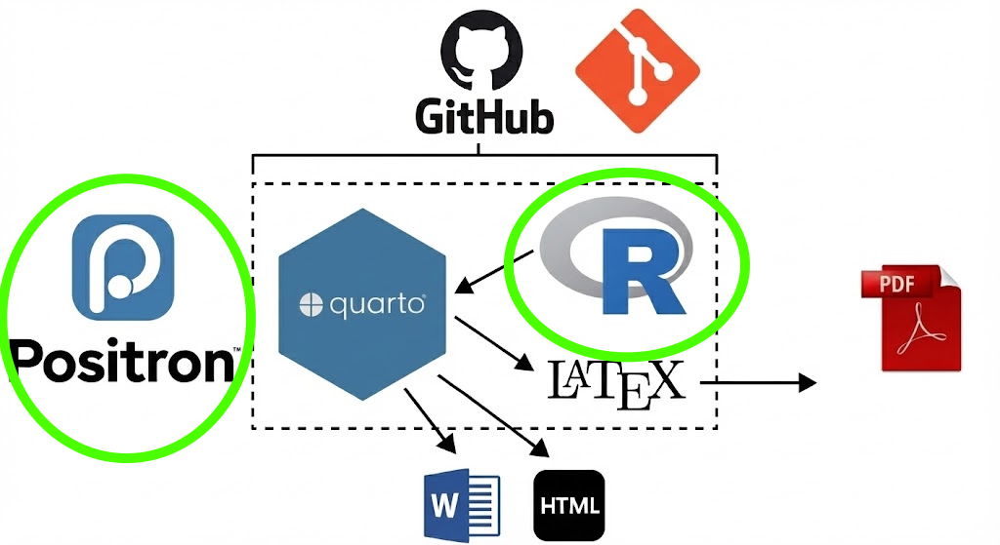
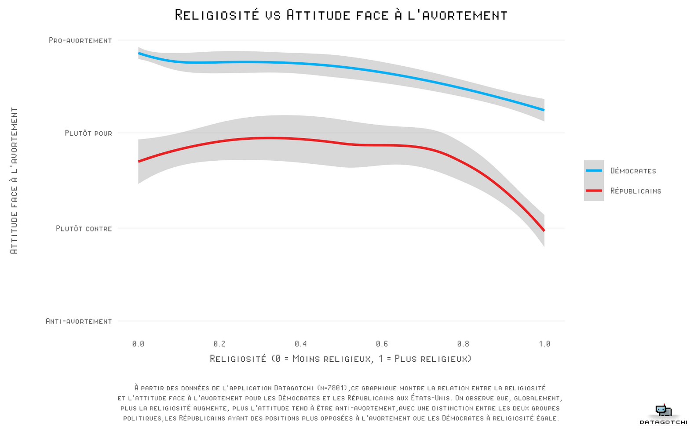
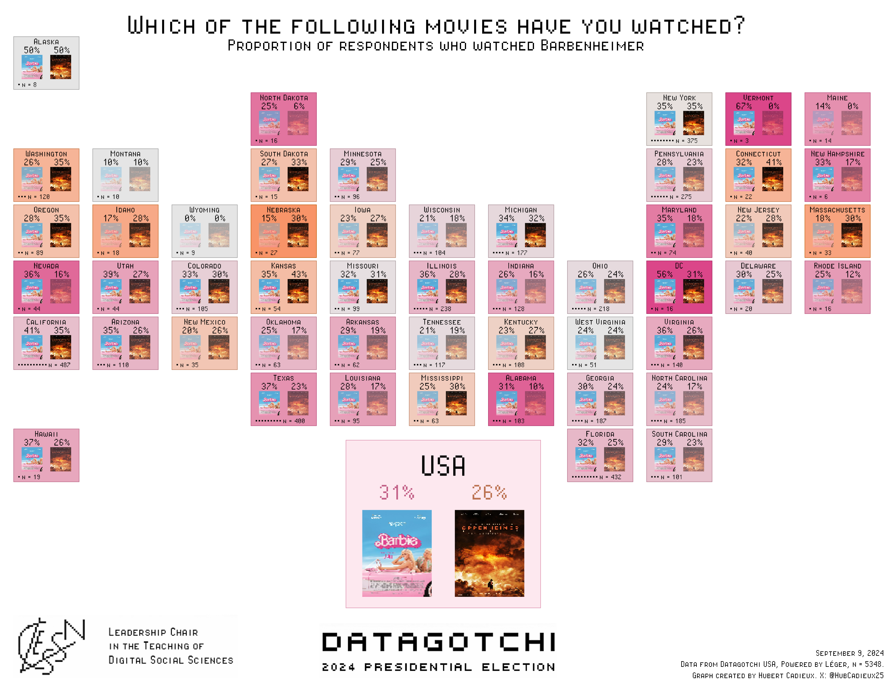
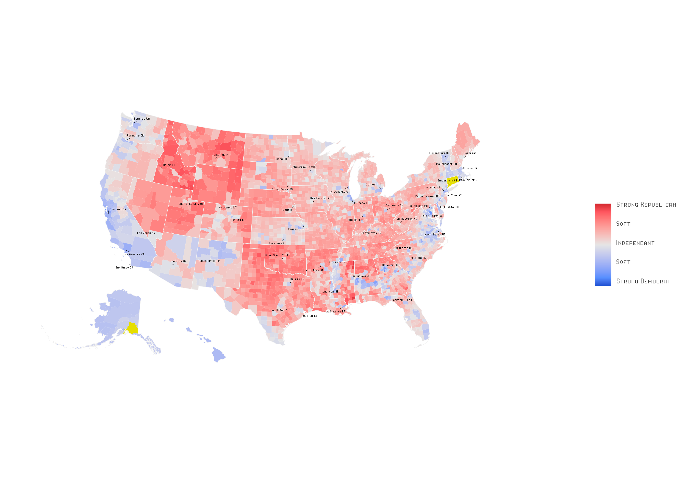
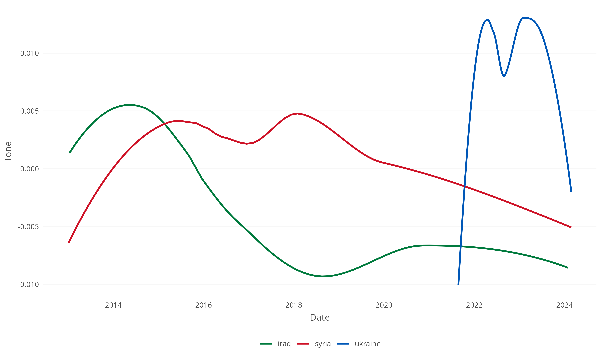
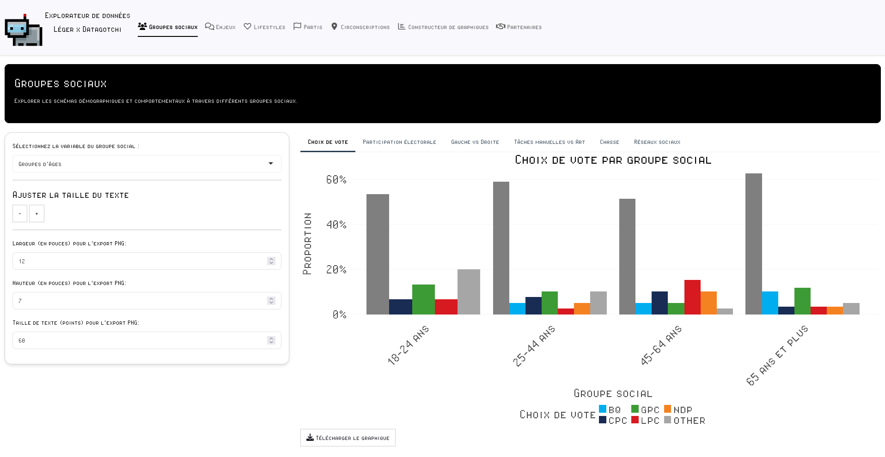
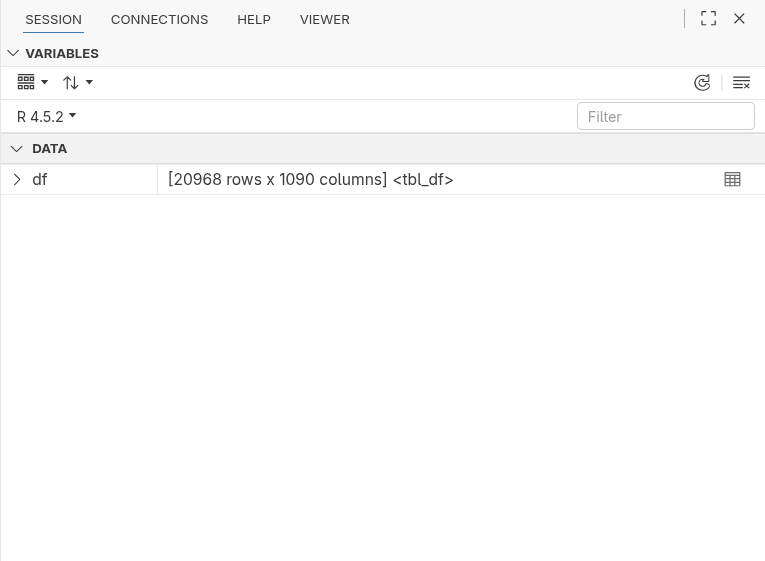

## Course Structure


## Tools to Get There {.smaller}

::: {.r-stack}


{.fragment}


{.fragment}

:::

## Course Objectives {.smaller}

- Introduce R for data analysis.
  - Dataframes
  - Functions
  - Packages 
  - Plots
  - Statistics

> The goal is for you to leave here with a basic understanding of R and to be able to find resources to continue learning.


## Data Analysis Tools {.smaller}

{.absolute top=400 left=100 width="20%"}

{.absolute top=150 left=800 width="20%"}

{.absolute top=400 left=800 width="20%"}

{.absolute top=100 left=100 width="20%"}

{.absolute top=200 left=330 width="40%"}

## Why R?

{.absolute top=0 left=800 width="20%"}

<br><br>

### Open Source

- Free
- Collaborative
- Active community
- Tailored to user needs

## Why R?

{.absolute top=0 left=800 width="20%"}

<br><br>

### Packages

- Offers an almost infinite extension of core features
- Can meet very specific needs
- More than 22,000 packages on CRAN (Comprehensive R Archive Network)
- Many more on GitHub

## Why R? {.smaller}

{.absolute top=0 left=800 width="20%"}

<br><br>

### Tidyverse

- A collection of packages for data manipulation

- `dplyr`: data manipulation
- `ggplot2`: plots
- `tidyr`: data cleaning
- `readr`: data import
- `stringr`: string manipulation

## Why R? {.smaller}

{.absolute top=0 left=800 width="20%"}

<br><br>

### CLESSN Packages

<!-- NOTE: Add package descriptions -->

- [sondr](https://github.com/clessnverse/sondr)
  - Allows automation of several aspects of data analysis. Enables us to run factor analyses in seconds.
- [clellm](https://github.com/clessn/clellm)
  - Allows using open-source LLMs directly in R and using functions only available in Python, in R.
- [clessnize](https://github.com/clessnverse/clessnize)
  - Allows standardizing the style of our plots quickly without repeating the same steps every time.

## Why R?

{.absolute top=0 left=800 width="20%"}

<br><br>

### Reproducibility

- Make analyses reproducible
- Allows sharing code
- Facilitates transparency and collaboration
- Helps trace errors

## Why R? {.smaller}

{.absolute top=0 left=800 width="20%"}

<br><br>

### Widely Used in Social Sciences

- Lots of resources
- Many tutorials oriented towards social sciences
  - Swirl
  - Datacamp
  - Codecademy

#### Important to use the same tools as researchers in your field

## Why R? {.smaller}

{.absolute top=0 left=800 width="20%"}

<br><br>

### Examples of Usage by Organizations

- [Used by AirBnB for data analysis](https://medium.com/airbnb-engineering/using-r-packages-and-education-to-scale-data-science-at-airbnb-906faa58e12d)

- [Used by the BBC for their graphics](https://bbc.github.io/rcookbook/)

- [Used by the MLB for data analysis](https://billpetti.github.io/baseballr/)

- [Used by Vox Pop Labs (Vote Compass) for data analysis](https://github.com/voxpoplabs)

- [Used by Google, Facebook, Amazon, etc.](https://makemeanalyst.com/companies-using-r/)

## 


## 

{.absolute top=0 left=0 width="200%"}

::: {.r-stack}

{.fragment .absolute top=0 left=0 width="200%"}

{.fragment .absolute top=0 left=0 width="200%"}

::: 


## Text Analysis {.smaller}

- Tone analysis 

{.absolute top=200 left=70 width="80%"}  

## But Also... {.smaller}

- Text categorization 
  - Does the text talk about politics, health, sports?
- Image analysis
- Audio transcription

## R: Beyond Data Analysis {.smaller}

- R is not limited to statistical analysis, it can also be used to develop [interactive web applications](https://mdubel.shinyapps.io/shark-attack/)



## After R

### Learning R allows you to understand other programming languages

- Python
- Julia
- SQL
- JavaScript
- HTML/CSS
- Bash 

## Installing R and Positron {.smaller}

- R is the programming language
- Positron is the interface
- Positron offers many tools to make R easier to use
- Positron is one IDE among many others 

<br><br>

### Downloads:

- [Install R](https://cran.r-project.org/)
- [Install Positron](https://positron.posit.co/)

# Positron Overview

## Before Starting: Planning {.smaller} 

#### The biggest mistake is starting to code without knowing what you want to do

<br>

- Clarify your objectives: What do you want to do?
  - Clean data?
  - Make a plot?

The possibilities are endless, so it is important to know where you want to go

## Before Starting: Breaking Down the Problem {.smaller}

- Break down the problem into small steps
- One R script for a single task
  - Name your scripts well to know what they do
  - Examples:
    - `1_collection.R`
    - `2_cleaning.R`
    - `3_analysis.R`
    - `4_plot.R`
- Each script should be clear and easy to understand
- Comment your code using `#`

## Before Starting: The Directory Tree {.smaller}

- At all times you must know where you are on your computer
- Your R session always "points" to a folder on your computer
  - This is the **working directory**
- The function `getwd()` allows you to find out the current working directory

{.absolute top=320 left=75 width="80%"}

<br>
<br>
<br>
<br>
<br>
<br>

**~/Colleague/6th/Interest Center 3/Materials/**

## Before Starting: The Directory Tree {.smaller}

{width="120%"}

## Importing Data {.smaller}

- Data is often in Excel, CSV, or other file formats
  - We use functions like `read.csv()` to read files 

<br>

```r
df <- read.csv("path/to/data.csv")
```
<br>

- In this line of code, there are several important elements:
  - The name of the object: `df` in this case, which is a dataframe
  - The assignment operator: `<-` 
  - The function used to read the file: `read.csv()`
  - The path to the file: `"path/to/data.csv"`

## Importing Data {.smaller}

Other functions for importing data depending on the format:

- `df <- readxl::read_excel("path/to/data.xlsx")`
- `df <- readRDS("path/to/data.rds")`
- `df <- haven::read_sav("path/to/data.sav")` 

{.absolute top=300 left=150 width="70%"}

## File Paths {.smaller}

#### Important to understand how to specify the path to a file

Here are the two ways to specify a path:

- Absolute: `/Users/username/Documents/project/data/data.csv`
  - Only useful on your computer; another user won't be able to use the same path

- Relative: `data/data.csv`
  - Useful for sharing code with other users
  
<br>

#### Difference between Mac and Windows

- Mac: `/`
- Windows: `\` (make sure to change `\` to `/`)

## Anatomy of a Line of Code {.smaller}

Let's take a simple example:
```r
result <- mean(df$age, na.rm = TRUE)
```

Let's break down this line:

- `result` : name of the object where we store the result
- `<-` : assignment operator
- `mean()` : function that calculates the mean
- `df$age` : variable 'age' of the dataframe 'df'
- `na.rm = TRUE` : argument of the function (ignore NAs)

## Understanding Functions {.smaller}

A function is like a **machine**: it takes **ingredients** (arguments), follows an internal **recipe** (code), and returns a **dish** (result/output).

```{mermaid}
flowchart LR
    A[Ingredients<br/>Arguments] -->|Input| B(The Machine<br/>Function)
    B -->|Processing| C[Result<br/>Output]
    
    style A fill:#e74c3c,stroke:#333,stroke-width:2px,color:white
    style B fill:#3498db,stroke:#333,stroke-width:2px,color:white
    style C fill:#2ecc71,stroke:#333,stroke-width:2px,color:white
```

### Concrete Example

```r
# The "mean" machine
result <- mean(x = c(10, 20, 30), na.rm = TRUE)
```

1. **Ingredients (`x`, `na.rm`)**: The data (the vector) and options (remove missing values).
2. **Machine (`mean`)**: Calculates the sum divided by the number of elements.
3. **Result (`result`)**: The value `20` is stored in the object.

## Data Structures: 1D vs 2D

In R, everything starts with the **vector**. A dataframe is simply a collection of vectors (columns) of the same length placed side by side.

:::: {.columns}

::: {.column width="48%"}
::: {.callout-note icon=false}

### 1. The Vector (1D)
A sequence of values of the **same type**.
<br>

```r
# Creation with c()
names <- c("Alice", "Bob")
ages <- c(24, 30)

# Direct calculation
average <- mean(ages)
```
:::
:::

::: {.column width="4%"}
:::

::: {.column width="48%"}
::: {.callout-tip icon=false}

### 2. The Dataframe (2D)
A rectangular table.
<br>

```r
# Assembly
df <- data.frame(
  name = names,
  age = ages
)
```

| name | age |
|:---|:---:|
| Alice | 24 |
| Bob | 30 |

:::
:::

::::

## Data Types in R {.smaller}

### Basic Types:

- `numeric`: numbers (with or without decimals)
```r
age <- 25        # integer
height <- 1.75   # double
```

- `character`: text (strings)
```r
name <- "Pierre"
city <- 'Montréal'  # single or double quotes
```

- `logical`: TRUE or FALSE
```r
is_student <- TRUE
has_job <- FALSE
```

## Data Types in R {.smaller}

### Special Types:

- `factor`: categories
```r
level <- factor(c("Beginner", "Intermediate", "Advanced"))
```

- `Date`: dates
```r
date <- as.Date("2025-01-14")
```

- `NA`: missing values
```r
data <- c(1, NA, 3, NA, 5)
```

## Parentheses, Quotes, and Commas {.smaller}

### Parentheses ():
- Delimit the arguments of a function
- Must always be closed
```r
# Correct
average <- mean(data)

# Incorrect - missing parenthesis
average <- mean(data
```

### Commas:
- Separate function arguments
```r
# Correct
result <- sum(1, 2, 3, na.rm = TRUE)

# Incorrect - missing comma
result <- sum(1 2 3, na.rm = TRUE)
```

## Assignment: = vs <- {.smaller}

### The <- Operator:
- Recommended for variable assignment
- Clearer and more explicit
- Standard in the R community
```r
age <- 25
name <- "Alice"
```

### The = Operator:
- Used primarily for function arguments
- Can create confusion
```r
# For function arguments
mean(x = data, na.rm = TRUE)

# Avoid for assignment
age = 25  # Works but not recommended
```

## Common Error Messages {.smaller}

### Syntax Error
```r
# Error message
Error: unexpected symbol in "my code"

# Probable cause
# Missing parenthesis or quote
```

### Object Not Found
```r
# Error message
Error: object 'data' not found

# Probable causes
# - Typo in the name
# - Object not created
# - Wrong working directory
```

## Error Messages (Continued) {.smaller}

### How to React to Errors:

1. Don't panic! Errors are normal
2. Read the error message carefully
3. Check the line indicated in the message
4. Things to check:
   - Parentheses closed?
   - Quotes closed?
   - Commas in the right places?
   - Correct object names?
   - Package loaded (`library()`)?

# Let's Code!

## We Will Use the `swiss` Dataframe {.smaller}

```r
# Load necessary packages
library(dplyr) # Data manipulation
library(ggplot2) # Plotting

# Import swiss data (built-in dataset)
df <- swiss

# Explore the data
View(df)
summary(df)
names(df)
head(df)
ncol(df)
nrow(df)

```

## Quick Analysis of a Variable

```r
# See the number of values for each element of a variable
table(df$Fertility)

# Histogram of the 'Fertility' variable
hist(df$Fertility)

# Get the mean of the 'Fertility' variable
mean(df$Fertility)

```

- `$` allows accessing a variable in a dataframe.
- We access the `Fertility` variable in the `df` dataframe with `df$Fertility`

## Filter and Select Variables

```r
# Select columns 
# (for example, Fertility, Education, and Agriculture)

df_selected <- df %>%
  select(Fertility, Education, Agriculture)

# Filter rows to include only cantons 
# with fertility above average

mean_fertility <- mean(df_selected$Fertility, na.rm = TRUE)

df_filtered <- df_selected %>%
  filter(Fertility > mean_fertility)
```

## The Pipe `|>` or `%>%` {.smaller}

The pipe means **"and then"**. It allows passing the result of one step to the next without nesting functions.

:::: {.columns}

::: {.column width="50%"}

Without Pipe (Hard to Read)

Read from the inside out:

```r
get_dressed(
  dry_off(
    take_shower(
      wake_up(me)
    )
  )
)
```
:::

::: {.column width="50%"}

With Pipe (Natural Reading)

Read from top to bottom:

```r
me |> 
  wake_up() |> 
  take_shower() |> 
  dry_off() |> 
  get_dressed()

```
:::

::::

:::{.callout-note} 

The native pipe |> (R 4.1+) is the new standard, but you will often see %>% (the tidyverse pipe). They do the same thing 99% of the time.

:::

## Modifying Variables

```r
# Create a new binary variable "high_agriculture" 
# indicating whether the percentage of agriculture is above 50

df_mutated <- df_filtered %>%
  mutate(high_agriculture = ifelse(Agriculture > 50, 1, 0))

# Group by "high_agriculture" and calculate the average education

df_summarized <- df_mutated %>%
  group_by(high_agriculture) %>%
  summarize(average_education = mean(Education, na.rm = TRUE))

# Print final result
print(df_summarized)
```

## Graphical Data Representation {.smaller}

### General Principles of Visualization

- Show the data 
  - Avoid unnecessary distractions
- Choose appropriate visualizations 
  - What information will be useful?
- Avoid "spaghetti" charts 
  - Avoid overly complex lines that overlap and intertwine
- Start in black and white 
  - Use colors effectively

## Visualization with ggplot2 {auto-animate=true}

### Initialize a Plot

```{.r code-line-numbers="1"}
ggplot(df, aes(x = Agriculture, y = Fertility, color = Education)) 
```
- `df` is the dataframe
- `aes()` is the function to specify the variables to use
- `x` and `y` are the variables for the x and y axes
- `color` is the variable for the color

## Visualization with ggplot2 {auto-animate=true}

### Add a geom_()

```{.r code-line-numbers="2"}
ggplot(df, aes(x = Agriculture, y = Fertility, color = Education)) +
  geom_point(alpha = 0.8) # alpha is transparency
```

- There are several `geom_()` for different types of plots
  - `geom_point()` is for a scatter plot
  - `geom_line()` is for a line chart
  - `geom_bar()` is for a bar chart
  - `geom_histogram()` is for a histogram

## Visualization with ggplot2 {auto-animate=true}

### Add a Color Scale

```{.r code-line-numbers="3"}
ggplot(df, aes(x = Agriculture, y = Fertility, color = Education)) +
  geom_point(alpha = 0.8) + # alpha is transparency
  scale_color_gradient(low = "blue", high = "red", name = "Education") 
```

- `scale_color_gradient()` specifies the colors for the `Education` variable
- `low` and `high` are the colors for the lowest and highest values
- `name` is the legend title
- You can use hex codes for colors

## Visualization with ggplot2 {auto-animate=true}

### Add Titles and Labels

```{.r code-line-numbers="4,5,6,7,8"}
ggplot(df, aes(x = Agriculture, y = Fertility, color = Education)) +
  geom_point(alpha = 0.8) + # alpha is transparency
  scale_color_gradient(low = "blue", high = "red", name = "Education") +
  labs(
    title = "Relationship between Agriculture and Fertility in Switzerland",
    x = "Percentage of Agriculture",
    y = "Fertility"
  ) 
```

## Visualization with ggplot2 {auto-animate=true}

### Add a Theme

```{.r code-line-numbers="9"}
ggplot(df, aes(x = Agriculture, y = Fertility, color = Education)) +
  geom_point(alpha = 0.8) + # alpha is transparency
  scale_color_gradient(low = "blue", high = "red", name = "Education") +
  labs(
    title = "Relationship between Agriculture and Fertility in Switzerland",
    x = "Percentage of Agriculture",
    y = "Fertility"
  ) +
  theme_minimal()
```

- `theme_minimal()` is a minimalist theme
- There are several predefined themes in ggplot2
- You can also create your own theme

## Visualization with ggplot2 {auto-animate=true}

### Save the Plot

```{.r code-line-numbers="11"}
ggplot(df, aes(x = Agriculture, y = Fertility, color = Education)) +
  geom_point(alpha = 0.8) + # alpha is transparency
  scale_color_gradient(low = "blue", high = "red", name = "Education") +
  labs(
    title = "Relationship between Agriculture and Fertility in Switzerland",
    x = "Percentage of Agriculture",
    y = "Fertility"
  ) +
  theme_minimal()

ggsave("plot_name.png", width = 10, height = 6)
```

- You can specify the plot format (png, pdf, etc.) and the path to save the plot

## Visualization with ggplot2 {auto-animate=true}

### A Histogram of the Fertility Variable

```r
ggplot(df, aes(x = Fertility)) +
  geom_histogram(fill = "skyblue", color = "white", bins = 5) +
  labs(
    title = "Distribution of Fertility in Switzerland",
    x = "Fertility",
    y = "Number of Cantons"
  ) +
  theme_minimal()
```

## Statistical Analysis

```r
# Calculate the correlation between Fertility and Agriculture

correlation <- cor(df$Fertility, df$Agriculture)
print(paste("Correlation between Fertility and Agriculture:", round(correlation, 2)))

# Run a linear regression with Fertility as the dependent variable

modele <- lm(Fertility ~ Agriculture, data = df)

# Display the summary of the regression model

summary(modele)
```

## Best Practices

### [style.tidyverse.org](https://style.tidyverse.org/)

- Used by the R community to standardize code style
- Used by [Google](https://google.github.io/styleguide/Rguide.html) 
- Used by popular packages like [stylr](https://styler.r-lib.org/) and [lintr](https://lintr.r-lib.org/)

## Best Practices {.smaller}

### General Rules:

- Name your files descriptively
- Use lowercase only and no special characters (like accents)
- If your files contain multiple words, separate them with underscores `_`
- Example: `data_cleaning.R`
- Use numbers to order your scripts
- Avoid writing overly long lines of code
- Use the `snake_case` convention rather than `camelCase`
- Name your dataframes in a standard way, e.g., `df_` or `data_`

## Organizing Your Working Environment

```bash
/your_project
├── data
│   ├── processed
│   │   └── data_clean.csv
│   └── raw
│       └── data_raw.csv
├── docs
│   └── article
│       ├── articles.qmd
│       └── references.bib
├── R
│   ├── 2_analysis.R
│   └── 3_graph.R
├── README.md
└── results
    └── graphs
        └── 1_bar_graph.png
 
```

## Learning More {.smaller} 

- [swirl](https://swirlstats.com/students.html)
- [Datacamp](https://www.datacamp.com/)
- [R4DS (R for Data Science)](https://r4ds.had.co.nz/)
- [Advanced R](https://adv-r.hadley.nz/)


## Resources {.smaller}

What to do when it doesn't work?

- ChatGPT
  - Be clear and precise in your prompts
  - Explain the structure of your data
  - Copy-paste the error message
  - Copy-paste package documentation
- Try ChatGPT again
  - It's rare for ChatGPT not to find the answer
- R documentation (e.g., `?mean()` in your console)
- Google
  - Stackoverflow
  - Stackexchange

## Conclusion
