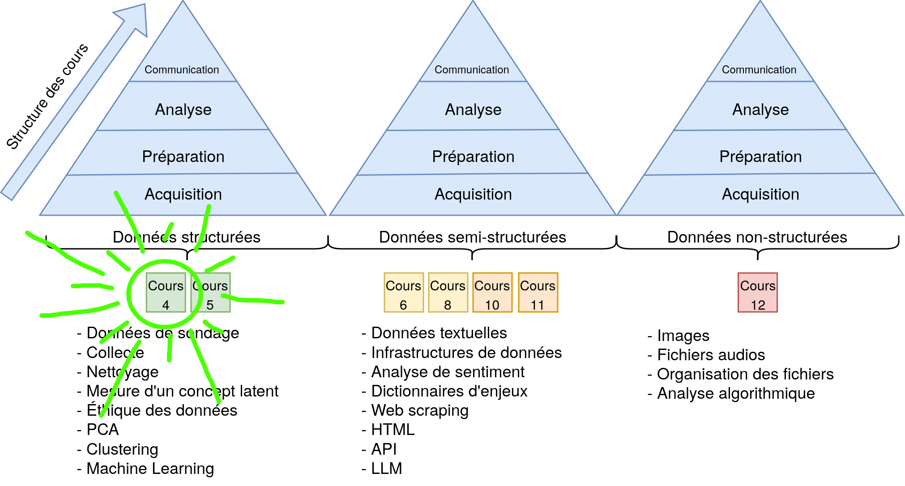
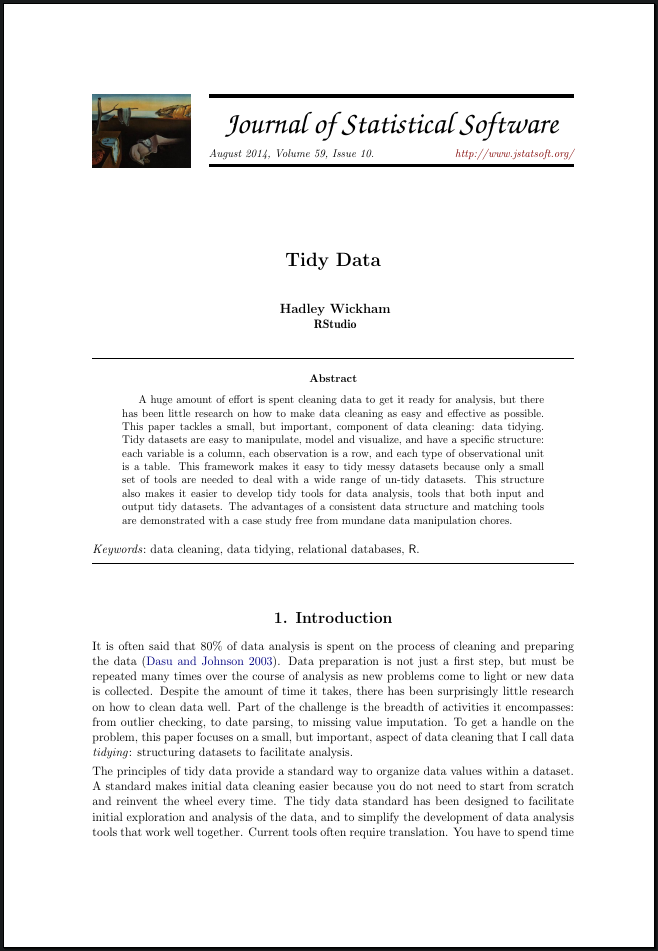
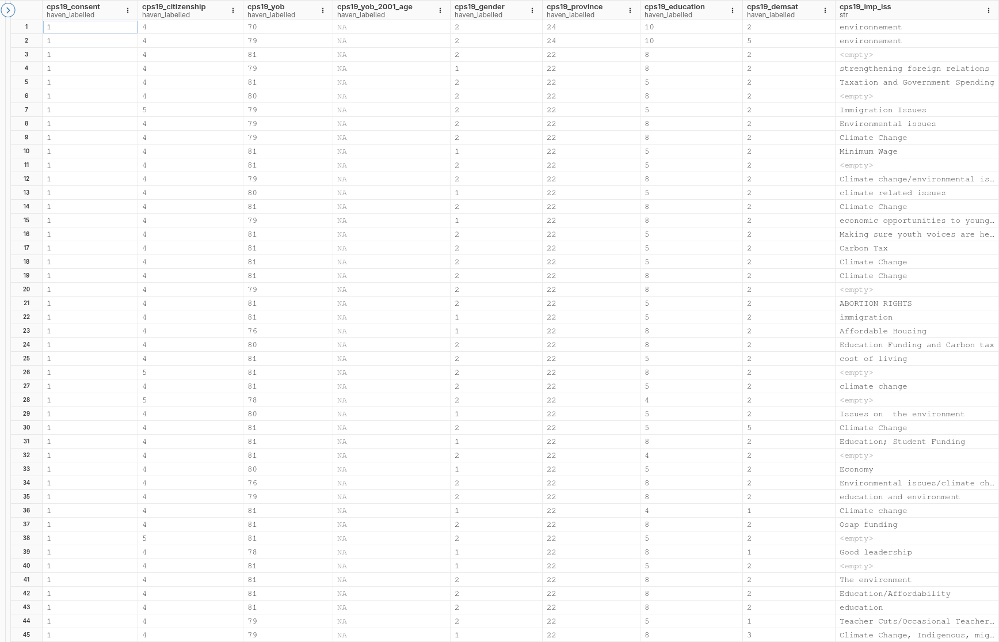
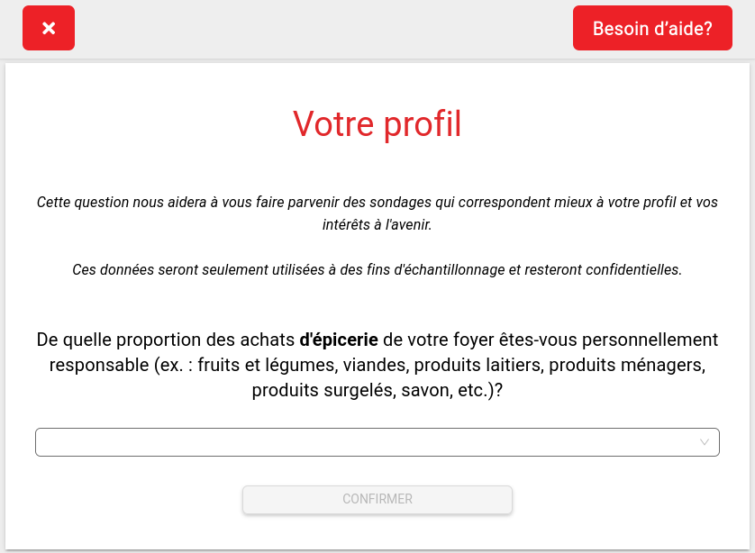
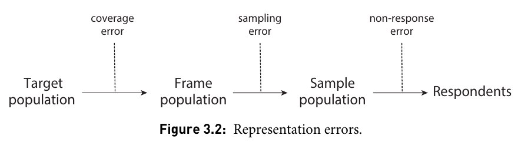
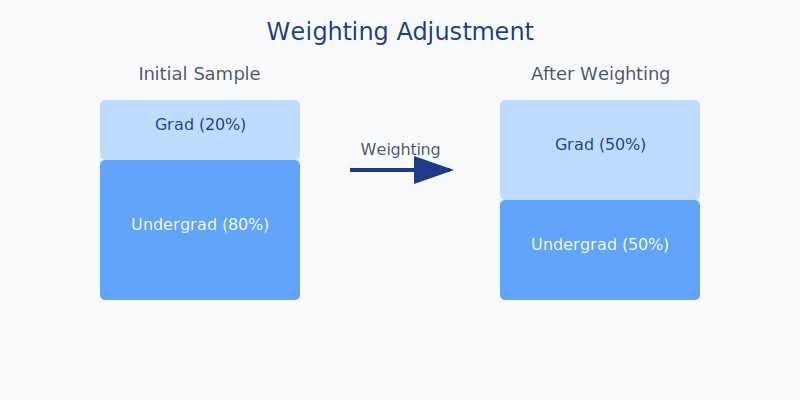
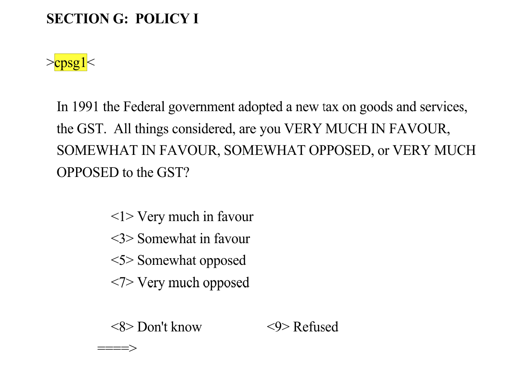
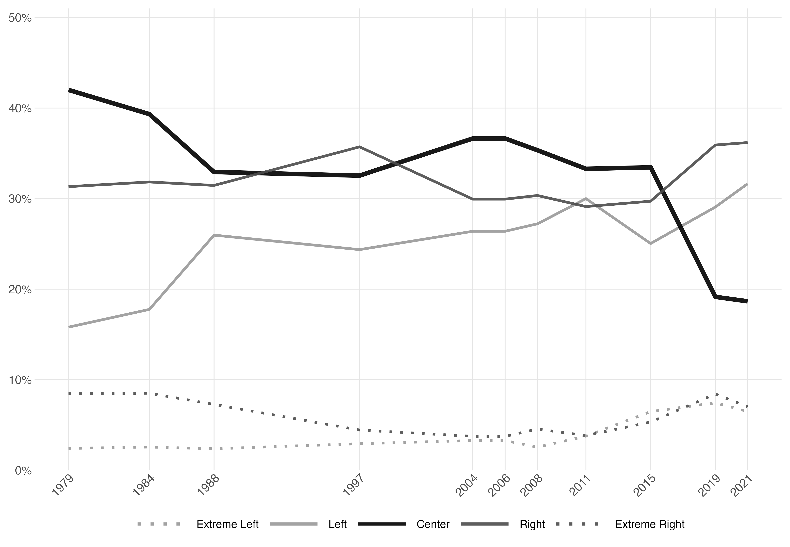
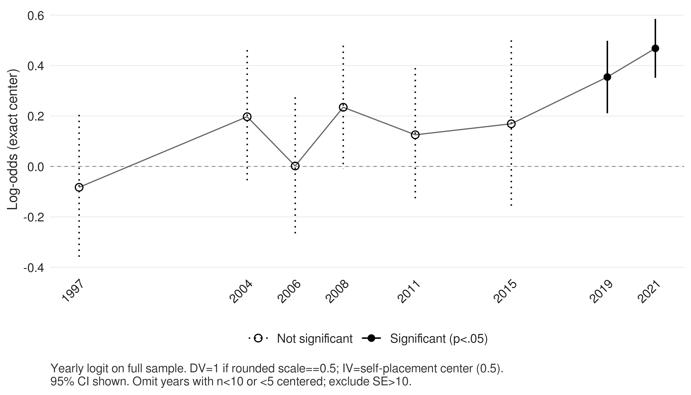

## Feedback on Assignment 1{.smaller}  

::: {.columns}

### Questions

:::: {.column width="50%"}

- What was the most difficult part?
- How many hours did it take you?
- Why do we put `../` in the chart path in Quarto but not in R?
- What is a package?
- Why wouldn't Quarto compile?
- LaTeX packages vs. R packages?

::::

:::: {.column width="50%"}

### Tips

- Rerun the code when it doesn't work
- Use the trash icon in Positron to reset the environment
- `This is not a git repository`
- **USE AI TO UNDERSTAND ERROR MESSAGES!**

::::

:::


# A bit more R?

## Course Structure

::: {.r-stack}


{.fragment}

:::

# Course Outline

1. Introduction
2. Tidy data
3. Surveys
    1. How to collect survey data?
    2. How to clean survey data?

## Our Goal

:::: {.columns}

::: {.column width="50%"}


:::

::: {.column width="50%"}

{.absolute top=120 right=150 width="40%"}

:::
::::


# Tidy Data {.center .smaller}

::: {columns}
:::: {.column width="50%"}

{width="70%"}

::::

:::: {.column width="50%"}

> Like families, tidy datasets are all alike but every messy dataset is messy in its own way.

Using the "tidy" format is like taking the path of least resistance for data analysis.

::::

:::


## Why "Tidy" Data? {.center}

> "80% of data analysis time is spent cleaning and preparing data"

- Facilitates manipulation
- Simplifies visualization  
- Standardizes analysis

## The 3 Rules of Tidy Data {.center}

| Rule | Description |
|------|-------------|
| 1    | Each column is a variable |
| 2    | Each row is an observation |
| 3    | Each table is an observed observational unit type |

## Canadian Election Study 2019

{.absolute top=100 right=120 width="80%"}

## The 5 Common Problems {.center}

1. Column headers are values
2. Multiple variables in a single column
3. Variables stored in both rows and columns
4. Multiple types of observations in one table
5. The same observation across multiple tables

## 1. Headers are values 

**❌ Religion and income data**

| religion  | <$10k | $10-20k | $20-30k |
|-----------|-------|---------|---------|
| Agnostic  | 27    | 34      | 60      |
| Atheist   | 12    | 27      | 37      |
| Buddhist  | 27    | 21      | 30      |

## 1. Headers are values 

```R
library(dplyr)
library(tidyr)

df %>%
  pivot_longer(
    cols = matches("\\$"), # Selects columns containing "$"
    names_to = "revenu",
    values_to = "freq"
  ) 
```

## 1. Headers are values 

**✅ Religion and income data**

| religion  | revenu  | freq |
|-----------|---------|------|
| Agnostic  | <$10k   | 27   |
| Agnostic  | $10-20k | 34   |
| Agnostic  | $20-30k | 60   |
| Atheist   | <$10k   | 12   |
| Atheist   | $10-20k | 27   |

## 2. Multiple variables in a single column 

**❌ Tuberculosis data**

| country | year | m014 | m1524 | m2534 | m3544 |
|---------|------|------|-------|-------|-------|
| AD      | 2000 | 0    | 0     | 1     | 0     |
| AE      | 2000 | 2    | 4     | 4     | 6     |
| AF      | 2000 | 52   | 228   | 183   | 149   |

## 2. Multiple variables in a single column {.smaller}

```R
df %>%
  pivot_longer(
    cols = starts_with("m"),
    names_to = "group",
    values_to = "cases"
  ) %>%
  separate(group, 
    into = c("sex", "age"),
    sep = 1,
    ) %>%
  mutate(
    age = case_when(
      age == "014" ~ "0-14",
      age == "1524" ~ "15-24",
      age == "2534" ~ "25-34",
      age == "3544" ~ "35-44"
    )
  )

```

## 2. Multiple variables in a single column 

**✅ Tuberculosis data**

| country | year | sex | age_group | cases |
|---------|------|-----|-----------|-------|
| AD      | 2000 |  m  | 0-14      | 0     |
| AD      | 2000 |  m  | 15-24     | 0     |
| AD      | 2000 |  m  | 25-34     | 1     |
| AD      | 2000 |  m  | 35-44     | 0     |
| AE      | 2000 |  m  | 0-14      | 2     |

## 3. Variables stored in both rows and columns

**❌ Temperature data in Mexico**

| id      | element | d1  | d2  | d3  | d4  |
|---------|---------|-----|-----|-----|-----|
| MX17004 | tmax    | NA  | 27.3| 24.1| NA  |
| MX17004 | tmin    | NA  | 14.4| 14.4| NA  |


## 3. Variables stored in both rows and columns 

```R
# Solution with pivot_longer
df %>%
  pivot_longer(
    cols = starts_with("d"),
    names_to = "date",
    values_to = "value",
    values_drop_na = TRUE  # Optional: drops NAs
  ) %>%
  rename(measure = element)
```

## 3. Variables stored in both rows and columns 

**✅ Temperature data in Mexico**

| id      | date | measure | value |
|---------|------|---------|-------|
| MX17004 | d1   | tmax    | NA    |
| MX17004 | d1   | tmin    | NA    |
| MX17004 | d2   | tmax    | 27.3  |
| MX17004 | d2   | tmin    | 14.4  |
| MX17004 | d3   | tmax    | 24.1  |

## 4. Multiple types of observations 

**❌ Billboard song and ranking data**

| song      | artist  | duration | rank_week1 | rank_week2 |
|-----------|---------|----------|------------|------------|
| Baby Don't| 2Pac    | 4:22     | 87         | 82         |
| Try Again | Aaliyah | 4:03     | 84         | 62         |

## 4. Multiple types of observations 

```R
# Creating the two tables
# Table 1: Song Info
songs <- df %>%
  select(song, artist, duration) %>%
  mutate(song_id = row_number())

# Table 2: Rankings
rankings <- df %>%
  mutate(song_id = row_number()) %>%
  pivot_longer(
    cols = starts_with("rank_"),
    names_to = "week",
    values_to = "rank",
    names_prefix = "rank_week"
  )
```

## 4. Multiple types of observations {.smaller}

**✅ Billboard song data**

| song_id | song       | artist  | duration |
|---------|------------|---------|----------|
| 1       | Baby Don't | 2Pac    | 4:22     |
| 2       | Try Again  | Aaliyah | 4:03     |

**✅ Billboard ranking data**

| song_id | week | rank |
|---------|------|------|
| 1       | 1    | 87   |
| 1       | 2    | 82   |
| 2       | 1    | 84   |
| 2       | 2    | 62   |

## 5. One observation across multiple tables {.smaller}

**❌ Medical data**

Table 1 - Patient Info:

| patient_id | name  | age |
|------------|-------|-----|
| 1          | Alice | 32  |
| 2          | Bob   | 45  |

Table 2 - Measurements:

| patient_id | pressure | glucose |
|------------|----------|---------|
| 1          | 120/80   | 95      |
| 2          | 130/85   | 105     |

## 5. One observation across multiple tables 

```R
# Transformation to long format
df_measurements <- df_measurements %>%
  pivot_longer(
    cols = c(pressure, glucose),
    names_to = "measure",
    values_to = "value"
  )

# Join tables
df_final <- df_patients %>%
  left_join(df_measurements, by = "patient_id")
```

## 5. One observation across multiple tables 

**✅ Medical data**

| patient_id | name  | age | measure  | value   |
|------------|-------|-----|----------|---------|
| 1          | Alice | 32  | pressure | 120/80  |
| 1          | Alice | 32  | glucose  | 95      |
| 2          | Bob   | 45  | pressure | 130/85  |
| 2          | Bob   | 45  | glucose  | 105     |

## Advantages of Tidy Data {.center}

- Facilitates the use of analysis tools
- Standardizes data structure
- Simplifies visualization
- Makes code more readable

```r
# Example with tidy data
tidy_data %>%
  group_by(category) %>%
  summarise(mean = mean(value))
```

## In Summary {.center}

- Consistent structure
- One observation = one row
- One variable = one column
- One type of observation = one table

# Surveys {.smaller}

## Observing vs. Asking

- Observing: Watching what people do.
  - Social media data
  - Mobility/location data
- Asking: Asking people questions.
  - Surveys
  - Interviews

## Wave 1: Face-to-Face (1930-1950) {.smaller}

::: {.columns}

::: {.column width="60%"}
**The Craft Approach**

- **Sampling**: Probability sampling by geographic area (cutting up a map).
- **Collection**: An interviewer knocks on the door.
- **Context**: Surveys are a rare event.
- **Advantage**: Very high response rate (hard to say no in person).
- **Disadvantage**: Extremely expensive and slow.
:::

::: {.column width="40%"}

:::

:::

## Wave 2: The Telephone Era (1950-1990) {.smaller}

::: {.columns}

::: {.column width="60%"}
**Industrialization (The Golden Age)**

- **Innovation**: Random Digit Dialing (RDD).
- **Collection**: Centralized in call centers.
- **Context**: Almost everyone has a landline.
- **Advantage**: Fast, standardized, anonymous.
- **Disadvantage**: Starts to decline as people screen calls.
:::

::: {.column width="40%"}

:::

:::

## Wave 3: The Digital Era (1990-2010) {.smaller}

::: {.columns}

::: {.column width="60%"}
**Democratization**

- **Shift**: Decline of landline phones, rise of the Internet.
- **Collection**: Web surveys, opt-in panels (volunteers).
- **New Challenge**: The sample is no longer a simple random sample.
- **Solution**: Need for complex weighting methods.
- **Cost**: Drastically reduced.
:::

::: {.column width="40%"}

:::

:::

## Now: The Behavioral Era (2010+) {.smaller}

::: {.columns}

::: {.column width="60%"}
**"Dataification"**

- **Paradigm**: We no longer ask questions; we observe.
- **Collection**: Passive (GPS, clicks, transactions, social networks).
- **Risk**: Data collected and used without consent.
- **Future**: Hybridization (Surveys + Digital traces).
:::

::: {.column width="40%"}

:::

:::

# Survey Representativeness

## 


## A Historic Poll {.center .smaller}

- Popular magazine **Literary Digest**
- Successful presidential polls in 1920, 1924, 1928, and 1932
- In 1936, massive poll during the Great Depression:
  - 10 million ballots sent out
  - 2.4 million responses (240x more than modern polls!)
  - Sources: telephone directories and automobile registries

::: {.callout-important}
### The result? 
- Prediction: Alf Landon victory
- Reality: Landslide victory for Roosevelt
:::

::: {.notes}
Key points for discussion:
- Illustrates the dangers of biased sampling
- Shows that size ≠ quality
- Parallels with big data issues today
:::

## The Literary Digest Case {.smaller}

::::{.columns}

:::{.column width="40%"}

- **Population** = American voters in 1936
- **Accessible population** = Car owners and people in the telephone directory
- **Sampling method** = Massive mailout
- **Sampling frame** = 10 million people
- **Sample** = 2.4 million respondents

:::

:::{.column width="60%"}
{.absolute top=100 right=-100 width="70%"}

:::

::::

## Representativeness Errors {.smaller}

{width="100%"}

- People in the Literary Digest's sampling frame were systematically different from the general population.
- Sampling must be representative of the target population.
- Non-responses must be randomly distributed.


## Weighting{.smaller}

### What is weighting?
- Assigning more or less "weight" to certain responses to correct for sampling bias
- Goal: Make our sample better represent the actual population

### Simple Example: The Campus Cafeteria
Imagine a survey on meal satisfaction:

- 50 undergraduate students respond
- 50 graduate students respond
- BUT in the university population, it's 70% undergraduates and 30% graduates

## Why Weight? {.smaller}

### The Representativeness Problem
- Some groups are overrepresented
- Others are underrepresented 
- Non-responses are not random

### The Cafeteria Example (continued)
- In our survey: 50% undergraduate / 50% graduate
- Reality: 70% undergraduate / 30% graduate
- Solution: Give more weight to undergraduate responses and less to graduate responses

## How to Weight? {.smaller} 

### The Basic Formula

```
Weight = % in population / % in sample
```

### For Our Example
- Undergraduates: 70/50 = 1.4
- Graduates: 30/50 = 0.6

### In Practice
1. Compare our sample to the census
2. Calculate weights for each group
3. Apply the weights in our analyses

## Real Example: Election Poll {.smaller}

### The Situation
- Poll of 1,000 people, total population of 1,000,000
- Overrepresentation of 65+ age group
- Underrepresentation of 18-34 age group

### The Data

| Age    | Poll (%)   | Poll (n)    | Census (%)      | Population (n) | Weight |
|--------|------------|-------------|-----------------|----------------|--------|
| 18-34  | 20%        | 200         | 30%             | 300,000        | 1.5    |
| 35-64  | 45%        | 450         | 45%             | 450,000        | 1.0    |
| 65+    | 35%        | 350         | 25%             | 250,000        | 0.71   |
| Total  | 100%       | 1,000       | 100%            | 1,000,000      | -      |

## Visualizing the Adjustment



## How to Use Weights in R? {.smaller}

### Example with a Linear Regression

```r
# Example with a linear regression
# Opinion on a 0-10 scale by age and income
model <- lm(opinion ~ revenu,
            data = df,
            weights = poids)  # Add weights here
# See the results
summary(model)
```

### Example with a Chart

```r
# Weighted scatter plot
ggplot(sondage_individual, aes(x = revenu, y = opinion)) +
  geom_smooth(method = "lm", aes(weight = poids)) +
  labs(title = "Income-opinion relationship (weighted)",
       x = "Income",
       y = "Opinion (0-10)")
```

# Measurement

## A Question of Wording...

::: {.columns}
::: {.column width="60%"}

- The first asks:  
  *"Is it permissible to smoke **while** praying?"*  
  → **No!** It is a sin.

- The second asks:  
  *"Is it permissible to pray **while** smoking?"*  
  → **Yes!** Of course.
:::

::: {.column width="40%"}
::: {.callout-tip}
## Methodological Point
The way a question is worded can drastically influence the response obtained!
:::
:::
:::

## The Effect of Question Wording/Order {.smaller}

**Version A:**  
"How much do you agree: Individuals are more to blame than social conditions for crime and lawlessness in this country."  
→ **Result**: ~60% blame individuals

**Version B:**  
"How much do you agree: Social conditions are more to blame than individuals for crime and lawlessness in this country."  
→ **Result**: ~60% blame social conditions

::: {.callout-warning}
Same question with inverted wording = opposite conclusions!
:::

::: {.notes}
Source: Schuman and Presser 1996
- Demonstrates how subtle changes in wording/order can drastically affect results
- Important implications for questionnaire design
:::

## Best Way to Ask Questions {.smaller}

::: {.r-fit-text}
- Copy questions from previous surveys
:::

## How to Collect Survey Data? 

- Multiple platforms 
  - [Qualtrics](https://www.qualtrics.com/){preview-link="true"}
  - [Survey Monkey](https://www.surveymonkey.com/){preview-link="true"}
  - [MTurk](https://www.mturk.com/){preview-link="true"}
- Polling companies.
- Surveys are expensive

## Which Survey Platform to Choose?

{.absolute top=500 right=0 width="40%"}

- The most popular survey platform in academia and the corporate world.
- Integrates with the most popular respondent panels.
- Very expensive. Around $15,000 per year.
- Allows adding quotas and conditional logic.

## Other Options?

- Election data such as [ces](https://cran.r-project.org/web/packages/ces/index.html)
- Databases such as [Odesi](https://odesi.ca/en)

# Cleaning Survey Data

## Canadian Election Study 1993

### Raw

| CPSIGEN | CPSA3 | CPSG1 | CPSO11 | CPSA2 |
|---------|-------|-------|--------|-------|
| 5       | 1     | 7     | 1      | 1     |
| 5       | 2     | 5     | 1      | 1     |
| 5       | 99    | 7     | 1      | 1     |
| 1       | 2     | 7     | 1      | 1     |
| 5       | 1     | 3     | 1      | 1     |
| 1       | 2     | 5     | 1      | 1     |

## Codebooks {.smaller}

:::: {.columns}

::: {.column width="65%"}

{width="100%"}

:::

::: {.column width="35%"}

```R
r$> table(df_raw$CPSG1)

   1    3    5    7    8    9 
 169  743  957 1843   57    6 
```
:::

::::

## Canadian Election Study 1993 {.smaller}

### Clean

| ses_gender | ses_born_canada | vote_intention | vote_probability_to_vote | issue_gst_opposed |
|------------|----------------|----------------|-------------------------|------------------|
| female     | 1              | cpc            | 1                       | 1.00             |
| female     | 1              | lpc            | 1                       | 0.67             |
| female     | 1              | NA             | 1                       | 1.00             |
| male       | 1              | lpc            | 1                       | 1.00             |
| female     | 1              | cpc            | 1                       | 0.33             |
| male       | 1              | lpc            | 1                       | 0.67             |

## Deconstructing the Cleaning Process {.smaller}

```R
library(dplyr)

df_raw <- read.csv("data/ces/1993/raw/CES-E-1993_F1_subset.csv")

df_clean <- data.frame(id = 1:nrow(df_raw))

#------------------------------------------------------------------------------#
# VARIABLE : CPSG1 - GST opposition
# Question : In 1991 the Federal government adopted a new tax on goods and 
#           services, the GST. All things considered, are you VERY MUCH IN FAVOUR, 
#           SOMEWHAT IN FAVOUR, SOMEWHAT OPPOSED, or VERY MUCH OPPOSED to the GST?
# Coding   : 1 = Opposed, 0 = Favour
#------------------------------------------------------------------------------#
table(df_raw$CPSG1, useNA = "ifany")
df_clean$issue_gst_opposed <- NA
df_clean$issue_gst_opposed[df_raw$CPSG1 == 1] <- 0
df_clean$issue_gst_opposed[df_raw$CPSG1 == 3] <- 0.33
df_clean$issue_gst_opposed[df_raw$CPSG1 == 5] <- 0.67
df_clean$issue_gst_opposed[df_raw$CPSG1 == 7] <- 1
table(df_clean$issue_gst_opposed, useNA = "ifany")

write.csv(df_clean, "data/ces/1993/ces93_clean.csv", row.names = FALSE)
```

## Anatomy of a Line of Code {.smaller}

```r
df_clean$issue_gst_opposed[df_raw$CPSG1 == 1] <- 0
```

1 - **New Variable**: `df_clean$issue_gst_opposed`

- Target dataframe: `df_clean`
- Name of variable created: `issue_gst_opposed`

2 - **Selection Condition**: `[df_raw$CPSG1 == 1]`

- Source dataframe: `df_raw`
- Source variable: `CPSG1`
- Condition: equal to 1

3 - **Assignment**: `<- 0`

- Assignment operator: `<-`
- New value: `0`

## In Plain English

```r
df_clean$issue_gst_opposed[df_raw$CPSG1 == 1] <- 0
```

> "For all observations where `CPSG1` equals 1 in `df_raw`, assign the value 0 to the variable `issue_gst_opposed` in `df_clean`"

## {background-image="img/cleaning_en.svg" background-size="90%" background-position="center"}

## Advantage of Standardizing the Cleaning Process 

{.absolute top=100 right=120 width="80%"}


## Advantage of Standardizing the Cleaning Process {.smaller}

{.absolute top=140 right=120 width="80%"}

## Questions?

# Next Lecture
