## Quiz 1 Feedback{.smaller}  

### Questions

- Too easy?
- How many hours did it take you?
- Do you understand the code structure? `1_`, `2_`, `3_`?
- Do you understand the `source()` function?
- Check GitHub to see if your commit was pushed successfully
- Use the Positron terminal
- Open PDFs directly in Positron
- Enable auto-save
- Enable the mini-map to navigate files

## Your Quarto Template

```bash
quarto use template fas1001/gabarit_udem
```

## Course Structure

::: {.r-stack}


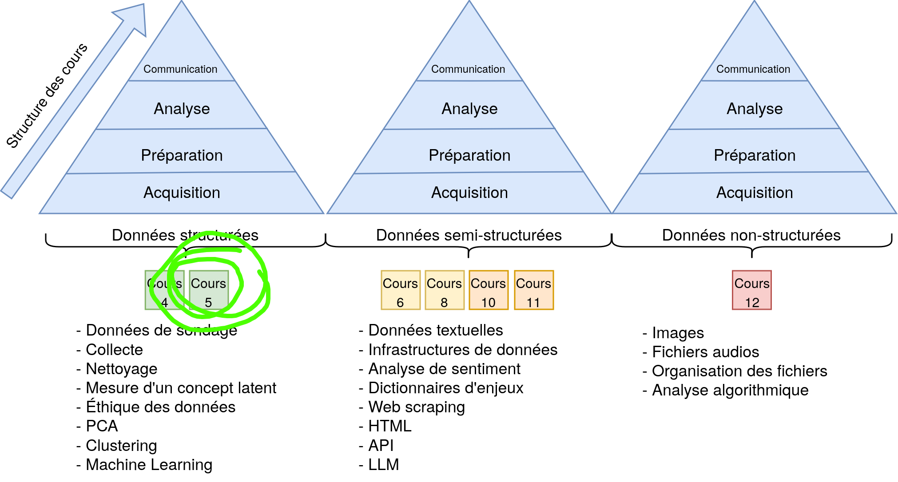{.fragment}

:::

# Lecture 5

- **The problem**: We want to study invisible things (concepts).

- **The solution**: Build measurement scales

- **The verification**: Is my scale reliable and valid?

- **The application**: Now that I have measured my concept, how does it interact with the world? (Visualization -> Regression).

# Latent Variables

## Introduction

### What is a latent variable?

- A characteristic that cannot be measured directly
  - Political ideology
  - Support for the environment
  - Intelligence
- Must be inferred from other observable variables
- Central concept in social sciences

## Example: Measuring Intelligence

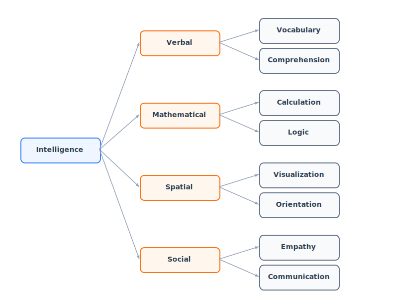

::: {.notes}
- Intelligence is a multidimensional concept
- Each branch represents a different facet
- Tests must capture this complexity
:::

## Measurement Challenge

### Why is it complex?

::: {.incremental}
1. **Abstraction**: Concepts are often abstract
2. **Multidimensionality**: Multiple aspects to consider
3. **Subjectivity**: Varying interpretation depending on the context
:::

# Measurement Scale

## Political attitude scale {transition="none"}


## Political attitude scale {transition="none"}

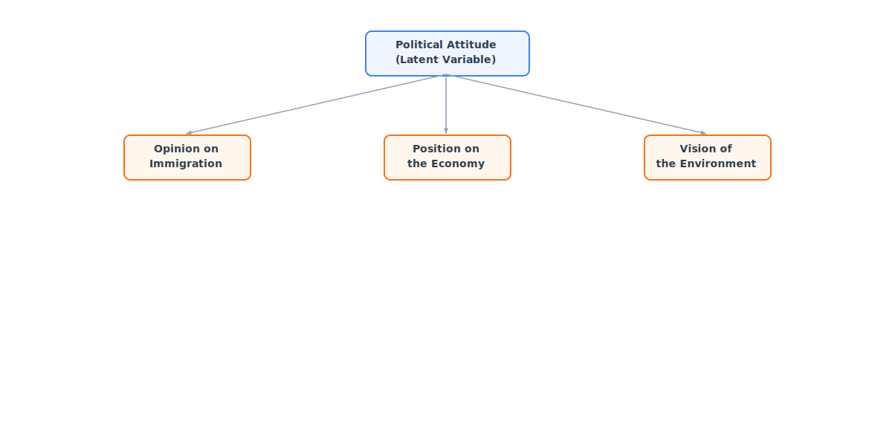

## Political attitude scale {transition="none"}

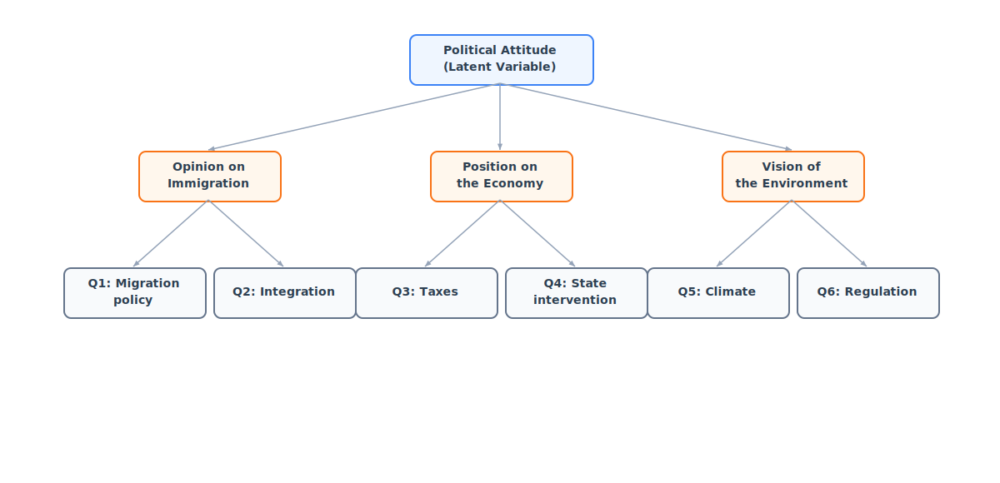

## Political attitude scale {transition="none"}

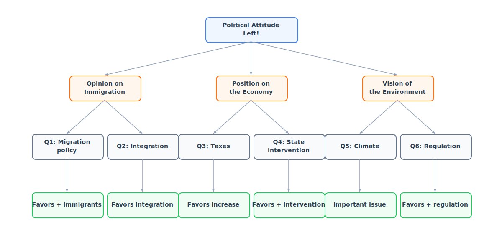

## Merkley's Ideology Scale (2022)

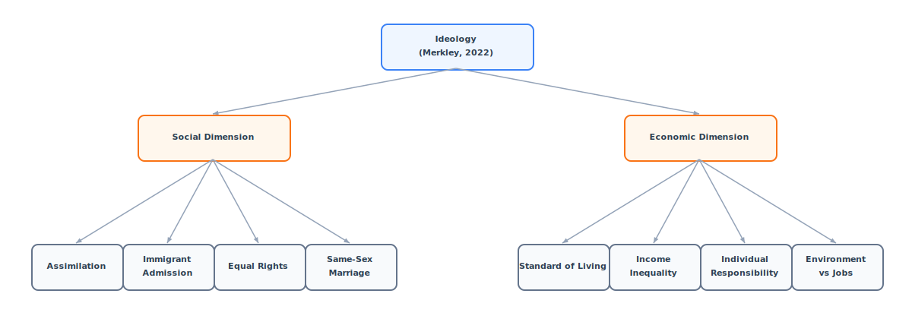

## The 8 Study Questions (Merkley, 2022)

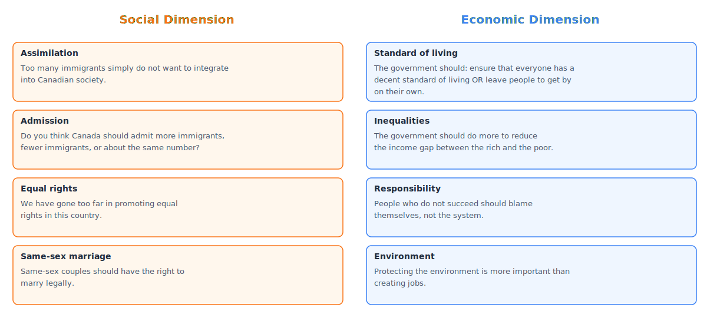

## Latent Concept: Rednecks

- Does education influence the probability of being a "redneck"?
- No question directly asks if someone is a "redneck"
- But this status can be inferred from other variables
- Create a "redneckness" variable

## Solution: Measurement Scales {.smaller}

::: {.columns}

::: {.column width="50%"}

### How to proceed?

1. **Identify key dimensions**
   - Break down the concept
   - Define measurable aspects

2. **Create indicators**
   - Precise questions
   - Concrete observations

3. **Validate the scale**
   - Reliability: Statistical tests
   - Validity: Theoretical

:::

::: {.column width="50%"}

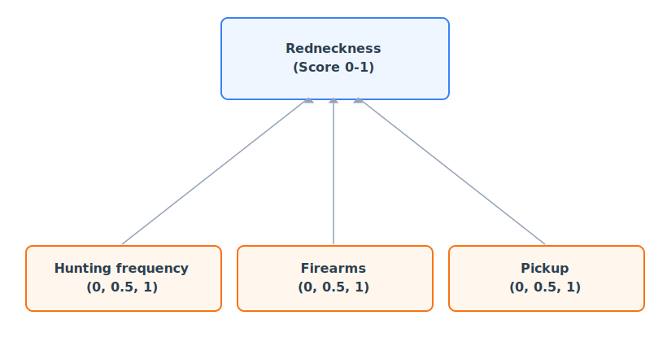{width="100%"}

:::

:::

# Hipster? {transition="none"}

# TikTok brain? {transition="none"}

# Trust in government? {transition="none"}

# Quality Evaluation

## Essential Criteria {transition="none"}

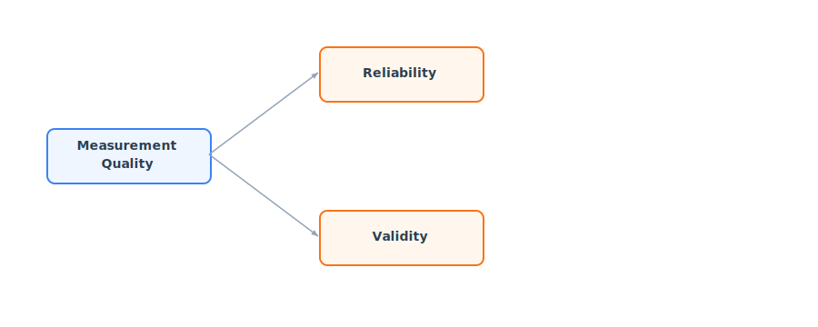

## Essential Criteria {transition="none"}

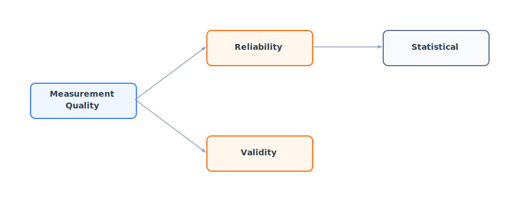

## Essential Criteria {transition="none"}

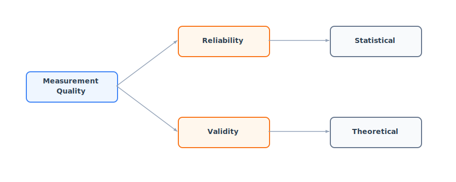


# Reliability

## Reliability: Statistical Measure

### Factor Analysis

- Automatically detects anomalies
- Verifies if all questions measure the same skill
- Helps improve exam quality
- Guides the revision of problematic questions

## History Exam

```{r}
#| echo: false
#| fig-align: center
library(ggplot2)

# Simulate exam grades
set.seed(123)
notes <- data.frame(
  Note = rnorm(100, mean = 75, sd = 10)
)

ggplot(notes, aes(x = Note)) +
  geom_histogram(binwidth = 5, fill = "#3182bd", color = "white", alpha = 0.8) +
  labs(
    title = "Grade distribution in a class",
    x = "Grade (%)",
    y = "Number of students"
  ) +
  theme_minimal() +
  theme(
    text = element_text(size = 16),
    plot.title = element_text(size = 20, face = "bold")
  )
```

::: {.notes}
- Some students naturally excel
- Others are average
- Some have more difficulty
:::

## The History Exam: 5 Questions {.smaller}

### Our hypothesis
- Each question measures **history proficiency**
- Strong students should answer well
- Average students will perform moderately well
- Struggling students will have more difficulty

## Typical exam distribution {auto-animate=true}

::: {data-id="dist-plot"}
```{r}
#| echo: false
#| fig-align: center
library(ggplot2)

# Simulate data
set.seed(123)
n_students <- 100
performance <- rnorm(n_students, mean = 75, sd = 15)
# Ensure scores remain between 0 and 100
performance <- pmax(0, pmin(100, performance))

# Common theme
custom_theme <- theme_minimal(base_size = 16) +
  theme(
    plot.title = element_text(face = "bold", size = 20, color = "#2c3e50"),
    panel.grid.minor = element_blank(),
    panel.grid.major.x = element_blank(),
    legend.position = "bottom",
    legend.title = element_blank()
  )

# Histogram version
ggplot(data.frame(Score = performance), aes(x = Score)) +
  geom_histogram(binwidth = 5, fill = "#2c3e50", color = "white", alpha = 0.9) +
  scale_y_continuous(breaks = seq(0, 30, 5)) +
  labs(
    x = "Grade (%)",
    y = "Number of students",
    title = "Typical exam distribution"
  ) +
  custom_theme
```
:::

## Typical exam distribution {auto-animate=true}

::: {data-id="dist-plot"}
```{r}
#| echo: false
#| fig-align: center

# Single density distribution version
ggplot(data.frame(Score = performance), aes(x = Score)) +
  geom_density(fill = "#2c3e50", alpha = 0.7, color = NA) +
  scale_y_continuous(labels = NULL) + # Hide confusing numbers
  labs(
    x = "Grade (%)",
    y = "Relative frequency",
    title = "Typical exam distribution"
  ) +
  custom_theme +
  theme(axis.ticks.y = element_blank())
```
:::

## Distribution by Student Groups {auto-animate=true}

::: {data-id="dist-plot"}
```{r}
#| echo: false
#| fig-align: center

# Create groups
data <- data.frame(
  Score = performance,
  Groupe = cut(performance, 
              breaks = c(-Inf, 60, 80, Inf),
              labels = c("Struggling students", "Average students", "Excellent students"),
              include.lowest = TRUE)
)

# Modern colors
# Red (Difficulty), Orange/Gold (Average), Blue (Excellent)
colors <- c("#e74c3c", "#f39c12", "#3498db")

ggplot(data, aes(x = Score, fill = Groupe)) +
  geom_density(alpha = 0.7, color = NA) +
  scale_fill_manual(values = colors) +
  scale_y_continuous(labels = NULL) +
  labs(
    x = "Grade (%)",
    y = "Relative frequency",
    title = "Distribution by level"
  ) +
  custom_theme +
  theme(axis.ticks.y = element_blank())
```
:::

## Question 1: Causes of the War {transition="none"}

"What events directly led to the outbreak of World War II in Europe?"

```{r}
#| echo: false
#| fig-align: center

# Common theme
custom_theme <- theme_minimal(base_size = 16) +
  theme(
    plot.title = element_text(face = "bold", size = 20, color = "#2c3e50"),
    panel.grid.minor = element_blank(),
    panel.grid.major.x = element_blank(),
    legend.position = "bottom",
    legend.title = element_blank(),
    axis.text.y = element_blank(),
    axis.ticks.y = element_blank()
  )
colors <- c("#e74c3c", "#f39c12", "#3498db")

# Same distribution for a good question
ggplot(data, aes(x = Score, fill = Groupe)) +
  geom_density(alpha = 0.7, color = NA) +
  scale_fill_manual(values = colors) +
  labs(
    x = "Grade (%)",
    y = "Relative frequency",
    title = "Grade distribution"
  ) +
  custom_theme
```

## Question 2: Strategic Analysis {transition="none"}

"Explain why Operation Barbarossa was a turning point in the war."

```{r}
#| echo: false
#| fig-align: center
# Slight variation but same pattern
set.seed(124)
performance2 <- rnorm(n_students, mean = 72, sd = 16)
data2 <- data.frame(
  Score = performance2,
  Groupe = cut(performance2, 
              breaks = c(-Inf, 60, 80, Inf),
              labels = c("Struggling students", "Average students", "Excellent students"),
              include.lowest = TRUE)
)

ggplot(data2, aes(x = Score, fill = Groupe)) +
  geom_density(alpha = 0.7, color = NA) +
  scale_fill_manual(values = colors) +
  labs(
    x = "Grade (%)",
    y = "Relative frequency",
    title = "Grade distribution"
  ) +
  custom_theme
```

## Question 3: Economic Impact {transition="none"}

"Analyze how the industrial mobilization of the United States influenced the outcome of the war."

```{r}
#| echo: false
#| fig-align: center
# New distribution but same pattern
set.seed(125)
performance3 <- rnorm(n_students, mean = 73, sd = 14)
data3 <- data.frame(
  Score = performance3,
  Groupe = cut(performance3, 
              breaks = c(-Inf, 60, 80, Inf),
              labels = c("Struggling students", "Average students", "Excellent students"),
              include.lowest = TRUE)
)

ggplot(data3, aes(x = Score, fill = Groupe)) +
  geom_density(alpha = 0.7, color = NA) +
  scale_fill_manual(values = colors) +
  labs(
    x = "Grade (%)",
    y = "Relative frequency",
    title = "Grade distribution"
  ) +
  custom_theme
```

## Question 4: Geopolitical Consequences {transition="none"}

"Evaluate how the Yalta Agreement redrew the political map of Europe."

```{r}
#| echo: false
#| fig-align: center
# Another variation with the same pattern
set.seed(126)
performance4 <- rnorm(n_students, mean = 71, sd = 15)
data4 <- data.frame(
  Score = performance4,
  Groupe = cut(performance4, 
              breaks = c(-Inf, 60, 80, Inf),
              labels = c("Struggling students", "Average students", "Excellent students"),
              include.lowest = TRUE)
)

ggplot(data4, aes(x = Score, fill = Groupe)) +
  geom_density(alpha = 0.7, color = NA) +
  scale_fill_manual(values = colors) +
  labs(
    x = "Grade (%)",
    y = "Relative frequency",
    title = "Grade distribution"
  ) +
  custom_theme
```

## Question 5: Churchill's Cigars {transition="none"}

"What was Winston Churchill's favorite brand of cigars?"

```{r}
#| echo: false
#| fig-align: center

# Reversed distribution for the problematic question
performance_reversed <- 100 - performance + rnorm(n_students, mean = 0, sd = 5)
data_prob <- data.frame(
  Score = performance_reversed,
  Groupe = cut(performance, 
              breaks = c(-Inf, 60, 80, Inf),
              labels = c("Struggling students", "Average students", "Excellent students"),
              include.lowest = TRUE)
)

ggplot(data_prob, aes(x = Score, fill = Groupe)) +
  geom_density(alpha = 0.7, color = NA) +
  scale_fill_manual(values = colors) +
  labs(
    x = "Grade (%)",
    y = "Relative frequency",
    title = "Reversed distribution!"
  ) +
  custom_theme +
  annotate("text", x = 20, y = 0.02, 
           label = "Best students\nfail?!", 
           color = "#e74c3c", size = 6, fontface = "bold")
```
## A Suspicious Question

Does this question really measure **history proficiency**?

Or does it measure something else?

- Pop culture?
- Knowledge of cigars?

## What's Wrong

- The best students mysteriously fail
- Struggling students suddenly excel
- The question does not measure history proficiency

## Factor Analysis Compares All Questions

```{r}
#| echo: false
#| fig-align: center
#| fig-width: 15
#| fig-height: 4.5

# Simulate data for all questions
set.seed(123)
n_students <- 100

# Create scores for the 4 good questions
q1 <- rnorm(n_students, mean = 75, sd = 15)  # Causes of the war
q2 <- rnorm(n_students, mean = 72, sd = 16)  # Barbarossa
q3 <- rnorm(n_students, mean = 73, sd = 14)  # Economic impact
q4 <- rnorm(n_students, mean = 71, sd = 15)  # Yalta
# Problematic question (inverse of q1)
q5 <- 100 - q1 + rnorm(n_students, mean = 0, sd = 5)

data <- data.frame(
  Question = rep(c("Causes", "Barbarossa", "Economy", "Yalta", "Cigars"), each = n_students),
  Score = c(q1, q2, q3, q4, q5),
  Type = rep(c("Good question", "Good question", "Good question", "Good question", "Suspicious question"), 
            each = n_students)
)

# Theme
custom_theme <- theme_minimal(base_size = 16) +
  theme(
    plot.title = element_text(face = "bold", size = 20, color = "#2c3e50"),
    panel.grid.minor = element_blank(),
    panel.grid.major.x = element_blank(),
    legend.position = "bottom",
    legend.title = element_blank(),
    axis.text.y = element_blank(),
    axis.ticks.y = element_blank(),
    strip.text = element_text(size = 14, face = "bold", color = "#2c3e50")
  )

ggplot(data, aes(x = Score, fill = Type)) +
  geom_density(alpha = 0.7, color = NA) +
  facet_wrap(~Question, nrow = 1) +
  scale_fill_manual(values = c("#3498db", "#e74c3c")) + # Blue (Good), Red (Bad)
  labs(
    title = "Grade distribution for each question",
    x = "Grade (%)",
    y = "Relative frequency"
  ) +
  custom_theme
```

## How does it work?

::: {.columns}
::: {.column width="50%"}
### Factor analysis checks:
1. The correlation between questions
2. The pattern of answers
3. The questions that "stand out"
:::

::: {.column width="50%"}
### Our results
- **Questions 1-4**: ✅
  - Causes of the war
  - Operation Barbarossa
  - Economic impact
  - Yalta Agreement
- **Question 5**: ❌
  - Churchill's cigars
:::
:::

::: {.notes}
- The first 4 questions measure history proficiency well
- The cigar question measures something else (Knowledge of cigars? Pop culture?)
- Factor analysis automatically detects these patterns
:::

## In Summary

::: {.columns}

::: {.column width="50%"}

### A good history question should:
  - Test historical understanding
  - Show a "normal" distribution
  - Discriminate based on proficiency

:::

::: {.column width="50%"}

### A problematic question can:
  - Test irrelevant knowledge
  - Show a reversed distribution
  - Not reflect the targeted proficiency

:::

:::


## Factor Analysis

### Three Statistical Measures

1. **Cronbach's Alpha**
2. **First Eigenvalue**
3. **Factor Loading**

# Cronbach's Alpha

## What is it?
- A measure of the **internal consistency** of a set of questions
- Indicates whether the questions measure the same thing
- Varies between 0 and 1 (closer to 1 is better)

## Simple Example
- Imagine a job satisfaction survey with 4 questions:
  - "I like my job"
  - "I am happy at the office"
  - "My job satisfies me"
  - "I thrive in my work"
- If answers are consistent with each other → High Alpha
- If answers are contradictory → Low Alpha

## In Practice
- Alpha > 0.6: Acceptable
- Alpha > 0.7: Good
- Alpha > 0.8: Excellent

# The First Eigenvalue

## What is it?
- Indicates the **strength of the main concept** measured by your questions
- The higher it is, the more your questions measure a single, strong concept

## Simple Analogy

5 questions to measure healthy lifestyle habits:

- "I never eat refined sugar"
- "I prioritize organic products"
- "I go to the gym 4 times a week"
- "I take protein supplements"
- "I own a smartwatch to track my cardio"

## In Practice
- Value > 1: Acceptable
- The higher the value, the more reliable it is
- Indicates that there is a "dominant factor" in your questions

# Factor Loading

## What is it?
- Measures the **contribution** of each question to the overall concept
- Indicates whether each question is relevant

## Simple Example
- For a survey on "love of cats":
  - "Cats are soft" → High loading (relevant)
  - "I eat pasta" → Low loading (irrelevant)

## In Practice
- Coefficient > 0.3: Acceptable
- Allows identifying which questions to keep or remove
- The higher the coefficient, the more relevant the question

## The Three Measures Work Together
- **Cronbach's Alpha**: Overall consistency
- **First Eigenvalue**: Strength of the main concept
- **Factor Loading**: Relevance of each question

## Practical Use

1. **Cronbach's Alpha**: > 0.6
2. **First Eigenvalue**: > 1
3. **Factor Loading**: > 0.3

## How to Do It

### 1. Install the sondr package

```r
# In the console:
install.packages("devtools")
devtools::install_github("clessnverse/sondr")
```

## How to Do It?

### 2. Load your data

```r
library(dplyr)
library(tidyr)

df <- read.csv("data.csv")
```
### 3. Determine potential variables

```r
r$> names(df)
 [1] "ses_gender"                        "ses_income"                        "ses_housing"                       "ses_language"                     
 [5] "ses_religion"                      "ses_education"                     "ses_ethnicity"                     "ses_immigrant"                    
 [9] "ses_skin_tone"                     "lifestyle_pets"                    "lifestyle_album"                   "lifestyle_movie"                  
[13] "lifestyle_prius"                   "ses_postal_code"                   "lifestyle_coffee"                  "lifestyle_gpt_freq"               
[17] "lifestyle_transport"               "lifestyle_yoga_freq"               "lifestyle_guns_number"             "lifestyle_classic_meal"           
[21] "lifestyle_fishing_freq"            "lifestyle_hunting_freq"            "ses_sexual_orientation"            "lifestyle_eat_meat_freq"          
[25] "lifestyle_clothing_style"          "lifestyle_motorized_freq"          "lifestyle_videogame_freq"          "lifestyle_alcohol_favorite"       
[29] "ses_religiosity_importance"        "lifestyle_nonmotorized_freq"       "lifestyle_watch_soccer_freq"       "lifestyle_movie_barbenheimer"     
[33] "lifestyle_watch_baseball_freq"     "lifestyle_volunteeringsocial_freq"
```
## How to Do It?{.smaller}

### 4. Clean the variables to evaluate so that they are numeric

```r
df_clean <- data.frame(id = 1:nrow(df))

# Fishing frequency variable
table(df$lifestyle_fishing_freq)
df_clean$lifestyle_fishing_freq_scale<- NA
df_clean$lifestyle_fishing_freq_scale[df$lifestyle_fishing_freq == "Never"] <- 0    
df_clean$lifestyle_fishing_freq_scale[df$lifestyle_fishing_freq == "Almost never"] <- 0.25
df_clean$lifestyle_fishing_freq_scale[df$lifestyle_fishing_freq == "Sometimes"] <- 0.5
df_clean$lifestyle_fishing_freq_scale[df$lifestyle_fishing_freq == "Often"] <- 0.75
df_clean$lifestyle_fishing_freq_scale[df$lifestyle_fishing_freq == " Very often"] <- 1
table(df_clean$lifestyle_fishing_freq_scale, useNA = "ifany")

saveRDS(df_clean, "data_clean.rds")
```

## How to Do It? {.smaller}

::: {.columns}

::: {.column width="55%"}

### 5. Isolate the variables to evaluate

```r

# Select variables to evaluate
df_fa <- df %>%
  select(lifestyle_fishing_scale, 
         lifestyle_hunting_scale, 
         lifestyle_guns_number_scale,
         lifestyle_motorized_scale, 
         lifestyle_pickup_scale,
         lifestyle_eat_meat_scale) %>%
  drop_na() # Remove missing values

```

:::

::: {.column width="45%"}

### 6. Conditions to respect

1. A dataframe containing only the variables to evaluate
2. NO missing values
3. The same measurement scale for all questions (0-1)
4. The same orientation for all items (positive or negative)

:::

:::


## How to Do It? {.smaller}

::: {.columns}

::: {.column width="35%"}

### 7. Use the function

`sondr::topdown_fa()`

```r
# Run the analysis
sondr::topdown_fa(df_fa)
```

:::

::: {.column width="65%"}

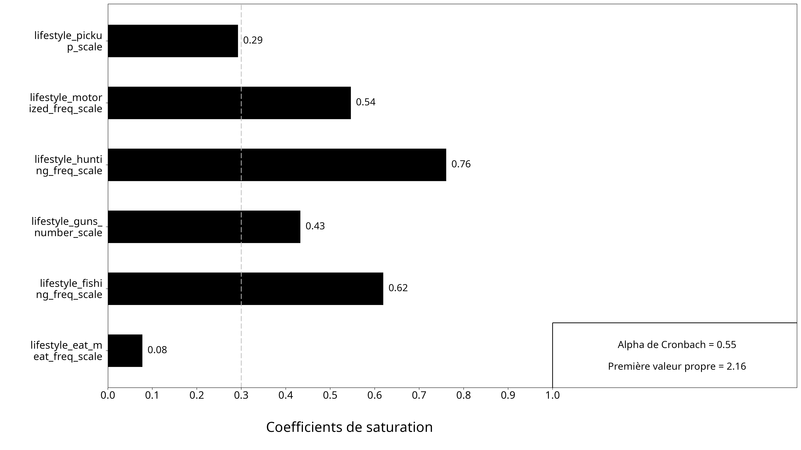

:::

:::

## How to Do It? {.smaller}

::: {.columns}

::: {.column width="40%"}

### 8. Try again

Trial and error until finding a winning combination

```r
# Remove irrelevant variables
df_fa_2 <- df_fa %>%
  select(-c(lifestyle_eat_meat_scale, 
            lifestyle_pickup_scale)) 

# Run the analysis again
sondr::topdown_fa(df_fa_2)

```

:::

::: {.column width="60%"}


:::

:::


## Validity?

### How to measure it?

1. **Agreement with theory**
  - Do the questions measure the concept well?
  - Are the results consistent with the literature?

2. **Agreement with other measures**
  - Are the results similar to other scales?
  - Are the results stable over time?

## Creating the Scale

### If reliability and validity are acceptable

```r
df$scale_redneck <- NA
df$scale_redneck <- (df$lifestyle_motorized_freq_scale +
                    df$lifestyle_hunting_freq_scale +
                    df$lifestyle_fishing_freq_scale +
                    df$lifestyle_pickup_scale +
                    df$lifestyle_guns_number_scale) / 5
table(df$scale_redneck)
hist(df$scale_redneck)

saveRDS(df, "data_scale.rds")
```

## df$scale_redneck

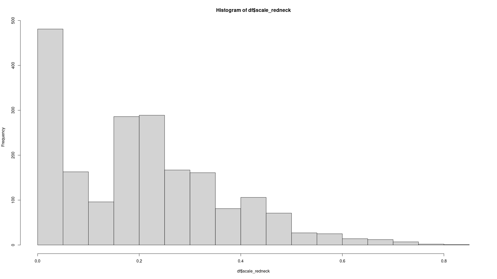

# Conclusion

::: {.incremental}
1. Latent variables are omnipresent in the social sciences
2. Measurement requires a systematic approach
3. Validation is crucial for quality
:::

# The Grammar of Graphics

## Graphical Representation of Data{.smaller}

### General Principles of Visualization

- Visualize data

- Avoid unnecessary distractions

- Avoid "spaghetti" charts

- Avoid overly complex, overlapping, and intertwining lines

- Start in black and white and use colors effectively

## Basic Components


## Visualization with ggplot2{auto-animate=true .smaller}

::: {.columns}

### Initialize a chart

```{.r code-line-numbers="1"}
ggplot(df, aes(x = Agriculture, y = Fertility, color = Education)) 
```

::: {.column width="40%"}

- `df` is the dataframe
- `aes()` is the function used to specify the variables to use
- `x` and `y` are the variables to use for the x and y axes
- `color` is the variable to use for the color

:::

::: {.column width="60%"}

```{r}
df <- swiss
ggplot(df, aes(x = Agriculture, y = Fertility, color = Education)) 
```

:::

:::

## Visualization with ggplot2{auto-animate=true .smaller}

::: {.columns}

### Add a geom_()

```{.r code-line-numbers="2"}
ggplot(df, aes(x = Agriculture, y = Fertility, color = Education)) +
  geom_point(alpha = 0.8) # alpha is transparency
```

::: {.column width="40%"}

- There are several `geom_()` functions for different types of charts
  - `geom_point()` for a scatter plot
  - `geom_line()` for a line chart
  - `geom_bar()` for a bar chart
  - `geom_histogram()` for a histogram

:::

::: {.column width="60%"}

```{r}
ggplot(df, aes(x = Agriculture, y = Fertility, color = Education)) +
  geom_point(alpha = 0.8) # alpha is transparency
```

:::

:::

## Visualization with ggplot2{auto-animate=true .smaller}

### Add a color scale

```{.r code-line-numbers="3"}
ggplot(df, aes(x = Agriculture, y = Fertility, color = Education)) +
  geom_point(alpha = 0.8) + # alpha is transparency
  scale_color_gradient(low = "blue", high = "red", name = "Education") 
```

::: {.columns}

::: {.column width="40%"}

- `scale_color_gradient()` allows specifying colors for the `Education` variable
- `low` and `high` are the colors for the lowest and highest values
- `name` is the name of the legend
- You can use hex codes for colors

:::

::: {.column width="60%"}

```{r}
ggplot(df, aes(x = Agriculture, y = Fertility, color = Education)) +
  geom_point(alpha = 0.8) + # alpha is transparency
  scale_color_gradient(low = "blue", high = "red", name = "Education") 
```


:::

:::

## Visualization with ggplot2{auto-animate=true .smaller}

### Add titles and labels

```{.r code-line-numbers="4,5,6,7,8"}
ggplot(df, aes(x = Agriculture, y = Fertility, color = Education)) +
  geom_point(alpha = 0.8) + # alpha is transparency
  scale_color_gradient(low = "blue", high = "red", name = "Education") +
  labs(
    title = "Relationship between agriculture and fertility in Switzerland",
    x = "Percentage of agriculture",
    y = "Fertility"
  ) 
```

::: {.columns}

::: {.column width="40%"}

:::

::: {.column width="60%"}

```{r}
ggplot(df, aes(x = Agriculture, y = Fertility, color = Education)) +
  geom_point(alpha = 0.8) + # alpha is transparency
  scale_color_gradient(low = "blue", high = "red", name = "Education") +
  labs(
    title = "Relationship between agriculture and fertility in Switzerland",
    x = "Percentage of agriculture",
    y = "Fertility"
  ) 
```

:::

:::

## Visualization with ggplot2{auto-animate=true .smaller}

### Add a theme

```{.r code-line-numbers="9"}
ggplot(df, aes(x = Agriculture, y = Fertility, color = Education)) +
  geom_point(alpha = 0.8) + # alpha is transparency
  scale_color_gradient(low = "blue", high = "red", name = "Education") +
  labs(
    title = "Relationship between agriculture and fertility in Switzerland",
    x = "Percentage of agriculture",
    y = "Fertility"
  ) +
  theme_minimal()
```


::: {.columns}

::: {.column width="40%"}

- `theme_minimal()` is a minimalist theme
- There are several predefined themes in ggplot2
- You can also create your own theme

:::

::: {.column width="60%"}

```{r}
ggplot(df, aes(x = Agriculture, y = Fertility, color = Education)) +
  geom_point(alpha = 0.8) + # alpha is transparency
  scale_color_gradient(low = "blue", high = "red", name = "Education") +
  labs(
    title = "Relationship between agriculture and fertility in Switzerland",
    x = "Percentage of agriculture",
    y = "Fertility"
  ) +
  theme_minimal()
```

:::

:::

## Visualization with ggplot2{auto-animate=true}

### Save the chart

```{.r code-line-numbers="11"}
ggplot(df, aes(x = Agriculture, y = Fertility, color = Education)) +
  geom_point(alpha = 0.8) + # alpha is transparency
  scale_color_gradient(low = "blue", high = "red", name = "Education") +
  labs(
    title = "Relationship between agriculture and fertility in Switzerland",
    x = "Percentage of agriculture",
    y = "Fertility"
  ) +
  theme_minimal()

ggsave("path/to/chart_name.png", width = 16, height = 9)
```

- You can specify the format of the chart (png, pdf, etc.) as well as the path to save it.

## Visualization with ggplot2{auto-animate=true}

### A histogram of the Fertility variable

```r
ggplot(df, aes(x = Fertility)) +
  geom_histogram(fill = "skyblue", color = "white", bins = 5) +
  labs(
    title = "Distribution of fertility in Switzerland",
    x = "Fertility",
    y = "Number of cantons"
  ) +
  theme_minimal()
```

::: {.columns}

::: {.column width="40%"}

:::

::: {.column width="60%"}

```{r}
ggplot(df, aes(x = Fertility)) +
  geom_histogram(fill = "skyblue", color = "white", bins = 5) +
  labs(
    title = "Distribution of fertility in Switzerland",
    x = "Fertility",
    y = "Number of cantons"
  ) +
  theme_minimal()
```

:::

:::

## Key Takeaways

::: {.incremental}
1. ggplot2 uses a consistent grammar of graphics
2. Build charts layer by layer
3. Customization is simple but powerful
4. Always think about readability
:::


# Linear Regression

$$
\begin{aligned}
y &= \beta_0 + \beta_1x + \epsilon \\
\end{aligned}
$$

```r
model <- lm(df$y ~ df$x, data = df) # A single line of code!
```

## What is it?

- A tool for understanding the relationship between two variables
- Allows predicting one variable from another
- Finds the "best line" representing this relationship

## Visualizing the Regression {.smaller}

```{r historical-plot}
#| echo: false
#| warning: false
#| message: false
library(ggplot2)
library(dplyr)

# Create example data for height prediction
set.seed(123)
n <- 50
father_height <- rnorm(n, 175, 7)
# Using slope of 0.5 to demonstrate regression to mean
son_height <- 0.5 * father_height + rnorm(n, 85, 5)
height_data <- data.frame(father = father_height, son = son_height)

# Add reference line data
ref_data <- data.frame(
  x = c(min(father_height), max(father_height)),
  y = c(min(father_height), max(father_height))
)

ggplot(height_data, aes(x = father, y = son)) +
  # Add reference line first (what Galton expected)
  geom_line(data = ref_data, aes(x = x, y = y), 
            color = "gray", linetype = "dashed", size = 1) +
  geom_point(alpha = 0.6, color = "#1f77b4") +
  geom_smooth(method = "lm", color = "#d62728", se = FALSE) +
  labs(
    title = "Galton's Discovery",
    subtitle = "Dashed line: what he expected (slope = 1)\nRed line: what he observed (slope < 1)",
    x = "Father's height (cm)",
    y = "Son's height (cm)"
  ) +
  theme_minimal() +
  theme(
    text = element_text(size = 12),
    plot.title = element_text(size = 16, face = "bold"),
    plot.subtitle = element_text(size = 12)
  ) +
  annotate("text", x = 185, y = 165, 
           label = "Regression\nto the mean", 
           color = "#d62728", 
           size = 4)
```

## How does it work? {.smaller transition="none"}

```{r}
#| echo: false
#| warning: false
#| message: false

# Create example data for intuitive understanding
set.seed(456)
x <- seq(1, 10, length.out = 30)
y <- 2 * x + rnorm(30, 0, 1.5)
intuitive_data <- data.frame(x = x, y = y)

ggplot(intuitive_data, aes(x = x, y = y)) +
  geom_point(color = "#1f77b4", size = 3) +
  labs(
    title = "Regression finds the best line",
    subtitle = "It minimizes the distance between the points and the line",
    x = "Variable X",
    y = "Variable Y"
  ) +
  theme_minimal() +
  theme(
    text = element_text(size = 12),
    plot.title = element_text(size = 16, face = "bold"),
    plot.subtitle = element_text(size = 12)
  )
```

::: {.notes}
Regression finds the line that fits "best" through the points.
The closer the points are to the line, the better the regression.
:::

## How does it work? {.smaller transition="none"}

```{r}
#| echo: false
#| warning: false
#| message: false

ggplot(intuitive_data, aes(x = x, y = y)) +
  geom_smooth(method = "lm", color = "#d62728", se = FALSE) +
  geom_point(color = "#1f77b4", size = 3) +
  geom_segment(
    aes(xend = x, yend = predict(lm(y ~ x))),
    color = "darkgray",
    linetype = "dashed"
  ) +
  labs(
    title = "Regression finds the best line",
    subtitle = "It minimizes the distance between the points and the line",
    x = "Variable X",
    y = "Variable Y"
  ) +
  theme_minimal() +
  theme(
    text = element_text(size = 12),
    plot.title = element_text(size = 16, face = "bold"),
    plot.subtitle = element_text(size = 12)
  )
```

## How does it work? {.smaller transition="none"}

```{r}
#| echo: false
#| warning: false
#| message: false

# Create example data for intuitive understanding
set.seed(456)
x <- seq(1, 10, length.out = 30)
y <- 2 * x + rnorm(30, 0, 1.5)
intuitive_data <- data.frame(x = x, y = y)

ggplot(intuitive_data, aes(x = x, y = y)) +
  geom_point(color = "#1f77b4", size = 3) +
  geom_smooth(method = "lm", color = "#d62728", se = TRUE) +
  labs(
    title = "Regression finds the best line",
    subtitle = "It minimizes the distance between the points and the line",
    x = "Variable X",
    y = "Variable Y"
  ) +
  theme_minimal() +
  theme(
    text = element_text(size = 12),
    plot.title = element_text(size = 16, face = "bold"),
    plot.subtitle = element_text(size = 12)
  )
```

## Why use regression?

- Understand relationships between variables
- Predict future values
- Test scientific hypotheses
- Control for multiple factors at once

## Regression

```r
model <- lm(df$ses_education ~ df$redneck_scale)

summary(model)

modelsummary::modelsummary(
  model,
  output = "results/tables/regression.md",
  stars = TRUE,
  title = "Simple linear regression"
)
```
## {transition="none"}

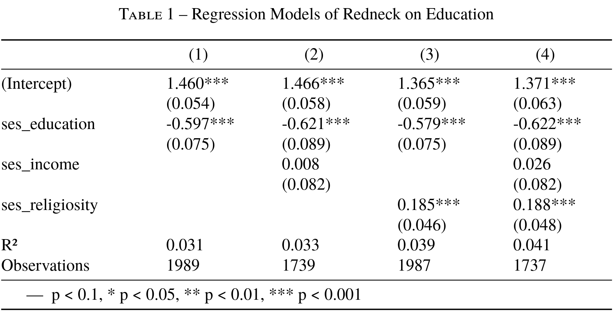 

## {transition="none"}

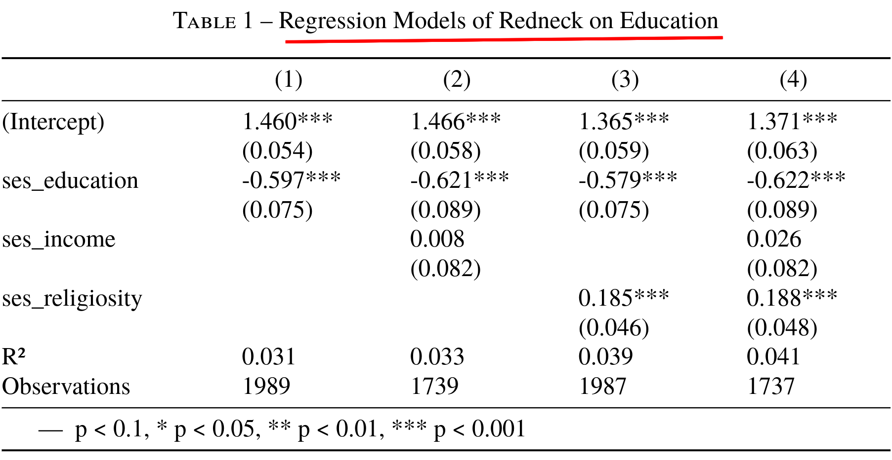

## {transition="none"}

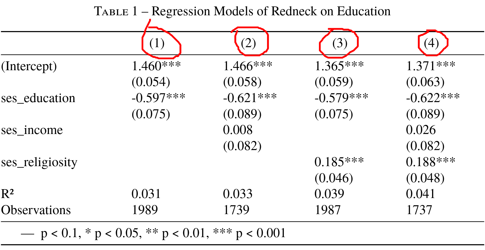

## {transition="none"}

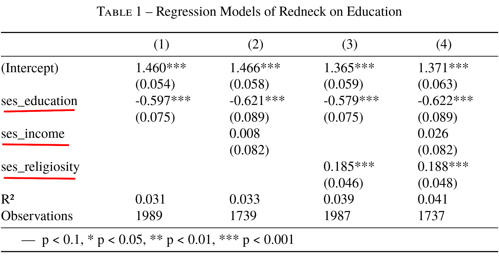

## {transition="none"}

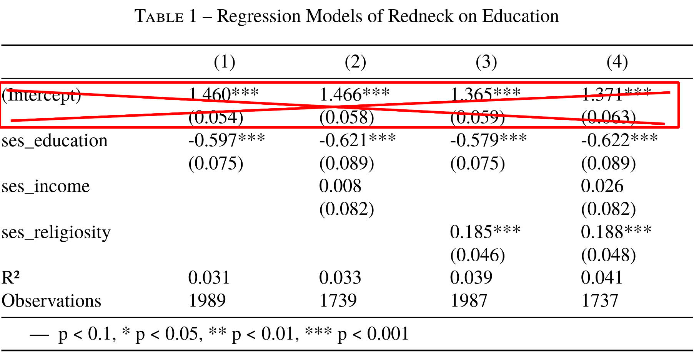

## {transition="none"}

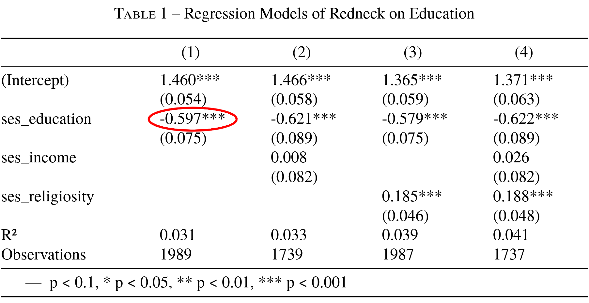

## {transition="none"}

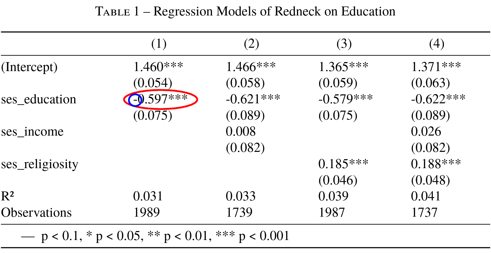

## {transition="none"}

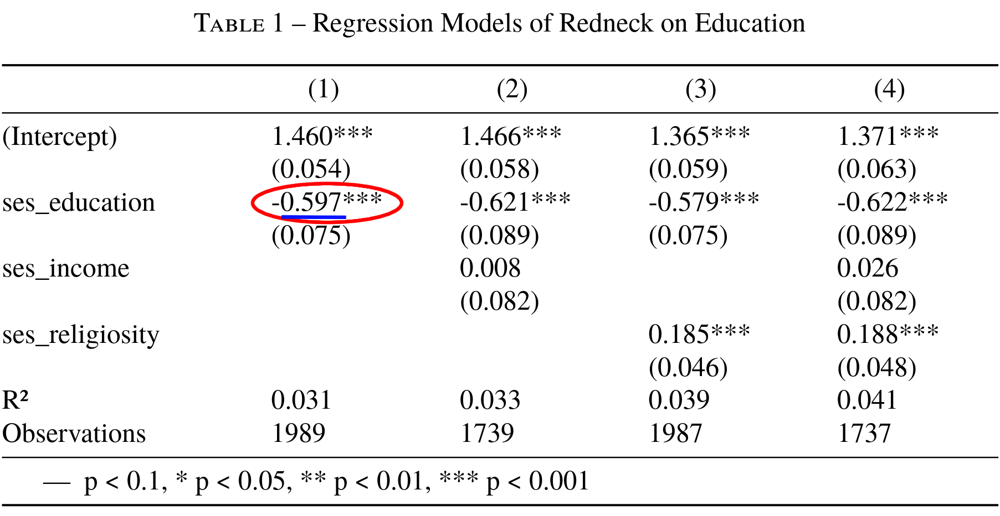

## {transition="none"}

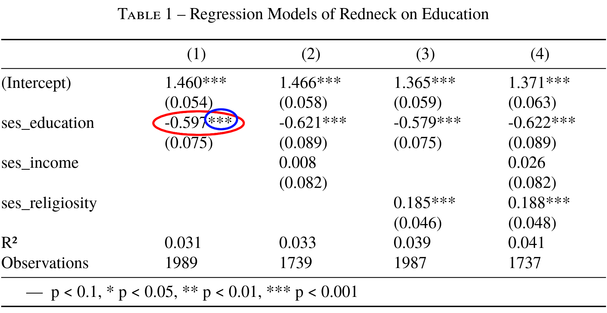

## {transition="none"}

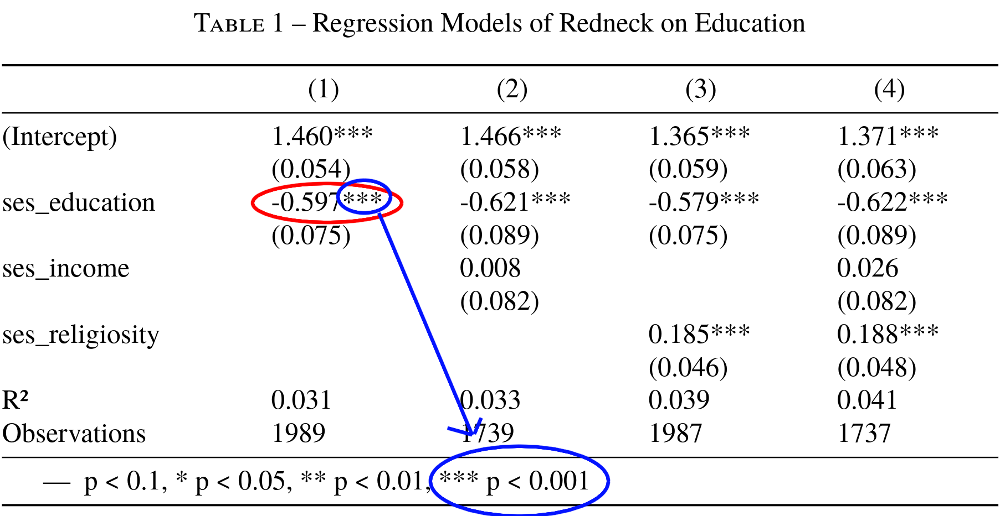

## {transition="none"}

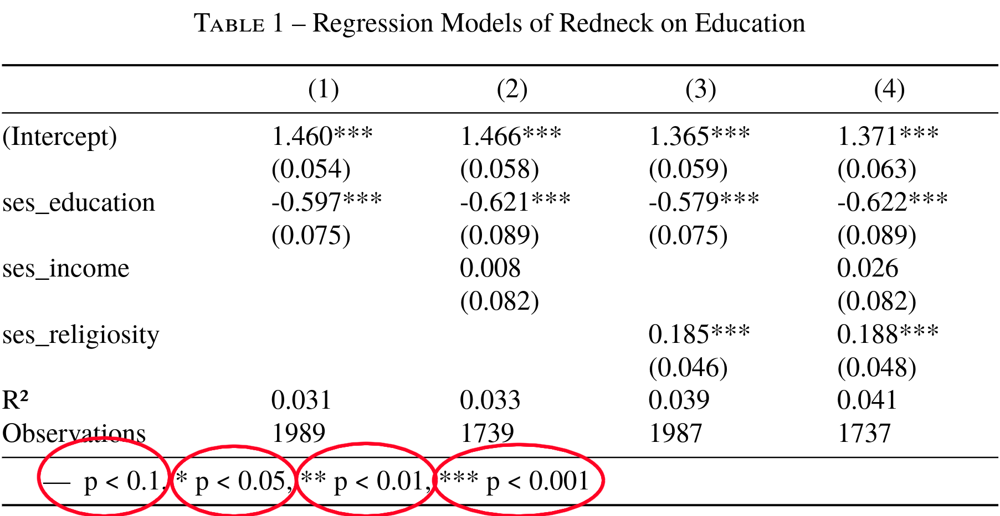

## {transition="none"}

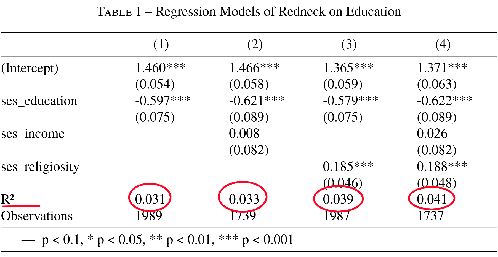

## {transition="none"}

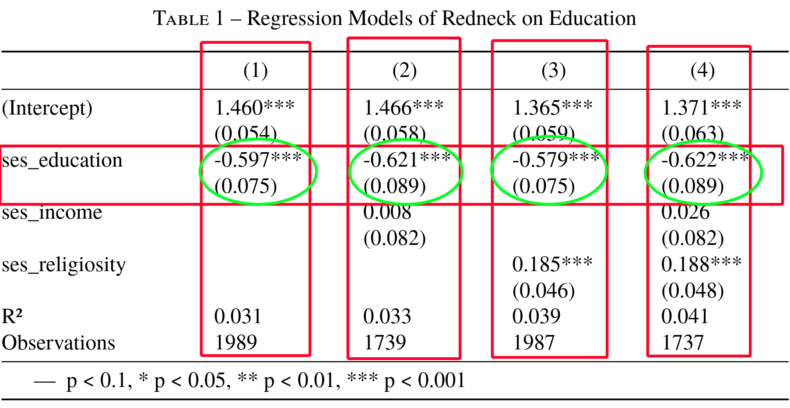


## Key Takeaways

::: {.incremental}
1. Always explore your data before analysis
2. Interpret results with caution
3. Visualize to understand better
:::

# Conclusion
