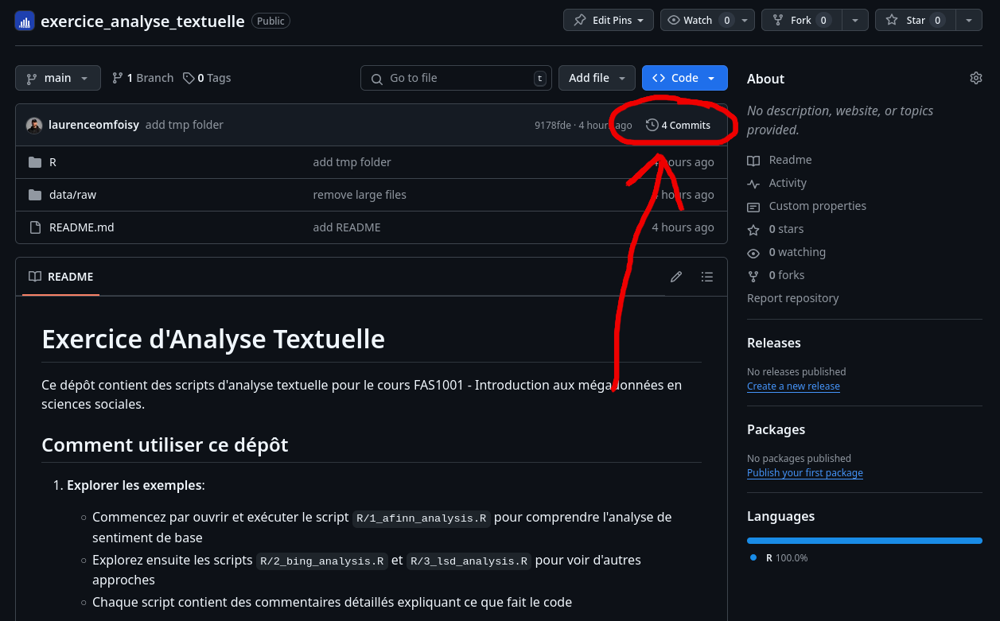
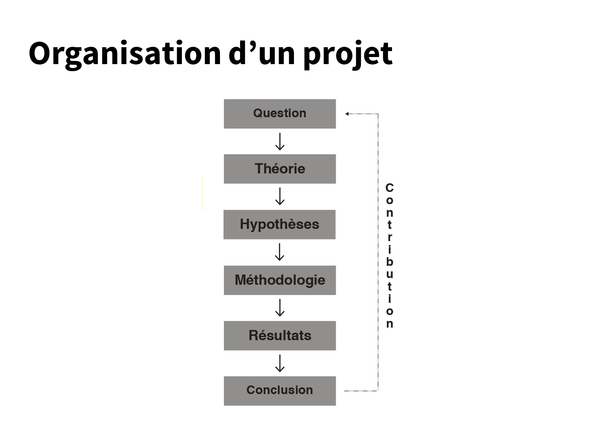
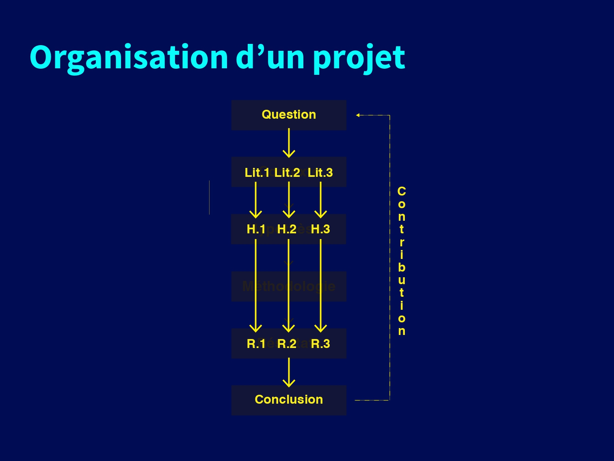
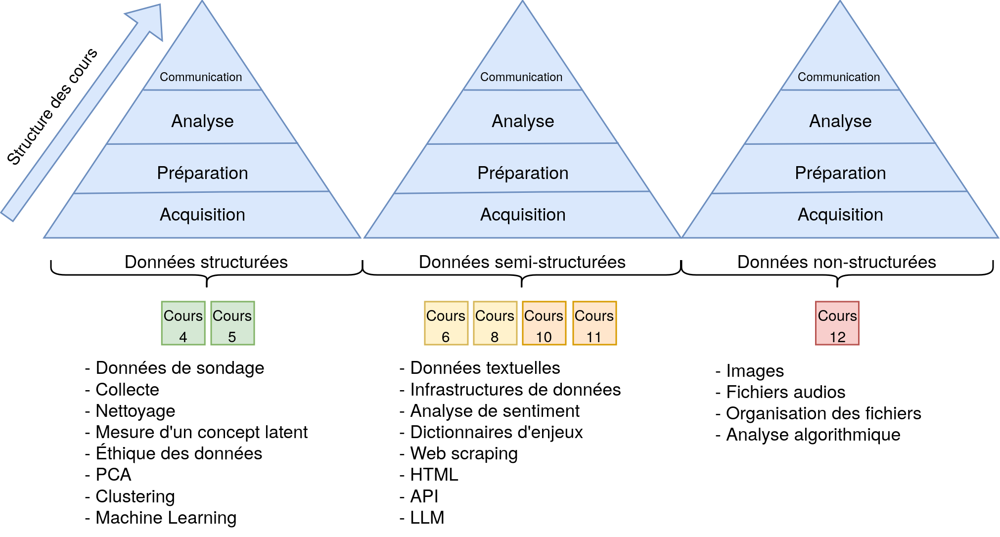
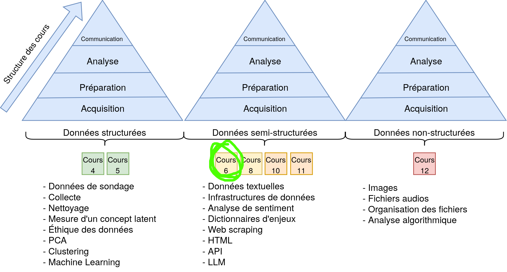
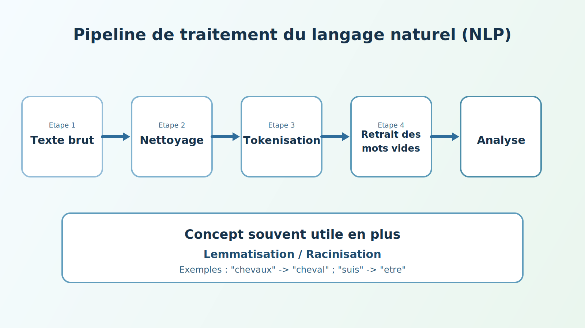
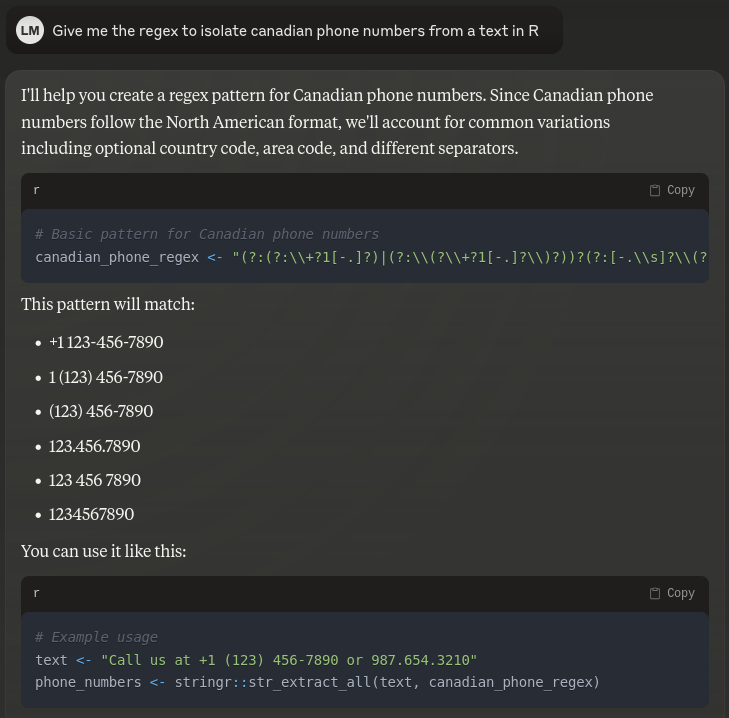

# Retour sur le Quiz1 {.smaller}

- Utiliser GitHub pour sauvegarder vos fichiers
- Comment retourner sur GitHub pour voir l'ancienne version de votre TP1
- Faire table() avant et après
- Éviter de mettre les citations en texte
- Ne laissez pas de code inutile

## Utiliser les citations en markdown {.smaller}

### La mauvaise façon :x:

```markdown
Selon Wickham (2014) [@wickham14], les tidy data ont trois propriétés.
```
Selon Wickham (2014) (Wickham, 2014), les tidy data ont trois propriétés.

### Les deux options :white_check_mark:
```markdown
Selon @wickham14, les tidy data ont trois propriétés.
```
Selon Wickham (2014), les tidy data ont trois propriétés:

```markdown
Les tidy data ont trois propriétés [@wickham14].
```
Les tidy data ont trois propriétés (Wickham, 2014).

## Ne pas laisser de code inutile {.smaller}

Utiliser l'historique GitHub pour voir les changements



## TP2 - Travail de mi-session {.smaller}

- À remettre le 11 mars 2025 avant minuit
- 20% de la note finale

## {transition="none"}



## {transition="none"}



## Gabarit suggéré {.smaller}

1. Introduction
2. Question de recherche
3. Revue de littérature 
4. Hypothèses dérivées de la littérature
5. Données et méthodologies
6. Résultats
7. Discussion
8. Conclusion

# Introduction à l'analyse textuelle

## Structure du cours

::: {.r-stack}



{.fragment}

:::

## Pourquoi analyser du texte?

### Les données sont partout :earth_americas: :earth_africa: :earth_asia:

- Données textuelles disponibles en grande quantité
- Méthodes de recherche de plus en plus accessibles
- Idée(s) sur différentes sources de données textuelles? 

## {background-image="img/newspapers.webp" background-size="cover"}

## {background-image="img/assnat.avif" background-size="cover"}

## L'explosion des données textuelles

- Médias sociaux
- Articles de presse
  - [Eureka et Factiva](https://bib.umontreal.ca/guides/types-documents/journaux)
- Documents légaux
- Sondages (questions ouvertes)
- Courriels
- Messages instantanés
- Beaucoup plus

## Que peut-on faire avec le texte?

1. Analyse de sentiment 
2. Classification de documents 
3. Extraction de thèmes 
4. Résumé automatique 
5. Analyse de discours 

## Différentes méthodes d'analyse textuelle


##

{width=100% fig-alt="Pipeline de traitement du langage naturel"}

# Le pipeline de traitement textuel

## Les 5 étapes

1. **Collecte** : Obtenir le texte
2. **Nettoyage** : Minuscules, ponctuation
3. **Tokenisation** : Découper en mots
4. **Filtrage** : Retirer les mots vides
5. **Analyse** : Sentiment, thèmes, etc.

## Tokenisation

### Découper le texte en mots

```
"J'aime analyser du texte"
      ↓
["J'", "aime", "analyser", "du", "texte"]
```

## Stopwords (mots vides)

### Quoi retirer?

**Français** : le, la, de, et, un, dans, est...

**Anglais** : the, a, an, in, on, at, is...

## Avant et après

::::{.columns}

:::{.column width="50%"}

### Avant
```
le chat est sur le tapis
```
6 mots

:::

:::{.column width="50%"}

### Après
```
chat tapis
```
2 mots significatifs

:::

::::

# Introduction aux expressions régulières

## Qu'est-ce qu'on essaie de faire?

- Trouver des patterns dans du texte
- Exemple : Trouver tous les numéros de téléphone dans un document
- Exemple : Extraire tous les courriels d'un texte

## Un exemple concret

Imaginons que vous ayez ce texte:

```text
Contact: Marie (514-555-1234) 
Courriel: marie@udem.ca
Contact: Pierre (438-555-5678)
Courriel: pierre@udem.ca
```

Comment trouver automatiquement tous les numéros de téléphone?

## La solution "manuelle"

1. Chercher des chiffres
2. Regroupés par 3 ou 4
3. Séparés par des tirets
4. Commençant par 514 ou 438

## La solution avec regex

```r
# Un pattern qui trouve les numéros de téléphone
"\\d{3}-\\d{3}-\\d{4}"
```

## Décomposons le pattern

- `\d` : un chiffre (0-9)
- `{3}` : exactement 3 fois
- `-` : un tiret
- Donc `\d{3}-\d{3}-\d{4}` trouve: "514-555-1234"

## Un deuxième exemple : Les courriels

Reprenons le même texte:

```text
Contact: Marie (514-555-1234)
Courriel: marie@udem.ca
Contact: Pierre (438-555-5678)
Courriel: pierre@udem.ca
```

Comment trouver automatiquement toutes les adresses courriel?

## La solution "manuelle"

1. Chercher des lettres
2. Suivies d'un symbole @
3. Suivies du nom de domaine
4. Terminant par .ca, .com, etc.

## La solution avec regex

```r
# Un pattern qui trouve les adresses courriel
"[a-zA-Z0-9._%+-]+@[a-zA-Z0-9.-]+\\.[a-zA-Z]{2,}"
```

## Décomposons le pattern

- `[a-zA-Z0-9._%+-]+` : lettres, chiffres et caractères spéciaux (avant @)
- `@` : le symbole @
- `[a-zA-Z0-9.-]+` : lettres, chiffres, points et tirets (nom de domaine)
- `\\.` : un point (échappé avec \\)
- `[a-zA-Z]{2,}` : au moins 2 lettres (.ca, .com, .info, etc.)
- Donc ce pattern trouve: "marie@udem.ca" et "jean.dupont@umontreal.ca"

## Pourquoi c'est utile?

- Automatise la recherche de patterns
- Fonctionne sur n'importe quelle quantité de texte
- Plus rapide et fiable que la recherche manuelle
- Essentiel pour le nettoyage de données textuelles

## Utilisation dans R

### Le package stringr

```r
# Installation si nécessaire
install.packages("stringr")

# Chargement
library(stringr)
```

- Fait partie du tidyverse
- Fonctions simples et cohérentes
- Documentation claire avec de nombreux exemples

## Fonctions principales de stringr

```r
# Détecter un pattern : retourne TRUE/FALSE si le pattern est présent
str_detect(string, pattern)

# Extraire un pattern : retourne le texte qui correspond au pattern
str_extract(string, pattern)

# Remplacer un pattern : remplace le pattern par un nouveau texte
str_replace(string, pattern, replacement)

# Séparer selon un pattern : découpe le texte selon le pattern
str_split(string, pattern)
```

## Exemple pratique

```r
library(stringr)

# Notre texte
text <- "Contact: Marie (514-555-1234), Pierre (438-555-5678)"

# Trouver tous les numéros
numeros <- str_extract_all(text, "\\d{3}-\\d{3}-\\d{4}")

# Résultat
print(numeros)
# [[1]]
# [1] "514-555-1234" "438-555-5678"
```

## Les briques de base des regex{.smaller}

### `\d` : Chiffres

```r
texte <- "Je suis né en 1990 et j'ai 33 ans"
str_extract_all(texte, "\\d+")
# Résultat: [1] "1990" "33"
```

### `[A-Z]` : Lettres majuscules

```r
texte <- "QUÉBEC est une ville du Canada"
str_extract(texte, "[A-Z]+")
# Résultat: "QUÉBEC"
```

### `\s` : Espaces

```r
texte <- "mot     clé"
str_replace_all(texte, "\\s+", " ")
# Résultat: "mot clé"
```

## Caractères spéciaux {.smaller}

### `\w` : Mot (lettres + chiffres + _)

```r
texte <- "user_123 a posté!"
str_extract_all(texte, "\\w+")
# Résultat: [1] "user_123" "a" "posté"
```

### `.` : N'importe quel caractère

```r
texte <- "chat, chut, chit"
str_extract_all(texte, "ch.t")
# Résultat: [1] "chat" "chut" "chit"
```

## Cas d'usage pour l'analyse textuelle {.smaller}

### Retirer les URLs d'un texte

```r
texte <- "Visitez https://www.umontreal.ca ou http://fas1001.com pour plus d'infos"
texte_propre <- str_remove_all(texte, "https?://[\\w\\./]+")
# Résultat: "Visitez  ou  pour plus d'infos"
```

### Extraire les hashtags

```r
tweet <- "Super soirée! Merci @JeanDupont #Montreal #UdeM"
hashtags <- str_extract_all(tweet, "#\\w+")
# Résultat: [1] "#Montreal" "#UdeM"
```

### Normaliser les dates

```r
texte <- "Rendez-vous le 2025-01-15 ou le 15/01/2025"
dates <- str_extract_all(texte, "\\d{4}-\\d{2}-\\d{2}|\\d{2}/\\d{2}/\\d{4}")
# Résultat: [1] "2025-01-15" "15/01/2025"
```

## Les quantificateurs : Combien de fois?{.smaller}

### Le `+` : "un ou plusieurs"
```r
# Trouver les nombres (un ou plusieurs chiffres)
texte <- "J'ai 1 chat et 22 poissons"
str_extract_all(texte, "\\d+")
# Résultat: [1] "1" "22"
```

### Le `*` : "zéro ou plusieurs"
```r
# Trouver les mots avec ou sans 's' à la fin
texte <- "chat chats chien chiens"
str_extract_all(texte, "chat[s]*")
# Résultat: [1] "chat" "chats"
```

### Le `?` : "optionnel (zéro ou un)"
```r
# Trouver 'behaviour' ou 'behavior'
texte <- "behaviour and behavior"
str_extract_all(texte, "behaviou?r")
# Résultat: [1] "behaviour" "behavior"
```

## Exemples pratiques pour les sciences sociales{.smaller}

### Extraire des codes postaux canadiens
```r
adresse <- "Mon adresse est H2X 1Y6"
str_extract(adresse, "[A-Z]\\d[A-Z]\\s?\\d[A-Z]\\d")
# Résultat: "H2X 1Y6"
```

### Extraire des identifiants Twitter
```r
tweet <- "Suivez-moi @MonProfR et @UdeM"
str_extract_all(tweet, "@\\w+")
# Résultat: [1] "@MonProfR" "@UdeM"
```

### Identifier des URLs dans un texte
```r
texte <- "Visitez https://www.umontreal.ca pour plus d'infos"
str_extract(texte, "https?://[\\w\\.]+\\.\\w+")
# Résultat: [1] "https://www.umontreal.ca"
```

## Comment utiliser les regex en R?

:::: {.columns}

::: {.column width="40%"}

1. Les numéros de téléphone?
2. Les adresses courriel?
3. Les pourcentages?

**L'intelligence artificielle :wink:**

:::

::: {.column width="65%"}

{.absolute top=100 left=600 width=50%}
:::

::::

# Analyse de sentiment

## La ligne rouge {transition="none"}


::: {.columns}

::: {.column width="60%"}

> Super good kebab! The portions are generous, the prices are really reasonable, and the quality is there. Tasty meat, fresh bread, and everything is well seasoned. An excellent address for a meal that is good without breaking the bank. I recommend!

:::

::: {.column width="40%"}

- Sentiment: Positif
- Thèmes: Nourriture, Prix
- Note: 5/5

:::

::::


## Étape 1: Création du dataframe {transition="none"}

```r
# Créer un data.frame avec notre review
review <- data.frame(
  restaurant = "La ligne rouge",
  text = "Super good kebab! The portions are generous, the prices are really reasonable, and the quality is there. Tasty meat, fresh bread, and everything is well seasoned. An excellent address for a meal that is good without breaking the bank. I recommend!",
  stringsAsFactors = FALSE
)
```

### Donne un dataframe comme ceci


| restaurant      | text                    |
|-----------------|-------------------------|
| La ligne rouge  | Super good kebab! [...] |


## Étape 2: Nettoyage de base {transition="none"}
```r
# Nettoyage avec stringr
review_clean <- review
review_clean$text <- stringr::str_to_lower(review_clean$text)                 # Minuscules
review_clean$text <- stringr::str_remove_all(review_clean$text, "!")          # Exclamations
review_clean$text <- stringr::str_remove_all(review_clean$text, "\\.")        # Points
review_clean$text <- stringr::str_remove_all(review_clean$text, ",")          # Virgules
```

::: {.columns}
::: {.column width="100%"}
> <span style="color:#880808">S</span>uper good kebab<span style="color:#880808">!</span> <span style="color:#880808">T</span>he portions are generous<span style="color:#880808">,</span> the prices are really reasonable<span style="color:#880808">,</span> and the quality is there<span style="color:#880808">.</span> <span style="color:#880808">T</span>asty meat<span style="color:#880808">,</span> fresh bread<span style="color:#880808">,</span> and everything is well seasoned<span style="color:#880808">.</span> <span style="color:#880808">A</span>n excellent address for a meal that is good without breaking the bank<span style="color:#880808">.</span> <span style="color:#880808">I</span> recommend<span style="color:#880808">!</span>
:::
:::

## Étape 2: Nettoyage de base {transition="none"}
```r
# Nettoyage avec stringr
review_clean <- review
review_clean$text <- stringr::str_to_lower(review_clean$text)                 # Minuscules
review_clean$text <- stringr::str_remove_all(review_clean$text, "!")          # Exclamations
review_clean$text <- stringr::str_remove_all(review_clean$text, "\\.")        # Points
review_clean$text <- stringr::str_remove_all(review_clean$text, ",")          # Virgules
```

::: {.columns}
::: {.column width="100%"}
> super good kebab the portions are generous the prices are really reasonable and the quality is there tasty meat fresh bread and everything is well seasoned an excellent address for a meal that is good without breaking the bank i recommend
:::
:::

## Étape 3: Tokenisation {transition="none"}


:::: {.columns}

::: {.column width="60%"}

```r
tokens <- tidytext::unnest_tokens(
  review_clean,
  output = word,
  input = text
)

```
:::

::: {.column width="40%"}


```
r$> head(tokens, 10)
       restaurant     word
1  La ligne rouge    super
2  La ligne rouge     good
3  La ligne rouge    kebab
4  La ligne rouge      the
5  La ligne rouge portions
6  La ligne rouge      are
7  La ligne rouge generous
8  La ligne rouge      the
9  La ligne rouge   prices
10 La ligne rouge      are
```

:::

::::

## Étape 4: Retrait des mots vides {transition="none"}


:::: {.columns}

::: {.column width="60%"}

```r
# Obtenir les stop words
stop_words <- tidytext::get_stopwords(language = "en")

# Retirer les stop words avec dplyr anti_join
tokens_clean <- dplyr::anti_join(
  tokens, 
  stop_words,
  by = "word"
)

```

:::

::: {.column width="40%"}

```
r$> head(tokens_clean, 10)
       restaurant       word
1  La ligne rouge      super
2  La ligne rouge       good
3  La ligne rouge      kebab
4  La ligne rouge   portions
5  La ligne rouge   generous
6  La ligne rouge     prices
7  La ligne rouge     really
8  La ligne rouge reasonable
9  La ligne rouge    quality
10 La ligne rouge      tasty
```

:::

::::

## Étape 5: Analyse de sentiment (AFINN) {transition="none"}


::: {.columns}

::: {.column width="70%"}

```r
# Obtenir le lexique AFINN
afinn <- tidytext::get_sentiments("afinn")

# Joindre avec nos tokens
sentiment_scores <- dplyr::inner_join(
  tokens_clean,
  afinn,
  by = "word"
)

# Voir les scores
arranged_scores <- sentiment_scores %>%
  dplyr::select(word, value) %>%
  dplyr::arrange(dplyr::desc(value))
```

:::

::: {.column width="30%"}

```
r$> head(arranged_scores, 10)
       word value
1     super     3
2      good     3
3 excellent     3
4      good     3
5  generous     2
6 recommend     2
7     fresh     1
```

:::

::::

## Étape 6: Score total {transition="none"}

```r
total_sentiment <- dplyr::summarise(
  sentiment_scores,
  n_words = dplyr::n(),
  total_score = sum(value),
  avg_score = mean(value)
)

```

```
r$> total_sentiment
  n_words total_score avg_score
1       7          17  2.428571
```

## Avec plusieurs textes {.smaller transition="none"}

> Nothing exceptional, just edible. I had good feedback about the food and I was very, very disappointed. Not to mention cash only which for me is unacceptable. Too many good restaurants in the neighborhood, I won't go back there

> Food is good and price is ok. The only issu is the attitude of the staff. The lady at he cash register and the guy that takes the orders seriously lack client service skills. Both are  very rude. Hygiene is another issue, there are flies all over the place. In addition to all this, they only take cash.


```r
# Créer un data.frame avec plusieurs reviews
reviews <- data.frame(
  restaurant = "La ligne rouge",
  text = c(
    "Super good kebab! The portions are generous, the prices are really reasonable, and the quality is there. Tasty meat, fresh bread, and everything is well seasoned. An excellent address for a meal that is good without breaking the bank. I recommend!",
    "Nothing exceptional, just edible. I had good feedback about the food and I was very, very disappointed. Not to mention cash only which for me is unacceptable. Too many good restaurants in the neighborhood, I won't go back there",
    "Food is good and price is ok. The only issu is the attitude of the staff. The lady at he cash register and the guy that takes the orders seriously lack client service skills. Both are very rude. Hygiene is another issue, there are flies all over the place. In addition to all this, they only take cash."
  ),
  stringsAsFactors = FALSE
) %>%
  dplyr::mutate(id = 1:nrow(.))
```

## Nettoyage des multiples textes {transition="none"}


```r
reviews_clean <- reviews
reviews_clean$text <- stringr::str_to_lower(reviews_clean$text)                 # Minuscules
reviews_clean$text <- stringr::str_remove_all(reviews_clean$text, "!")          # Exclamations
reviews_clean$text <- stringr::str_remove_all(reviews_clean$text, "\\.")        # Points
reviews_clean$text <- stringr::str_remove_all(reviews_clean$text, ",")          # Virgules

```

## Étape 3: Tokenisation {transition="none"}


::::{.columns}

:::{.column width="60%"}

```r
tokens <- tidytext::unnest_tokens(
  reviews_clean,
  output = word,
  input = text
)

```
:::

:::{.column width="40%"}
```
r$> head(tokens, 10)
       restaurant id     word
1  La ligne rouge  1    super
2  La ligne rouge  1     good
3  La ligne rouge  1    kebab
4  La ligne rouge  1      the
5  La ligne rouge  1 portions
6  La ligne rouge  1      are
7  La ligne rouge  1 generous
8  La ligne rouge  1      the
9  La ligne rouge  1   prices
10 La ligne rouge  1      are
```
:::

::::

## Étape 4: Retrait des mots vides {transition="none"}


::::{.columns}

:::{.column width="60%"}

```r
# Obtenir les stop words
stop_words <- tidytext::get_stopwords(language = "en")

# Retirer les stop words avec dplyr anti_join
tokens_clean <- dplyr::anti_join(
  tokens, 
  stop_words,
  by = "word"
)

```
:::

:::{.column width="40%"}
```
r$> head(tokens_clean, 10)
       restaurant id       word
1  La ligne rouge  1      super
2  La ligne rouge  1       good
3  La ligne rouge  1      kebab
4  La ligne rouge  1   portions
5  La ligne rouge  1   generous
6  La ligne rouge  1     prices
7  La ligne rouge  1     really
8  La ligne rouge  1 reasonable
9  La ligne rouge  1    quality
10 La ligne rouge  1      tasty
```
:::

::::


## Étape 5: Analyse de sentiment (AFINN) {transition="none"}


::::{.columns}

:::{.column width="60%"}

```r
# Obtenir le lexique AFINN
afinn <- tidytext::get_sentiments("afinn")

# Joindre avec nos tokens
sentiment_scores <- dplyr::inner_join(
  tokens_clean,
  afinn,
  by = "word"
)

```

:::

:::{.column width="55%"}
```
r$> head(sentiment_scores, 10)
       restaurant id         word value
1  La ligne rouge  1        super     3
2  La ligne rouge  1         good     3
3  La ligne rouge  1     generous     2
4  La ligne rouge  1        fresh     1
5  La ligne rouge  1    excellent     3
6  La ligne rouge  1         good     3
7  La ligne rouge  1    recommend     2
8  La ligne rouge  2         good     3
9  La ligne rouge  2 disappointed    -2
10 La ligne rouge  2 unacceptable    -2
```
:::

::::

## Étape 6: Score total {.smaller transition="none"}


```r
# Calculate summary statistics per review
sentiment_summary <- sentiment_scores %>%
  group_by(id, restaurant) %>%
  summarise(
    total_sentiment = sum(value),            # Sum of all sentiment scores
    mean_sentiment = mean(value),            # Average sentiment
    word_count = n(),                        # Number of sentiment words
    min_sentiment = min(value),              # Most negative word
    max_sentiment = max(value)               # Most positive word
  ) %>%
  ungroup()


```
### Voici les résultats

```
r$> print(sentiment_summary)
# A tibble: 3 × 7
     id restaurant     total_sentiment mean_sentiment word_count min_sentiment max_sentiment
  <int> <chr>                    <dbl>          <dbl>      <int>         <dbl>         <dbl>
1     1 La ligne rouge              17           2.43          7             1             3
2     2 La ligne rouge               2           0.5           4            -2             3
3     3 La ligne rouge               1           0.5           2            -2             3
```


## Réassembler les données{.smaller transition="none"}

```r
# First, let's create a dataframe with just id and text
original_texts <- reviews %>%
  select(id, text)

# Then merge it with your sentiment summary
sentiment_summary_with_text <- sentiment_summary %>%
  left_join(original_texts, by = "id")
```
### En réunissant le text original avec les analyses:

```
r$> sentiment_summary_with_text
# A tibble: 3 × 8
     id restaurant     total_sentiment mean_sentiment word_count min_sentiment max_sentiment text                                                   
  <int> <chr>                    <dbl>          <dbl>      <int>         <dbl>         <dbl> <chr>                                                  
1     1 La ligne rouge              17           2.43          7             1             3 Super good kebab! [...]
2     2 La ligne rouge               2           0.5           4            -2             3 Nothing exceptional [...]
3     3 La ligne rouge               1           0.5           2            -2             3 Food is good and price is ok. [...]

```

## Lexicoder (LSD) {transition="none"}

- Spécialisé pour textes politiques
- Gestion avancée des négations
- Validation académique extensive
- Plus précis pour l'analyse politique

## Pourquoi LSD pour la science politique? {.smaller transition="none"}

1. **Contexte politique**
   - Vocabulaire politique spécifique
   - Expressions complexes
   - Nuances importantes

2. **Gestion des négations**
   - "not bad" ≠ "bad"
   - "no support" vs "support"

3. **Validation scientifique**
   - Testé sur des textes politiques
   - Utilisé dans des publications majeures
   - Benchmark en science politique

## Étape 1 : Préparation des données pour LSD {transition="none"}

```r
library(quanteda)
library(pbapply)
library(dplyr)
library(tidytext)
library(stringr)

source("R/lsd_prep_functions.R")

# Charger les exemples de reviews de restaurants
reviews <- data.frame(
  restaurant = "La ligne rouge",
  text = c(
    "Super good kebab! The portions are generous, the prices are really reasonable, and the quality is there. Tasty meat, fresh bread, and everything is well seasoned. An excellent address for a meal that is good without breaking the bank. I recommend!",
    "Nothing exceptional, just edible. I had good feedback about the food and I was very, very disappointed. Not to mention cash only which for me is unacceptable. Too many good restaurants in the neighborhood, I won't go back there",
    "Food is good and price is ok. The only issu is the attitude of the staff. The lady at he cash register and the guy that takes the orders seriously lack client service skills. Both are very rude. Hygiene is another issue, there are flies all over the place. In addition to all this, they only take cash."
  ),
  stringsAsFactors = FALSE
) %>%
  dplyr::mutate(id = 1:nrow(.))
```

## Étape 2 : Division en phrases {.smaller transition="none"}

```r
# Diviser en phrases et créer ID unique
reviews_sentences <- reviews %>%
  tidytext::unnest_sentences(text, text) %>%
  mutate(id_sentence = row_number())

```

## Prétraitement LSD : Fonctionnalités {.smaller transition="none"}

1. **Ordre des fonctions**
   - L'ordre d'application est important
   - Chaque fonction a un rôle spécifique

2. **Fonctions spéciales**
   - LSDprep_contr : Gère les contractions (don't → do not)
   - LSDprep_negation : Traite les négations
   - mark_proper_nouns : Identifie les noms propres

3. **Avantages**
   - Prétraitement standardisé
   - Meilleure gestion des négations
   - Plus précis pour l'analyse de sentiment

## Étape 3 : Application des fonctions de préparation {transition="none"}

```r
# Application séquentielle des fonctions de préparation LSD
reviews_sentences$text_prepped <- NA
reviews_sentences$text_prepped <- pbapply::pbsapply(reviews_sentences$text, LSDprep_contr)
reviews_sentences$text_prepped <- pbapply::pbsapply(reviews_sentences$text_prepped, LSDprep_dict_punct)
reviews_sentences$text_prepped <- pbapply::pbsapply(reviews_sentences$text_prepped, remove_punctuation_from_acronyms)
reviews_sentences$text_prepped <- pbapply::pbsapply(reviews_sentences$text_prepped, remove_punctuation_from_abbreviations)
reviews_sentences$text_prepped <- pbapply::pbsapply(reviews_sentences$text_prepped, LSDprep_punctspace)
reviews_sentences$text_prepped <- pbapply::pbsapply(reviews_sentences$text_prepped, LSDprep_negation)
reviews_sentences$text_prepped <- pbapply::pbsapply(reviews_sentences$text_prepped, LSDprep_dict)
reviews_sentences$text_prepped <- pbapply::pbsapply(reviews_sentences$text_prepped, mark_proper_nouns)
```

## Étape 3 : Application des fonctions de préparation {transition="none"}

#### Avant

```markdown
nothing exceptional, just edible.
```

#### Après

```markdown
(nothing) not exceptional , just edible .
```

## Étape 4 : Création du corpus et tokenisation {transition="none"}

```r
# Convertir en dataframe (pour s'assurer du type)
reviews_sentences <- as.data.frame(reviews_sentences)

# Création du corpus et tokenisation
corpus_text <- quanteda::tokens(reviews_sentences$text_prepped)
```
```
r$> head(corpus_text)
Tokens consisting of 6 documents.
text1 :
[1] "super" "good"  "kebab" "!"    

text2 :
 [1] "the"        "portions"   "are"        "generous"   ","          "the"       
 [7] "prices"     "are"        "really"     "reasonable" ","          "and"       
[ ... and 5 more ]

text3 :
 [1] "tasty"      "meat"       ","          "fresh"      "bread"      ","         
 [7] "and"        "everything" "is"         "well"       "seasoned"   "."         
```


## Étape 5 : Application du dictionnaire LSD {transition="none"}

```r
# Application du dictionnaire LSD pour l'analyse de sentiment
matrice_sentiment <- quanteda::dfm(
  quanteda::tokens_lookup(corpus_text, data_dictionary_LSD2015, nested_scope = "dictionary")
)

```

```
r$> print(matrice_sentiment)
Document-feature matrix of: 15 documents, 4 features (76.67% sparse) and 0 docvars.
       features
docs    negative positive neg_positive neg_negative
  text1        0        2            0            0
  text2        0        3            0            0
  text3        0        2            0            0
  text4        0        2            0            1
  text5        0        0            0            0
  text6        0        0            1            0
[ reached max_ndoc ... 9 more documents ]
```

## Étape 6 : Calcul des scores de sentiment {transition="none"}

```r
# Conversion de la matrice de fréquence des termes en dataframe
resultats_sentiment <- quanteda::convert(matrice_sentiment, to = "data.frame")

# Combinaison des résultats de sentiment avec les données originales
articles_sentiment <- cbind(reviews_sentences, resultats_sentiment)

# Calcul des métriques de sentiment
articles_sentiment <- articles_sentiment %>%
  mutate(
    total_words = str_count(text_prepped, "\\S+"),
    # Calcul des proportions de termes positifs et négatifs
    proportion_positive = (positive + neg_negative) / total_words,
    proportion_negative = (negative + neg_positive) / total_words,
    tone_index = proportion_positive - proportion_negative
  )
```

## Étape 6 : Calcul des scores de sentiment {transition="none"}

| doc_id | positive | negative | neg_pos | neg_neg | tone_index |
|--------|----------|----------|---------|---------|------------|
| text1  | 2        | 0        | 0       | 0       | 0.500      |
| text2  | 3        | 0        | 0       | 0       | 0.176      |
| text3  | 2        | 0        | 0       | 0       | 0.167      |
| text4  | 2        | 0        | 0       | 1       | 0.200      |
| text5  | 0        | 0        | 0       | 0       | 0.000      |
| text6  | 0        | 0        | 1       | 0       | -0.143     |

## Étape 7 : Agrégation et interprétation des résultats {transition="none"}

```r
# Agrégation des résultats par review (id)
sentiment_par_review <- articles_sentiment %>%
  group_by(id) %>%
  summarise(
    text_original = first(reviews$text[id]),     # Texte original complet
    total_positive = sum(positive),              # Somme des termes positifs
    total_negative = sum(negative),              # Somme des termes négatifs
    total_neg_positive = sum(neg_positive),      # Somme des négations de termes positifs
    total_neg_negative = sum(neg_negative),      # Somme des négations de termes négatifs
    total_words = sum(total_words),              # Nombre total de mots
    # Calcul des proportions globales
    proportion_positive = sum(positive) / sum(total_words),
    proportion_negative = sum(negative) / sum(total_words),
    # Indice de ton global normalisé
    tone_index = (sum(positive) - sum(negative)) / (sum(positive) + sum(negative)),
    .groups = "drop"
  ) %>%
  select(id, text_original, tone_index)

```

## Comparaison des scores de sentiment {transition="none"}

<div style="display: flex; justify-content: space-around; margin-top: 20px;">
<div>
<h3>Scores par review</h3>
<table style="border-collapse: collapse; width: 100%;">
<tr style="border-bottom: 2px solid #ddd; background-color: #f5f5f5;">
  <th style="padding: 8px; text-align: left;">Review</th>
  <th style="padding: 8px; text-align: center;">Positif</th>
  <th style="padding: 8px; text-align: center;">Négatif</th>
  <th style="padding: 8px; text-align: center;">Score final</th>
</tr>
<tr style="border-bottom: 1px solid #ddd;">
  <td style="padding: 8px;">Review #1</td>
  <td style="padding: 8px; text-align: center; color: green;">9</td>
  <td style="padding: 8px; text-align: center; color: red;">0</td>
  <td style="padding: 8px; text-align: center; font-weight: bold; color: green;">+1.0</td>
</tr>
<tr style="border-bottom: 1px solid #ddd;">
  <td style="padding: 8px;">Review #2</td>
  <td style="padding: 8px; text-align: center; color: green;">2</td>
  <td style="padding: 8px; text-align: center; color: red;">3</td>
  <td style="padding: 8px; text-align: center; font-weight: bold; color: red;">-0.2</td>
</tr>
<tr style="border-bottom: 1px solid #ddd;">
  <td style="padding: 8px;">Review #3</td>
  <td style="padding: 8px; text-align: center; color: green;">2</td>
  <td style="padding: 8px; text-align: center; color: red;">2</td>
  <td style="padding: 8px; text-align: center; font-weight: bold; color: gray;">0.0</td>
</tr>
</table>
</div>
</div>

## Conseils pratiques 

1. **Validation**
   - Vérifier manuellement les résultats
   - Comparer les dictionnaires
   - Documenter les choix méthodologiques

2. **Limites**
   - Aucun dictionnaire n'est parfait
   - Contexte est toujours important
   - Valider avec analyses qualitatives

## Quel lexique choisir? {.smaller}

| Lexique | Type de score | Forces | Utilisation idéale | Discipline |
|---------|---------------|---------|-------------------|------------|
| AFINN | -5 à +5 | Nuancé, simple | Médias sociaux, avis | Marketing |
| BING | Pos/Neg | Simple, précis | Analyses générales | Sciences sociales |
| NRC | 8 émotions | Riche en contexte | Analyse émotionnelle | Psychologie |
| Lexicoder | Binaire + thèmes | Validé académiquement | Discours politiques | Science politique |
| VADER | -1 à +1 | Gère emojis/web | Médias sociaux | Communications |

## Limites de l'analyse de sentiment

### Problèmes linguistiques

- Ironie : "Super, encore un retard..."
- Expressions idiomatiques : "C'est pas piqué des vers"
- Contexte culturel : "Sick" = malade ou cool?
- Négations complexes

### Limites techniques

- Dépendance au dictionnaire
- Mots ambigus
- Agrégation qui cache les nuances
- Évolution du langage

## Quand ne PAS utiliser

- Textes très courts (< 5 mots)
- Vocabulaire très spécialisé
- Analyses juridiques précises
- Forte présence d'ironie/sarcasme

## Bonnes pratiques

1. Valider manuellement un échantillon
2. Utiliser plusieurs dictionnaires
3. Analyser par segments
4. Documenter vos choix
5. Reconnaître les limites

## Erreurs courantes {.smaller}

### Prétraitement

- Oublier de nettoyer le texte
- Retirer les négations (not, no, never)
- Mauvaise langue de dictionnaire

### Interprétation

- Sur-interpréter les scores
- Comparer des dictionnaires différents
- Ignorer le contexte
- Ne pas valider manuellement

## LDA : Allocation de Dirichlet Latente {transition="none"}

:::: {.columns}
::: {.column width="60%"}
### Qu'est-ce que c'est?
- Une méthode pour **découvrir automatiquement** des thèmes dans une collection de textes
- Développée en 2003 (Blei, Ng, Jordan)
- **Apprentissage non supervisé** : l'algorithme découvre seul les structures
:::

::: {.column width="40%"}

:::
::::

## L'intuition derrière LDA {transition="none"}

### L'idée centrale
- Chaque **document** contient plusieurs **sujets**
- Chaque **sujet** est une collection de **mots** liés
- Les mots apparaissent avec différentes **probabilités** dans chaque sujet

## Comment fonctionne LDA? {transition="fade"}

### Approche non supervisée
1. **Aucune connaissance préalable**
   - Pas de liste de mots prédéfinie
   - Pas d'étiquettes nécessaires
   
2. **Découverte automatique**
   - Les relations entre mots émergent des données
   - Les thèmes se forment naturellement

## Le processus en pratique {transition="none"}

### Étapes simplifiées
1. Transformer les textes en chiffres
2. Commencer par des assignations aléatoires
3. Répéter des milliers de fois:
   - Pour chaque mot: quel sujet est le plus probable?
   - Mettre à jour les distributions
4. Aboutir à des groupes cohérents

## Avantages pour les sciences sociales {transition="none"}

### Pourquoi utiliser LDA en sciences sociales?

1. **Analyse de grandes quantités de texte** (discours politiques, médias sociaux)
2. **Découverte objective de thèmes** sans biais d'interprétation préalable
3. **Suivi de l'évolution des discours** dans le temps
4. **Combinaison possible avec l'analyse de sentiment**

## Limites à connaître

- Nombre de sujets (k) à définir à l'avance
- Les sujets nécessitent une interprétation humaine
- Besoin d'un volume suffisant de données

## Le processus LDA en 4 étapes

```{mermaid}
flowchart LR
    A[Textes bruts] --> B[Tokenisation + nettoyage]
    B --> C[Matrice document-terme]
    C --> D[Modèle LDA]
    D --> E[Topics découverts]

    style A fill:#e8f4f8
    style B fill:#b8dce8
    style C fill:#88c4d8
    style D fill:#58acc8
    style E fill:#2894b8
```

## Exemple complet de LDA {.smaller}

```r
library(tidytext)
library(topicmodels)
library(dplyr)

# 1. Charger les données
reviews <- data.frame(
  id = 1:3,
  text = c("Super good kebab! The portions are generous...",
           "Nothing exceptional, just edible. I was disappointed...",
           "Food is good but staff attitude is rude...")
)

# 2. Tokeniser et nettoyer
reviews_tokens <- reviews %>%
  unnest_tokens(word, text) %>%
  anti_join(stop_words) %>%
  count(id, word)

# 3. Créer la matrice document-terme
reviews_dtm <- reviews_tokens %>%
  cast_dtm(id, word, n)

# 4. Appliquer LDA avec k topics
lda_model <- LDA(reviews_dtm, k = 2)

# 5. Extraire les mots principaux par topic
top_terms <- tidy(lda_model, matrix = "beta") %>%
  group_by(topic) %>%
  slice_max(beta, n = 10)
```

## Résultats avec k=2 topics {.smaller}

### Topic 1
good, portions, generous, quality, meat, bread, seasoned, excellent, recommend

### Topic 2
food, disappointed, exceptional, staff, attitude, rude, hygiene, cash

## Résultats avec k=3 topics {.smaller}

### Topic 1: Qualité de la nourriture
good, kebab, meat, bread, quality, tasty, fresh, seasoned

### Topic 2: Service et expérience
staff, attitude, rude, disappointed, exceptional, lady, client

### Topic 3: Prix et paiement
prices, reasonable, cash, bank, meal, generous, portions

## Résultats avec k=5 topics {.smaller}

### Topics découverts

1. **Qualité culinaire**: kebab, meat, bread, fresh, tasty
2. **Portions et générosité**: portions, generous, quality
3. **Prix**: prices, reasonable, bank, meal
4. **Service client**: staff, attitude, lady, client
5. **Problèmes**: disappointed, rude, cash, hygiene, flies

## Interprétation des topics par LLM

### Le défi
Les topics sont des listes de mots. Il faut les nommer.

### Solution moderne
Utiliser un LLM pour interpréter automatiquement:

```r
prompt <- paste("Ces mots représentent un thème:",
                paste(top_words, collapse=", "),
                "Donnez un nom à ce thème en 2-3 mots:")

theme_name <- ask_llm(prompt)
```

## Exemple d'interprétation LLM {.smaller}

### Input
**Topic 1**: good, portions, generous, quality, meat, bread, seasoned, excellent, recommend

**Topic 2**: staff, attitude, rude, disappointed, exceptional, lady, client, service

### Output du LLM
**Topic 1**: "Qualité de la nourriture et générosité"

**Topic 2**: "Service client et expérience"

## Comment choisir k? {.smaller}

### Approches courantes

1. **Intuition du domaine**: Combien de thèmes attendez-vous?
2. **Essais multiples**: Tester k=2, 3, 5, 10 et comparer
3. **Métriques statistiques**: Perplexité, cohérence
4. **Interprétabilité**: Les topics sont-ils cohérents?

### Règle pratique
Commencer petit (k=2-5) et augmenter progressivement

## Cas d'usage en sciences sociales

- Analyser des milliers de discours parlementaires
- Identifier les thèmes dans des campagnes électorales
- Suivre l'évolution de débats publics dans le temps
- Découvrir des patterns dans des questions ouvertes de sondages
