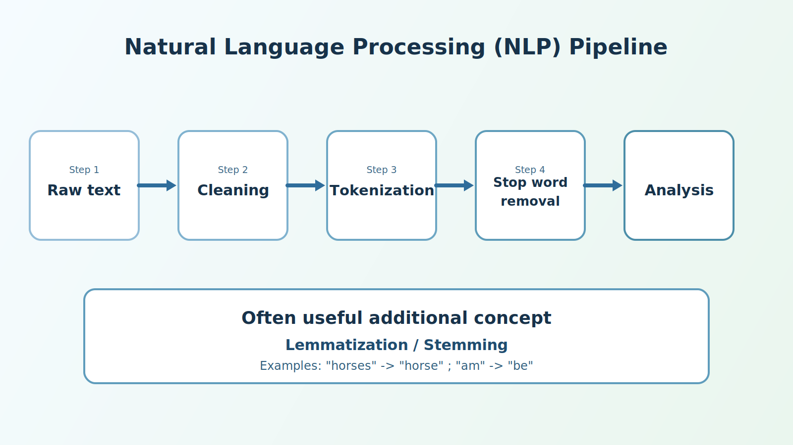
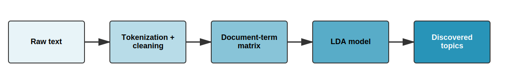

# Quiz 1 Review {.smaller}

- Use GitHub to save your files
- How to return to GitHub to see the previous version of your TP1
- Run table() before and after
- Avoid putting citations in raw text
- Do not leave unused code

## Using Citations in Markdown {.smaller}

### The wrong way :x:

```markdown
According to Wickham (2014) [@wickham14], tidy data has three properties.
```
According to Wickham (2014) (Wickham, 2014), tidy data has three properties.

### The two options :white_check_mark:
```markdown
According to @wickham14, tidy data has three properties.
```
According to Wickham (2014), tidy data has three properties:

```markdown
Tidy data has three properties [@wickham14].
```
Tidy data has three properties (Wickham, 2014).

## Do Not Leave Unused Code {.smaller}

Use GitHub history to see changes


## TP2 - Midterm Assignment {.smaller}

- Due on March 11, 2025, before midnight
- 20% of the final grade

## {transition="none"}


## {transition="none"}


## Suggested Template {.smaller}

1. Introduction
2. Research Question
3. Literature Review
4. Hypotheses Derived from the Literature
5. Data and Methodology
6. Results
7. Discussion
8. Conclusion

# Introduction to Text Analysis

## Course Structure

::: {.r-stack}


{.fragment}

:::

## Why Analyze Text?

### Data is Everywhere :earth_americas: :earth_africa: :earth_asia:

- Large quantities of text data are available
- Increasingly accessible research methods
- Any ideas on different sources of text data?

## {background-image="img/newspapers.webp" background-size="cover"}

## {background-image="img/assnat.avif" background-size="cover"}

## The Explosion of Text Data

- Social media
- Press articles
  - [Eureka and Factiva](https://bib.umontreal.ca/guides/types-documents/journaux)
- Legal documents
- Surveys (open-ended questions)
- Emails
- Instant messages
- And much more

## What Can We Do with Text?

1. Sentiment analysis
2. Document classification
3. Topic extraction
4. Automatic summarization
5. Discourse analysis

## Different Text Analysis Methods


# The Text Processing Pipeline

##

{width=100% fig-alt="Natural Language Processing Pipeline"}

## Tokenization

### Splitting text into words

```
"I love analyzing text"
      ↓
["I", "love", "analyzing", "text"]
```

## Stopwords

### What to remove?

**French**: le, la, de, et, un, dans, est...

**English**: the, a, an, in, on, at, is...

## Before and After

::::{.columns}

:::{.column width="50%"}

### Before
```
the cat is on the rug
```
6 words

:::

:::{.column width="50%"}

### After
```
chat tapis
```
2 meaningful words

:::

::::

# Introduction to Regular Expressions

## What Are We Trying to Do?

- Find patterns in text
- Example: Find all phone numbers in a document
- Example: Extract all emails from a text

## A Concrete Example

Imagine you have this text:

```text
Contact: Marie (514-555-1234) 
Email: marie@udem.ca
Contact: Pierre (438-555-5678)
Email: pierre@udem.ca
```

How do we automatically find all phone numbers?

## The "Manual" Solution

1. Look for digits
2. Grouped in 3s or 4s
3. Separated by hyphens
4. Starting with 514 or 438

## The Regex Solution

```r
# A pattern that finds phone numbers
"\\d{3}-\\d{3}-\\d{4}"
```

## Breaking Down the Pattern

- `\d` : a digit (0-9)
- `{3}` : exactly 3 times
- `-` : a hyphen
- So `\d{3}-\d{3}-\d{4}` finds: "514-555-1234"

## A Second Example: Emails

Let's use the same text:

```text
Contact: Marie (514-555-1234)
Email: marie@udem.ca
Contact: Pierre (438-555-5678)
Email: pierre@udem.ca
```

How to automatically find all email addresses?

## The "Manual" Solution

1. Look for letters
2. Followed by a @ symbol
3. Followed by the domain name
4. Ending with .ca, .com, etc.

## The Regex Solution

```r
# A pattern that finds email addresses
"[a-zA-Z0-9._%+-]+@[a-zA-Z0-9.-]+\\.[a-zA-Z]{2,}"
```

## Breaking Down the Pattern

- `[a-zA-Z0-9._%+-]+` : letters, numbers, and special characters (before @)
- `@` : the @ symbol
- `[a-zA-Z0-9.-]+` : letters, numbers, periods, and hyphens (domain name)
- `\\.` : a period (escaped with \\)
- `[a-zA-Z]{2,}` : at least 2 letters (.ca, .com, .info, etc.)
- So this pattern finds: "marie@udem.ca" and "jean.dupont@umontreal.ca"

## Why is it Useful?

- Automates pattern searching
- Works on any amount of text
- Faster and more reliable than manual searching
- Essential for cleaning text data

## Use in R

### The stringr Package

```r
# Installation if necessary
install.packages("stringr")

# Loading
library(stringr)
```

- Part of the tidyverse
- Simple and consistent functions
- Clear documentation with many examples

## Main stringr Functions

```r
# Detect a pattern
str_detect(string, pattern)

# Extract a pattern
str_extract(string, pattern)

# Replace a pattern
str_replace(string, pattern, replacement)

# Split according to a pattern
str_split(string, pattern)
```

## Practical Example

```r
library(stringr)

# Our text
text <- "Contact: Marie (514-555-1234), Pierre (438-555-5678)"

# Find all numbers
numeros <- str_extract_all(text, "\\d{3}-\\d{3}-\\d{4}")

# Result
print(numeros)
# [[1]]
# [1] "514-555-1234" "438-555-5678"
```

## Basic Regex Building Blocks{.smaller}

### `\d` : Digits

```r
text <- "I was born in 1990 and I am 33 years old"
str_extract_all(text, "\\d+")
# Result: [1] "1990" "33"
```

### `[A-Z]` : Uppercase letters

```r
text <- "QUEBEC is a city in Canada"
str_extract(text, "[A-Z]+")
# Result: "QUEBEC"
```

### `\s` : Spaces

```r
text <- "key     word"
str_replace_all(text, "\\s+", " ")
# Result: "key word"
```

## Special Characters {.smaller}

### `\w` : Word (letters + digits + _)

```r
text <- "user_123 posted!"
str_extract_all(text, "\\w+")
# Result: [1] "user_123" "posted"
```

### `.` : Any character

```r
text <- "cat, cot, cut"
str_extract_all(text, "c.t")
# Result: [1] "cat" "cot" "cut"
```

## Use Cases for Text Analysis {.smaller}

### Remove URLs from text

```r
text <- "Visit https://www.umontreal.ca or http://fas1001.com for more info"
clean_text <- str_remove_all(text, "https?://[\\w\\./]+")
# Result: "Visit  or  for more info"
```

### Extract hashtags

```r
tweet <- "Great evening! Thanks @JeanDupont #Montreal #UdeM"
hashtags <- str_extract_all(tweet, "#\\w+")
# Result: [1] "#Montreal" "#UdeM"
```

### Normalize dates

```r
text <- "Meeting on 2025-01-15 or on 15/01/2025"
dates <- str_extract_all(text, "\\d{4}-\\d{2}-\\d{2}|\\d{2}/\\d{2}/\\d{4}")
# Result: [1] "2025-01-15" "15/01/2025"
```

## Quantifiers: How Many Times?{.smaller}

### The `+` : "one or more"
```r
# Find numbers (one or more digits)
text <- "I have 1 cat and 22 fish"
str_extract_all(text, "\\d+")
# Result: [1] "1" "22"
```

### The `*` : "zero or more"
```r
# Find words with or without 's' at the end
text <- "cat cats dog dogs"
str_extract_all(text, "cat[s]*")
# Result: [1] "cat" "cats"
```

### The `?` : "optional (zero or one)"
```r
# Find 'behaviour' or 'behavior'
text <- "behaviour and behavior"
str_extract_all(text, "behaviou?r")
# Result: [1] "behaviour" "behavior"
```

## Practical Examples for the Social Sciences{.smaller}

### Extract Canadian postal codes
```r
address <- "My address is H2X 1Y6"
str_extract(address, "[A-Z]\\d[A-Z]\\s?\\d[A-Z]\\d")
# Result: "H2X 1Y6"
```

### Extract Twitter handles
```r
tweet <- "Follow me @MonProfR and @UdeM"
str_extract_all(tweet, "@\\w+")
# Result: [1] "@MonProfR" "@UdeM"
```

### Extract percentages
```r
text <- "The participation rate is 67.5% and support is at 82%"
str_extract_all(text, "\\d+\\.?\\d*%")
# Result: [1] "67.5%" "82%"
```

## How to Use Regex in R?

:::: {.columns}

::: {.column width="40%"}

1. Phone numbers?
2. Email addresses?
3. Percentages?

**Artificial Intelligence :wink:**

:::

::: {.column width="65%"}

{.absolute top=100 left=600 width=50%}
:::

::::

# Sentiment Analysis

## Dictionary-Based Analysis

### The Principle

Assign a score to each word based on its emotional connotation

| Word | Score |
|-----|-------|
| excellent | +3 |
| good | +1 |
| bad | -1 |
| horrible | -3 |

Text score = sum or average of the scores

## What is a Sentiment Dictionary? {.smaller}

### A list of words with predefined scores

- Manually created by experts
- Each word associated with a score (positive/negative)

### Advantages

- Fast and reproducible
- No training required

## Popular Dictionaries {.smaller}

| Dictionary | Language | Score Type | Usage |
|--------------|--------|---------------|-------------|
| **AFINN** | EN | -5 to +5 | Social media, reviews |
| **Bing** | EN | Pos/Neg | General analysis |
| **NRC** | EN/FR | 8 emotions | Emotional analysis |
| **Lexicoder** | EN/FR | Binary | Political texts |
| **VADER** | EN | -1 to +1 | Twitter, slang |

## The AFINN Dictionary {.smaller}

### Created by Finn Årup Nielsen (2011)

- 2,477 words in English
- Scores from -5 (very negative) to +5 (very positive)
- Optimized for short texts (Twitter, reviews)
- Includes informal vocabulary

### Examples

| Word | Score | Word | Score |
|-----|-------|-----|-------|
| love | +3 | hate | -3 |
| excellent | +3 | terrible | -3 |
| good | +3 | bad | -3 |
| disappointed | -2 | recommend | +2 |

## Analysis with AFINN: La ligne rouge {transition="none"}


::: {.columns}

::: {.column width="60%"}

> Super good kebab! The portions are generous, the prices are really reasonable, and the quality is there. Tasty meat, fresh bread, and everything is well seasoned. An excellent address for a meal that is good without breaking the bank. I recommend!

:::

::: {.column width="40%"}

- Sentiment: Positive
- Topics: Food, Price
- Rating: 5/5

:::

::::

##

{width=100% fig-alt="Natural Language Processing Pipeline"}


## Step 1: Raw Text {transition="none"}

```r
# Create a data.frame with our review
review <- data.frame(
  restaurant = "La ligne rouge",
  text = "Super good kebab! The portions are generous, the prices are really reasonable, and the quality is there. Tasty meat, fresh bread, and everything is well seasoned. An excellent address for a meal that is good without breaking the bank. I recommend!",
  stringsAsFactors = FALSE
)
```

### Yields a dataframe like this


| restaurant      | text                    |
|-----------------|-------------------------|
| La ligne rouge  | Super good kebab! [...] |


## Step 2: Cleaning {transition="none"}
```r
# Cleaning with stringr
review_clean <- review
review_clean$text <- stringr::str_to_lower(review_clean$text)                 # Lowercase
review_clean$text <- stringr::str_remove_all(review_clean$text, "!")          # Exclamations
review_clean$text <- stringr::str_remove_all(review_clean$text, "\\.")        # Periods
review_clean$text <- stringr::str_remove_all(review_clean$text, ",")          # Commas
```

::: {.columns}
::: {.column width="100%"}
> <span style="color:#880808">S</span>uper good kebab<span style="color:#880808">!</span> <span style="color:#880808">T</span>he portions are generous<span style="color:#880808">,</span> the prices are really reasonable<span style="color:#880808">,</span> and the quality is there<span style="color:#880808">.</span> <span style="color:#880808">T</span>asty meat<span style="color:#880808">,</span> fresh bread<span style="color:#880808">,</span> and everything is well seasoned<span style="color:#880808">.</span> <span style="color:#880808">A</span>n excellent address for a meal that is good without breaking the bank<span style="color:#880808">.</span> <span style="color:#880808">I</span> recommend<span style="color:#880808">!</span>
:::
:::

## Step 2: Cleaning {transition="none"}
```r
# Cleaning with stringr
review_clean <- review
review_clean$text <- stringr::str_to_lower(review_clean$text)                 # Lowercase
review_clean$text <- stringr::str_remove_all(review_clean$text, "!")          # Exclamations
review_clean$text <- stringr::str_remove_all(review_clean$text, "\\.")        # Periods
review_clean$text <- stringr::str_remove_all(review_clean$text, ",")          # Commas
```

::: {.columns}
::: {.column width="100%"}
> super good kebab the portions are generous the prices are really reasonable and the quality is there tasty meat fresh bread and everything is well seasoned an excellent address for a meal that is good without breaking the bank i recommend
:::
:::

## Step 3: Tokenization {transition="none"}


:::: {.columns}

::: {.column width="60%"}

```r
tokens <- tidytext::unnest_tokens(
  review_clean,
  output = word,
  input = text
)

```
:::

::: {.column width="40%"}


```
r$> head(tokens, 10)
       restaurant     word
1  La ligne rouge    super
2  La ligne rouge     good
3  La ligne rouge    kebab
4  La ligne rouge      the
5  La ligne rouge portions
6  La ligne rouge      are
7  La ligne rouge generous
8  La ligne rouge      the
9  La ligne rouge   prices
10 La ligne rouge      are
```

:::

::::

## Step 4: Stop Word Removal {transition="none"}


:::: {.columns}

::: {.column width="60%"}

```r
# Get stop words
stop_words <- tidytext::get_stopwords(language = "en")

# Remove stop words with dplyr anti_join
tokens_clean <- dplyr::anti_join(
  tokens, 
  stop_words,
  by = "word"
)

```

:::

::: {.column width="40%"}

```
r$> head(tokens_clean, 10)
       restaurant       word
1  La ligne rouge      super
2  La ligne rouge       good
3  La ligne rouge      kebab
4  La ligne rouge   portions
5  La ligne rouge   generous
6  La ligne rouge     prices
7  La ligne rouge     really
8  La ligne rouge reasonable
9  La ligne rouge    quality
10 La ligne rouge      tasty
```

:::

::::

## Step 5: Analysis (AFINN) {transition="none"}


::: {.columns}

::: {.column width="70%"}

```r
# Get the AFINN lexicon
afinn <- tidytext::get_sentiments("afinn")

# Join with our tokens
sentiment_scores <- dplyr::inner_join(
  tokens_clean,
  afinn,
  by = "word"
)

# See the scores
arranged_scores <- sentiment_scores %>%
  dplyr::select(word, value) %>%
  dplyr::arrange(dplyr::desc(value))
```

:::

::: {.column width="30%"}

```
r$> head(arranged_scores, 10)
       word value
1     super     3
2      good     3
3 excellent     3
4      good     3
5  generous     2
6 recommend     2
7     fresh     1
```

:::

::::

## Step 5: Analysis (AFINN) {transition="none"}

```r
total_sentiment <- dplyr::summarise(
  sentiment_scores,
  n_words = dplyr::n(),
  total_score = sum(value),
  avg_score = mean(value)
)

```

```
r$> total_sentiment
  n_words total_score avg_score
1       7          17  2.428571
```

## With Multiple Texts {.smaller transition="none"}

> Nothing exceptional, just edible. I had good feedback about the food and I was very, very disappointed. Not to mention cash only which for me is unacceptable. Too many good restaurants in the neighborhood, I won't go back there

> Food is good and price is ok. The only issu is the attitude of the staff. The lady at he cash register and the guy that takes the orders seriously lack client service skills. Both are  very rude. Hygiene is another issue, there are flies all over the place. In addition to all this, they only take cash.


```r
# Create a data.frame with multiple reviews
reviews <- data.frame(
  restaurant = "La ligne rouge",
  text = c(
    "Super good kebab! The portions are generous, the prices are really reasonable, and the quality is there. Tasty meat, fresh bread, and everything is well seasoned. An excellent address for a meal that is good without breaking the bank. I recommend!",
    "Nothing exceptional, just edible. I had good feedback about the food and I was very, very disappointed. Not to mention cash only which for me is unacceptable. Too many good restaurants in the neighborhood, I won't go back there",
    "Food is good and price is ok. The only issu is the attitude of the staff. The lady at he cash register and the guy that takes the orders seriously lack client service skills. Both are very rude. Hygiene is another issue, there are flies all over the place. In addition to all this, they only take cash."
  ),
  stringsAsFactors = FALSE
) %>%
  dplyr::mutate(id = 1:nrow(.))
```

## Cleaning Multiple Texts {transition="none"}


```r
reviews_clean <- reviews
reviews_clean$text <- stringr::str_to_lower(reviews_clean$text)                 # Lowercase
reviews_clean$text <- stringr::str_remove_all(reviews_clean$text, "!")          # Exclamations
reviews_clean$text <- stringr::str_remove_all(reviews_clean$text, "\\.")        # Periods
reviews_clean$text <- stringr::str_remove_all(reviews_clean$text, ",")          # Commas

```

## Step 3: Tokenization {transition="none"}


::::{.columns}

:::{.column width="60%"}

```r
tokens <- tidytext::unnest_tokens(
  reviews_clean,
  output = word,
  input = text
)

```
:::

:::{.column width="40%"}
```
r$> head(tokens, 10)
       restaurant id     word
1  La ligne rouge  1    super
2  La ligne rouge  1     good
3  La ligne rouge  1    kebab
4  La ligne rouge  1      the
5  La ligne rouge  1 portions
6  La ligne rouge  1      are
7  La ligne rouge  1 generous
8  La ligne rouge  1      the
9  La ligne rouge  1   prices
10 La ligne rouge  1      are
```
:::

::::

## Step 4: Stop Word Removal {transition="none"}

::::{.columns}

:::{.column width="60%"}

```r
# Get stop words
stop_words <- tidytext::get_stopwords(language = "en")

# Remove stop words with dplyr anti_join
tokens_clean <- dplyr::anti_join(
  tokens, 
  stop_words,
  by = "word"
)

```
:::

:::{.column width="40%"}
```
r$> head(tokens_clean, 10)
       restaurant id       word
1  La ligne rouge  1      super
2  La ligne rouge  1       good
3  La ligne rouge  1      kebab
4  La ligne rouge  1   portions
5  La ligne rouge  1   generous
6  La ligne rouge  1     prices
7  La ligne rouge  1     really
8  La ligne rouge  1 reasonable
9  La ligne rouge  1    quality
10 La ligne rouge  1      tasty
```
:::

::::


## Step 5: Sentiment Analysis (AFINN) {transition="none"}


::::{.columns}

:::{.column width="50%"}

```r
# Get the AFINN lexicon
afinn <- tidytext::get_sentiments("afinn")

# Join with our tokens
sentiment_scores <- dplyr::inner_join(
  tokens_clean,
  afinn,
  by = "word"
)

```

:::

:::{.column width="50%"}

```
r$> head(sentiment_scores, 10)
       restaurant id         word value
1  La ligne rouge  1        super     3
2  La ligne rouge  1         good     3
3  La ligne rouge  1     generous     2
4  La ligne rouge  1        fresh     1
5  La ligne rouge  1    excellent     3
6  La ligne rouge  1         good     3
7  La ligne rouge  1    recommend     2
8  La ligne rouge  2         good     3
9  La ligne rouge  2 disappointed    -2
10 La ligne rouge  2 unacceptable    -2
```

:::

::::

## Step 5: Sentiment Analysis (AFINN) {transition="none" .smaller}


```r
# Calculate summary statistics per review
sentiment_summary <- sentiment_scores %>%
  group_by(id, restaurant) %>%
  summarise(
    total_sentiment = sum(value),            # Sum of all sentiment scores
    mean_sentiment = mean(value),            # Average sentiment
    word_count = n(),                        # Number of sentiment words
    min_sentiment = min(value),              # Most negative word
    max_sentiment = max(value)               # Most positive word
  ) %>%
  ungroup()

```

### Here are the results


```
r$> print(sentiment_summary)
# A tibble: 3 × 7
     id restaurant     total_sentiment mean_sentiment word_count min_sentiment max_sentiment
  <int> <chr>                    <dbl>          <dbl>      <int>         <dbl>         <dbl>
1     1 La ligne rouge              17           2.43          7             1             3
2     2 La ligne rouge               2           0.5           4            -2             3
3     3 La ligne rouge               1           0.5           2            -2             3
```


## Reassembling the Data{.smaller transition="none"}

```r
# First, let's create a dataframe with just id and text
original_texts <- reviews %>%
  select(id, text)

# Then merge it with your sentiment summary
sentiment_summary_with_text <- sentiment_summary %>%
  left_join(original_texts, by = "id")
```
### Merging the original text with the analysis:

```
r$> sentiment_summary_with_text
# A tibble: 3 × 8
     id restaurant     total_sentiment mean_sentiment word_count [..] text                                                   
  <int> <chr>                    <dbl>          <dbl>      <int> [..] <chr>                                                  
1     1 La ligne rouge              17           2.43          7 [..] Super good kebab! [...]
2     2 La ligne rouge               2           0.5           4 [..] Nothing exceptional [...]
3     3 La ligne rouge               1           0.5           2 [..] Food is good and price is ok. [...]

```

## Practical Advice 

1. **Validation**
   - Manually check results
   - Compare dictionaries
   - Document methodological choices

2. **Limitations**
   - No dictionary is perfect
   - Context is always important
   - Validate with qualitative analysis

## Which Lexicon to Choose? {.smaller}

| Lexicon | Score Type | Strengths | Ideal Usage | Discipline |
|---------|---------------|---------|-------------------|------------|
| AFINN | -5 to +5 | Nuanced, simple | Social media, reviews | Marketing |
| BING | Pos/Neg | Simple, precise | General analysis | Social Sciences |
| NRC | 8 emotions | Context-rich | Emotional analysis | Psychology |
| Lexicoder | Binary + themes | Academically validated | Political discourse | Political Science |
| VADER | -1 to +1 | Handles emojis/web | Social media | Communications |

## Limitations of Sentiment Analysis {.smaller}

::::{.columns}

:::{.column width="50%"}

### Linguistic Problems

- Irony: "Great, another delay..."
- Idiomatic expressions: "Under the weather"
- Cultural context: "Sick" = ill or cool?
- Complex negations: "Not bad at all"

:::

:::{.column width="50%"}

### Technical Limitations

- Dictionary dependency
- Ambiguous words
- Aggregation hiding nuances
- Evolution of language

:::


::::

## When NOT to Use

- Very short texts (< 5 words)
- Highly specialized vocabulary
- Strong presence of irony/sarcasme

## Best Practices

1. Manually validate a sample
2. Use multiple dictionaries
3. Analyze by segments
4. Document your choices
5. Acknowledge limitations

## LDA: Latent Dirichlet Allocation {transition="none"}

:::: {.columns}
::: {.column width="60%"}
### What is it?
- A method to **automatically discover** topics in a collection of texts
- Developed in 2003 (Blei, Ng, Jordan)
- **Unsupervised learning**: the algorithm discovers structures on its own
:::

::: {.column width="40%"}

:::
::::

## The Intuition Behind LDA {transition="none"}

### The Central Idea
- Each **document** contains multiple **topics**
- Each **topic** is a collection of related **words**
- Words appear with different **probabilities** in each topic

## How Does LDA Work? {transition="fade"}

### Unsupervised Approach
1. **No prior knowledge**
   - No predefined word list
   - No labels needed
   
2. **Automatic Discovery**
   - Relationships between words emerge from the data
   - Topics form naturally

## The Process in Practice {transition="none"}

### Simplified Steps
1. Transform texts into numbers
2. Start with random assignments
3. Repeat thousands of times:
   - For each word: which topic is most likely?
   - Update distributions
4. Arrive at coherent groups

## Advantages for the Social Sciences {transition="none"}

### Why use LDA in the social sciences?

1. **Analysis of large amounts of text** (political speeches, social media)
2. **Objective topic discovery** without prior interpretive bias
3. **Tracking the evolution of discourse** over time
4. **Possible combination with sentiment analysis**

## Limitations to Keep in Mind

- Number of topics (k) must be defined in advance
- Topics require human interpretation
- Needs a sufficient volume of data

## The 4 Steps of the LDA Process



## Topic Modeling {transition="none"}

```r
# Loading libraries
library(tidytext)
library(tidyr)
library(dplyr)
library(ggplot2)
library(topicmodels)

# Load restaurant review examples
reviews <- data.frame(
  restaurant = "La ligne rouge",
  text = c(
    "Super good kebab! The portions are generous, the prices are really reasonable, and the quality is there. Tasty meat, fresh bread, and everything is well seasoned. An excellent address for a meal that is good without breaking the bank. I recommend!",
    "Nothing exceptional, just edible. I had good feedback about the food and I was very, very disappointed. Not to mention cash only which for me is unacceptable. Too many good restaurants in the neighborhood, I won't go back there",
    "Food is good and price is ok. The only issu is the attitude of the staff. The lady at he cash register and the guy that takes the orders seriously lack client service skills. Both are very rude. Hygiene is another issue, there are flies all over the place. In addition to all this, they only take cash."
  ),
  stringsAsFactors = FALSE
) %>%
  dplyr::mutate(id = 1:nrow(.))
```

## Creating the Document-Term Matrix {transition="none"}

```r
reviews_dtm <- reviews %>%
  mutate(doc_id = paste0("doc_", id)) %>%
  tidytext::unnest_tokens(word, text) %>%
  anti_join(stop_words) %>% # Remove stop words
  count(doc_id, word) %>%
  cast_dtm(doc_id, word, n)

# Display a preview of the matrix
reviews_dtm
```

```
<<DocumentTermMatrix (documents: 3, terms: 71)>>
Non-/sparse entries: 77/136
Sparsity           : 64%
Maximal term length: 11
Weighting          : term frequency (tf)
Sample             :
      Terms
Docs   food good price quality
  doc_1    0    2     0       1
  doc_2    1    1     0       0
  doc_3    1    1     1       0
```

## Applying the LDA Model {transition="none"}

```r
# Run the LDA model
set.seed(123) # For reproducibility
lda_model <- LDA(reviews_dtm, k = 2, control = list(seed = 123, verbose = TRUE))

# Examine the topic distribution for each document
topics <- tidy(lda_model, matrix = "gamma")
topics_wide <- topics %>%
  pivot_wider(names_from = topic, values_from = gamma)

print(topics_wide)
```

```
# A tibble: 3 × 3
  document   `1`   `2`
  <chr>    <dbl> <dbl>
1 doc_1    0.692 0.308
2 doc_2    0.333 0.667
3 doc_3    0.391 0.609
```

## Extracting the Top Terms for Each Topic {transition="none"}

:::: {.columns}

::: {.column width="50%"}

```r
# Extract the top terms for each topic
top_terms <- tidy(lda_model, matrix = "beta") %>%
  group_by(topic) %>%
  slice_max(beta, n = 10) %>%
  arrange(topic, -beta)

# Display the top terms for each topic
print(top_terms)
```

:::

::: {.column width="50%"}

```
r$> print(top_terms)
# A tibble: 20 × 3
# Groups:   topic [2]
   topic term           beta
   <int> <chr>         <dbl>
 1     1 portions     0.0384
 2     1 hygiene      0.0381
 3     1 takes        0.0374
 4     1 seasoned     0.0366
 5     1 recommend    0.0364
 6     1 lady         0.0352
 7     1 disappointed 0.0334
 8     1 client       0.0333
 9     1 super        0.0328
10     1 address      0.0321
11     2 cash         0.113 
12     2 food         0.0600
13     2 bank         0.0390
14     2 meal         0.0389
15     2 feedback     0.0377
16     2 bread        0.0374
17     2 meat         0.0371
18     2 kebab        0.0350
19     2 prices       0.0317
20     2 generous     0.0305
```

:::

::::

## Interpretation of Results {.smaller transition="none"}

:::: {.columns}
::: {.column width="50%"}
### Topic: Service and Experience

- portions (0.0384)
- hygiene (0.0381)
- takes (0.0374)
- seasoned (0.0366)
- recommend (0.0364)
- lady (0.0352)
- disappointed (0.0334)
- client (0.0333)
- super (0.0328)
- address (0.0321)

:::

::: {.column width="50%"}
### Topic: Food and Price

- cash (0.1130)
- food (0.0600)
- bank (0.0390)
- meal (0.0389)
- feedback (0.0377)
- bread (0.0374)
- meat (0.0371)
- kebab (0.0350)
- prices (0.0317)
- generous (0.0305)

:::
::::


## Results with k=3 Topics {.smaller}

### Topic 1: Food Quality
good, kebab, meat, bread, quality, tasty, fresh, seasoned

### Topic 2: Service and Experience
staff, attitude, rude, disappointed, exceptional, lady, client

### Topic 3: Price and Payment
prices, reasonable, cash, bank, meal, generous, portions

## Results with k=5 Topics {.smaller}

### Discovered Topics

1. **Culinary Quality**: kebab, meat, bread, fresh, tasty
2. **Portions and Generosity**: portions, generous, quality
3. **Price**: prices, reasonable, bank, meal
4. **Customer Service**: staff, attitude, lady, client
5. **Problems**: disappointed, rude, cash, hygiene, flies

## How to Choose k? {.smaller}

### Common Approaches

1. **Domain Intuition**: How many topics do you expect?
2. **Multiple Trials**: Test k=2, 3, 5, 10 and compare
3. **Statistical Metrics**: Perplexity, coherence
4. **Interpretability**: Are the topics coherent?

### Rule of Thumb
Start small (k=2-5) and increase progressively

## Use Cases in the Social Sciences

- Analyze thousands of parliamentary speeches
- Identify topics in election campaigns
- Track the evolution of public debates over time
- Discover patterns in open-ended survey questions

## Classification of Reviews by Topic {transition="none"}

```r
# Display the topic distribution for each review
document_topics <- augment(lda_model, data = reviews_dtm)

# Format for readability
review_classifications <- document_topics %>%
  select(document, .topic) %>%
  distinct() %>%
  mutate(
    review_id = as.integer(gsub("doc_", "", document)),
    review_text = reviews$text[review_id],
    primary_topic = ifelse(.topic == 1, "Food", "Service/Experience")
  ) %>%
  select(document, review_text, primary_topic) %>%
  arrange(document)

# Display review classification
head(review_classifications, 3)

```

## Classification of Reviews by Topic {.smaller transition="none"}

:::: {.columns}
::: {.column width="45%"}
### Topic: Food

::: {style="background-color: #f0f8ff; padding: 10px; border-left: 4px solid #4682b4;"}
**Review 1**  
"Super good kebab! The portions are generous, the prices are really reasonable..."  
**Keywords:** kebab, meat, bread, portions
:::
:::

::: {.column width="55%"}
### Topic: Service/Experience

::: {style="background-color: #fff0f5; padding: 10px; border-left: 4px solid #db7093; margin-bottom: 10px;"}
**Review 2**  
"Nothing exceptional, just edible. I had good feedback about the food and I was very, very disappointed..."  
**Keywords:** disappointed, cash only, exceptional
:::

::: {style="background-color: #fff0f5; padding: 10px; border-left: 4px solid #db7093;"}
**Review 3**  
"Food is good and price is ok. The only issu is the attitude of the staff..."  
**Keywords:** staff, attitude, hygiene
:::
:::
::::


# Conclusion
