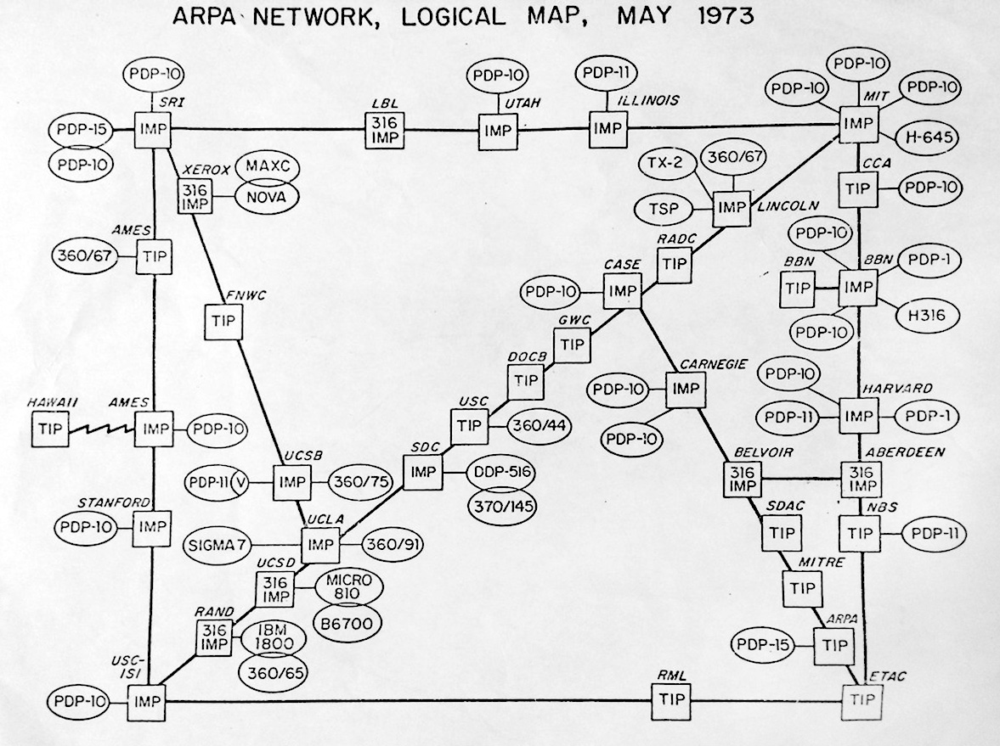
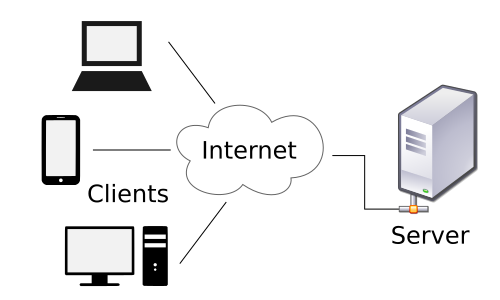
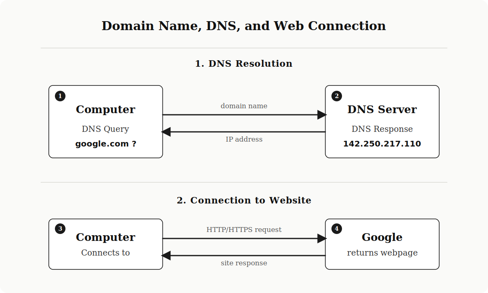
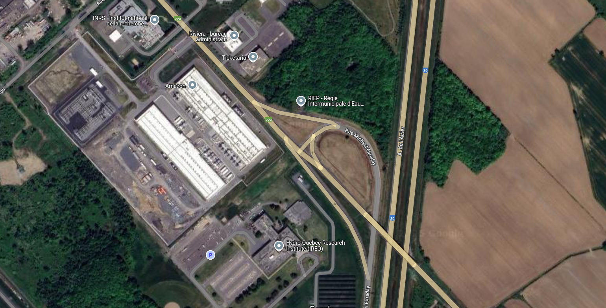
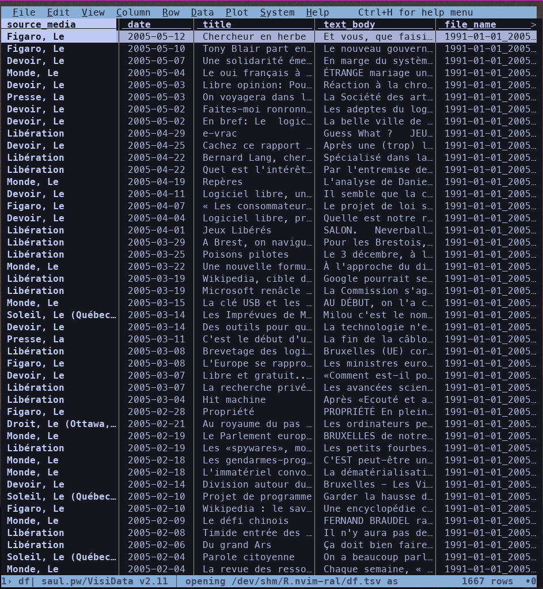
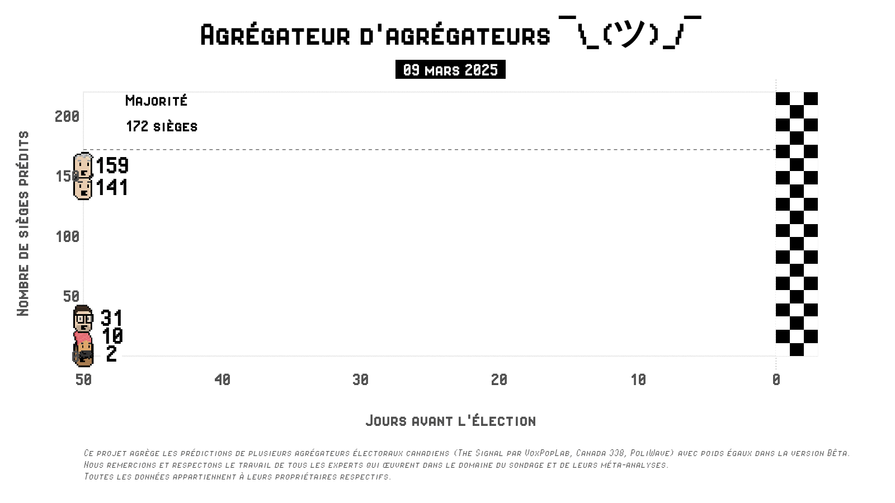
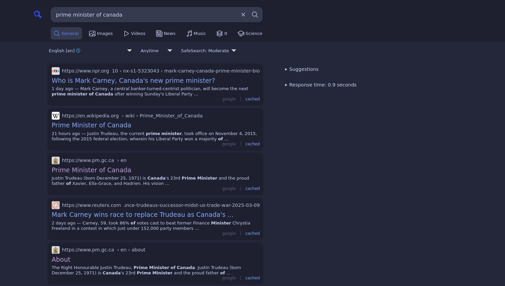
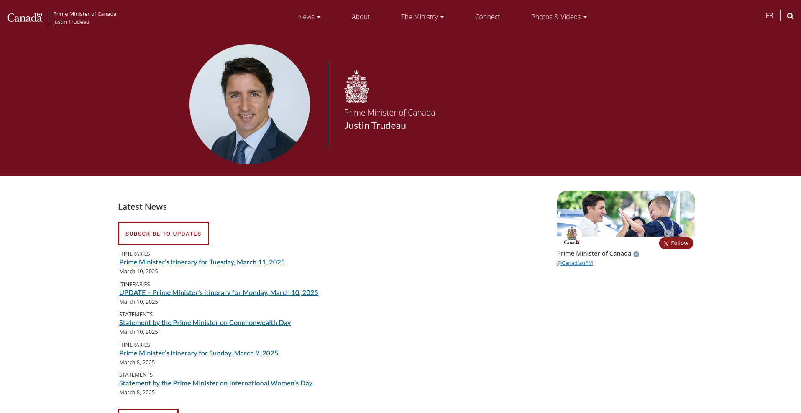
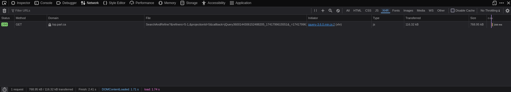
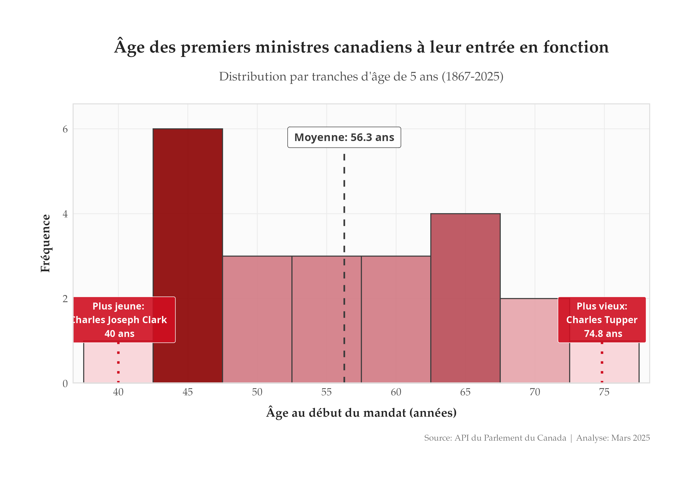

# Review of Assignment 2

- Difficult?
- Codebook issues?
- Questions?

## Course Structure

::: {.r-stack}


{.fragment}

:::

## Course Outline {.smaller}

1. Introduction to the Internet
2. Web scraping
3. Concrete examples

# The Internet

## What is the Internet? {.smaller}

:::: {.columns}
::: {.column width="60%"}

### A network of networks

- **Global interconnection** of computer networks
- **Data exchange** via standardized protocols
- Invented in the 1960s (ARPANET)
- Became public in the 1990s

### It is not the Web

- Internet = the infrastructure
- Web = one service among others (email, FTP, etc.)
:::

::: {.column width="40%"}
{width="100%"}
<p style="font-size: 0.6em; text-align: center;">ARPANET in 1973</p>
:::
::::

## Client-Server Architecture {.smaller}

:::: {.columns}
::: {.column width="40%"}

**Fundamental Principle**

- **Client**: requests resources
- **Server**: provides resources

**Examples**

- Client: web browser, mobile application
- Server: computer hosting a website

:::

::: {.column width="50%"}

{width="100%"}

:::
::::

## Physical Reality of the Internet {.smaller}

:::: {.columns}
::: {.column width="60%"}
### The Internet is tangible
- Undersea cables crossing oceans
- Fiber optics, copper, satellites
- Routers and switches
- Physical servers in datacenters

### The "cloud" does not exist
- "The cloud is just someone else's computer"
- Data is physically stored somewhere
:::

::: {.column width="40%"}
{width="100%"}
<p style="font-size: 0.6em; text-align: center;">Physical map of the Internet</p>
:::
::::

## {background-image="img/internet_map.jpg"}

## Traceroute to umontreal.ca

```bash
❯ tcptraceroute umontreal.ca
Selected device wlp3s0, address 192.168.2.71, port 45431 for outgoing packets
Tracing the path to umontreal.ca (132.204.8.144) on TCP port 80 (http), 30 hops max
 1  192.168.2.1  5.618 ms  1.743 ms  2.499 ms
 2  10.11.16.41  3.860 ms  4.041 ms  3.737 ms
 3  * **
 4  64.230.36.102  6.344 ms  7.423 ms  9.020 ms
 5  64.230.91.65  5.214 ms  5.570 ms  6.500 ms
 6  192.77.55.233  6.890 ms  6.169 ms  5.786 ms
 7  imtrl-rq-ic-dmtrl-rq.risq.net (192.77.55.246)  5.837 ms  9.565 ms  7.724 ms
 8  umontreal2-contenu-dmtrl-um.risq.net (132.202.51.145)  32.002 ms  6.428 ms  7.800 ms
 9  * **
10  umontreal2-contenu-membre.risq.net (206.167.253.66)  33.855 ms  8.017 ms  6.263 ms
11  * **
12  * **
13  varnish.ti.umontreal.ca (132.204.8.144) [open]  10.542 ms  9.826 ms  13.408 ms
```

## The path of a web request to UdeM {.smaller}

:::: {.columns}
::: {.column width="50%"}
1. **Your computer (192.168.2.71)**  
   Starting point in Quebec City

2. **Residential router (192.168.2.1)** 
   Your gateway to the Internet

3. **Bell Fibe router (10.11.16.41)**  
   Entry into the Bell Canada infrastructure

4. **Bell Canada backbone (64.230.36.102)**
   Bell's main infrastructure - high-capacity cables 
   (up to 100 Tbps on certain lines)

5. **Bell regional point (64.230.91.65)**
   Transfer to Montreal - long-distance connection
:::

::: {.column width="50%"}

6. **RISQ - Entry point (192.77.55.233)**
   Entry into the Réseau d'Informations Scientifiques du Québec (RISQ)

7. **RISQ - Montreal Interconnection (192.77.55.246)**
   Internal routing of the Quebec academic network

8. **RISQ - UdeM Gateway (132.202.51.145)**
   The specific gateway to the Université de Montréal

9. **UdeM - Member network (206.167.253.66)**
    Transfer to UdeM's internal network

10. **UdeM Varnish Server (132.204.8.144)**
    Final destination: cache server accelerating site delivery
:::
::::

## 


## 


## Physical Infrastructure

### Try this!
Type in your browser: **http://142.250.217.110**  

:::: {.columns}

::: {.column width="50%"}

- Computers: use numbers (IP)
- Humans: prefer names (google.com)
- DNS = the directory making the connection

:::

::: {.column width="50%"}

{width="100%"}

:::
::::

## Physical Footprint of Data {.smaller}

:::: {.columns}

::: {.column width="50%"}

### Where is your data stored?
- Messenger messages
- Instagram photos
- Google Drive documents
- Netflix history

### Geographic Redundancy
- Same data stored in multiple datacenters
- Protection against regional outages

:::

::: {.column width="50%"}




:::

::::

## When You Visit a Website

:::: {.columns}

::: {.column width="40%"}

1. JavaScript - The website's behavior
2. HTML - The structure
3. CSS - The style
4. API - The data

:::

::: {.column width="60%"}


:::

::::

# Web Scraping

## What is Web Scraping?

**Harvesting / Extracting / Scraping** of data on the Web

:::: {.columns}
::: {.column width="45%"}


:::
::: {.column width="10%"}

➡️  

:::
::: {.column width="45%"}



:::
::::

## 


##



## Digital Revolution

1. Comprehensive access to vast corpora of documents:
   media, international agreements, parliamentary debates and proceedings, annual corporate reports,
   case law, etc.

2. The digital footprint of social networks allows the study of many social phenomena

## Case Study: Prime Ministers of Canada {.smaller}

::: {.callout-important}
### Research Question
**Is being elected young an advantage for remaining Prime Minister for a long time?**

:::

To answer this, we need to collect:

- Birth dates of the Prime Ministers
- Their age upon taking office
- Their duration in power
- Analyze the correlation between these variables

## At what age did Justin Trudeau come to power? {.smaller}

:::: {.columns}
::: {.column width="60%"}
### Traditional Manual Method
1. **Browser**: Open Google
2. **Search**: "Justin Trudeau birth date" + "date taking office"
3. **Selection**: Choose a reliable source
4. **Information**: Extract the dates
5. **Calculation**: Determine the age
:::

::: {.column width="40%"}
### Results
- Born: **December 25, 1971**
- First term: **November 4, 2015**
- Age at entry: **43 years old**
:::
::::

## The Inefficiency of the Manual Approach

::: {.callout-warning}
### Repeat for EACH Prime Minister...

- **Mark Carney**: 1. Search, 2. Select, 3. Extract, 4. Calculate, 5. Note
- **Stephen Harper**: 1. Search, 2. Select, 3. Extract, 4. Calculate, 5. Note
- **Paul Martin**: 1. Search, 2. Select, 3. Extract, 4. Calculate, 5. Note
- **Jean Chrétien**: 1. Search, 2. Select, 3. Extract, 4. Calculate, 5. Note
- **Kim Campbell**: 1. Search, 2. Select, 3. Extract, 4. Calculate, 5. Note

**...and another 18 Prime Ministers!** 😓
:::

## How to Approach the Problem?

:::: {.columns}
::: {.column width="25%"}
### 1. Navigate
Identify sources and structure of the pages
:::

::: {.column width="25%"}
### 2. Fetch
Download the content 
:::

::: {.column width="25%"}
### 3. Parse
Isolate the relevant data
:::

::: {.column width="25%"}
### 4. Clean
Structure for analysis
:::
::::

> These four steps form the standard web scraping process and can be automated with R

## 1. Navigate

Find the desired data

- Identify potential sources (government sites)
- Explore the Parliament of Canada website
- Determine if the data is accessible via HTML, JavaScript or JSON
- Inspect network requests to find hidden APIs

## 1. Navigate



## 1. Navigate



## 1. Navigate


## 1. Navigate


## 2. Fetch - Anatomy of a URL {.smaller}

::: {.callout-note appearance="minimal"}
`https://www.parlement.ca/premiers-ministres?periode=1950-2020&lang=fr`
:::

:::: {.columns}
::: {.column width="20%"}
**Protocol**
`https://`
*Secure communication*
:::

::: {.column width="30%"}
**Host**
`www.parlement.ca`
*Full host name (subdomain + domain)*
:::

::: {.column width="25%"}
**Path**
`/premiers-ministres`
*Specific resource*
:::

::: {.column width="25%"}
**Parameters**
`?periode=1950-2020&lang=fr`
*Filters and options*
:::
::::

> Understanding these components allows you to identify which parts of the URL to modify to access the desired data during web scraping

## 1. Navigate

### Understanding Web Page Structure

- CTRL + U allows you to view the source code
- Right-click -> Inspect <- allows you to view elements
- "Network" tab to observe API requests

## 2. Fetch

### Data Formats

1. HTML: for standard web pages
2. JSON: for APIs (our case)
3. JavaScript: for dynamic pages

## 2. Fetch

```r
# URL of the page to scrape
url <- "https://lop.parl.ca/sites/ParlInfo/default/en_CA/People/primeMinisters"

# Read the webpage
page <- xml2::read_html(url)

elem <- rvest::html_table(page, "table.dx-datagrid-table")
```

### Not working? Why?

**➡️ Back to the website!**

## 2. Fetch

### Ctrl + U

Allows you to see that the table is not visible in the page source

### Network Tab



##


## 2. Fetch

::: {.callout-tip}
In our case, we discovered an API from the Parliament of Canada!
:::

```r
api_url <- "https://lop.parl.ca/parlinfoWebAPI/Person/GetPrimeMinisters"

response <- httr::GET(api_url)
content <- httr::content(response, "text", encoding = "UTF-8")
```

::: {.callout-note}
APIs are often hidden, but can be discovered by inspecting network requests!
:::

## 2. Fetch

::: {.callout-warning}
### Quick Methodological Reminder
A scraping script can stop working even if:

- `robots.txt` still allows access
- the URL still exists
- the general structure of the site seems identical

Why? Because servers also change their anti-bot mechanisms.
:::

## 2. Fetch

```r
api_url <- "https://lop.parl.ca/parlinfoWebAPI/Person/GetPrimeMinisters"

response <- httr::GET(api_url)
content <- httr::content(response, "text", encoding = "UTF-8")
```

::: {.callout-important}

You see? Last year, it worked. Today, it doesn't.

It's not `robots.txt` blocking us here.

The problem is that a request that is too "bare" now looks more like a bot than a browser.
:::

## 2. Fetch

```r
# We therefore modify our approach.
# We keep the same site, but send more information to the server
# so that our request looks like that of an ordinary browser.
api_url <- "https://lop.parl.ca/parlinfoWebAPI/Person/GetPrimeMinisters"

response <- httr::GET(
  api_url,
  httr::add_headers(
    "Accept" = "application/json, text/javascript, */*; q=0.01",
    "Referer" = "https://lop.parl.ca/sites/ParlInfo/default/en_CA/People/primeMinisters",
    "X-Requested-With" = "XMLHttpRequest"
  ),
  httr::user_agent(
    "Mozilla/5.0 (X11; Linux x86_64) AppleWebKit/537.36 (KHTML, like Gecko) Chrome/134.0.0.0 Safari/537.36"
  )
)

httr::stop_for_status(response)
content <- httr::content(response, "text", encoding = "UTF-8")
```

## 3. Extract

### JSON vs HTML

For HTML: `library(rvest)` and `library(xml2)`

For JSON (our case):
```r
# Now, the valid response is direct JSON.
jsonlite::validate(content)

# Conversion of JSON to an R object
pm_data <- jsonlite::fromJSON(content)
```

## 3. Extract {.smaller}

### JSON Structure

`json$prime_ministers$details$party$name`

```json
{
  "prime_ministers": [
    {
      "name": "Justin Trudeau",
      "details": {
        "birth_date": "1971-12-25",
        "party": {
          "name": "Liberal",
          "color": "red"
        }
      },
    },
    {
      "name": "Stephen Harper",
      "details": {
        "birth_date": "1959-04-30",
        "party": {
          "name": "Conservative",
          "color": "blue"
        }
      },
    }
  ],
}
```

## 3. Extract

### Processing JSON Data

```r
# Creating a dataframe with the main information
df_pm <- data.frame(
  name = paste(pm_data$UsedFirstName, pm_data$LastName),
  yob = pm_data$DateOfBirth,                  # Date of birth
  Party = pm_data$PartyEn,                    # Political party
  occupation = pm_data$ProfessionsEn,         # Profession
  stringsAsFactors = FALSE
)
```

## 3. Extract

### Navigating Complex JSON Structures

```r
start_date <- c()
end_date <- c()
# Loop through each prime minister to extract term dates
for (i in 1:nrow(pm_data)) {
  # Retrieve all political roles of the person
  roles <- pm_data$Roles[[i]]
  
  # Loop through each role to find "Premier ministre"
  for (j in 1:nrow(roles)) {
    # Check if the title includes "Premier ministre"
    if ("Premier ministre" %in% roles$NameFr) {
      # Record start and end dates
      start_date[i] <- roles$StartDate[j]
      end_date[i] <- roles$EndDate[j]
    }
  }
}
```

## 4. Clean

### Preparation for Analysis

```r
# Converting dates to R's Date format
df_pm$start_date <- as.Date(substr(start_date, 1, 10))
df_pm$end_date <- as.Date(substr(end_date, 1, 10))
df_pm$yob <- as.Date(substr(df_pm$yob, 1, 10))

# Calculating variables of interest
df_pm$duration <- as.numeric(difftime(df_pm$end_date, 
                                     df_pm$start_date, 
                                     units = "days"))/365.25

df_pm$age_at_start <- as.numeric(difftime(df_pm$start_date, 
                                         df_pm$yob, 
                                         units = "days"))/365.25
```

## 5. Visualize and Analyze

### Creating a Plot

```r
# Visualization with ggplot2
ggplot2::ggplot(df_pm, ggplot2::aes(x = age_at_start)) +
  ggplot2::geom_histogram(binwidth = 5, fill = "#CF0E20") +
  ggplot2::labs(
    title = "Age of Canadian Prime Ministers at Taking Office",
    x = "Age at start of term (years)",
    y = "Frequency"
  )
```

## 5. Visualize and Analyze



## 5. Visualize and Analyze {.smaller}

### Statistical Analysis

```r
# Linear regression: duration ~ age at start
model <- lm(duration ~ age_at_start, data = df_pm)
summary(model)
```
```txt
r$> summary(m)

Call:
lm(formula = duration ~ age_at_start, data = df_pm)

Coefficients:
             Estimate Std. Error t value Pr(>|t|)
age_at_start -0.05162    0.09679  -0.533    0.599

Residual standard error: 4.515 on 21 degrees of freedom
Multiple R-squared:  0.01336,   Adjusted R-squared:  -0.03362 
F-statistic: 0.2845 on 1 and 21 DF,  p-value: 0.5994
```

::: {.callout-important}
Do the youngest prime ministers tend to stay in office longer? NO!
:::

# Concrete Examples

## Poll Aggregator

### The Three Main Approaches to Web Scraping {.smaller}

1. Extraction of HTML/CSS tables (`rvest`)
2. Direct file download (CSV, Excel)
3. Connection to REST APIs (`httr`, `jsonlite`)

## Our Project: Poll Aggregator {.smaller}

### Three Canadian Electoral Data Sources:

1. **338Canada**: HTML tables with electoral projections
2. **Poliwave**: direct download of Excel files
3. **The Signal**: REST API (JSON endpoints)

### Data Pipeline Structure:
- Extraction → Raw Storage → Transformation → Visualization

## Poll Aggregator - Objective {.smaller}

For each scraping method, we will see:

1. Key packages and functions
2. Step-by-step code 
3. Advantages and disadvantages

# 1. Web Scraping with HTML/CSS {background-color="#4A235A" .center}

## 338Canada {.smaller}

### The 338Canada Website

- Presents electoral projections by riding
- Data is organized in an HTML table
- Identified by the CSS ID `#myTable`

### Our Approach

1. Load the main page
2. Extract the HTML table of projections
3. Clean and structure the data
4. Save in RDS format for later analysis

## 338Canada

```r
# Loading necessary packages
library(rvest)     # For HTML scraping
library(dplyr)     # For data manipulation
library(stringr)   # For text manipulation

# 1. URL of the page to scrape
url <- "https://338canada.com/districts.htm"

# 2. Reading the web page
html_content <- read_html(url)

# 3. Extracting the HTML table
table_data <- html_content %>%
  html_node("#myTable") %>%     # Selects the table by its CSS ID
  html_table(fill = TRUE)       # Converts to dataframe

```

## 338Canada {.smaller}

```r
# 4. Extracting useful information
# 4.1 Extract the riding ID (format 12345)
table_data$riding_id <- str_extract(table_data$electoral_district, "\\d{5}")

# 4.2 Extract the riding name itself
table_data$district_name <- str_replace_all(table_data$electoral_district, "\\d{5} ", "")

# 4.3 Extract the projected winning party (LPC, CPC, NDP, BQ, GPC)
table_data$projected_party <- str_extract(table_data$latest_projection, "(LPC|CPC|NDP|BQ|GPC)")

# 4.4 Extract the projection status (safe, likely, leaning)
table_data$projection_status <- str_replace_all(table_data$latest_projection, "(LPC|CPC|NDP|BQ|GPC) ", "")

# 5. Creation of a clean dataframe and saving
clean_data <- table_data %>%
  select(riding_id, district_name, projected_party, projection_status) %>%
  filter(!is.na(riding_id))  # Removes rows without IDs (headers)

# 6. Add scraping date and save
clean_data$scrape_date <- Sys.Date()
saveRDS(clean_data, "data/lake/can338/338_canada_projection.rds")
```

## 338Canada - How to Find the Right CSS Selectors? {.smaller}

:::: {.columns}

::: {.column width="50%"}

**Browser Tools**

1. Right-click on the element → Inspect
2. Explore the HTML tree
3. Identify unique tags and attributes

**Strategies for Tables**

- Find the table ID: `#myTable`
- Select by position: `table:nth-child(2)`
- By class: `.data-table`
- Combination: `div.content table`

:::

::: {.column width="50%"}

**The html_table() Function**

- Converts an HTML table directly to a dataframe
- Option `fill = TRUE` for irregular tables
- Preserves column structure

:::

::::

## 338Canada - Advantages and Disadvantages {.smaller}

### Disadvantages
- Dependency on the website's HTML structure
- Sensitive to layout modifications
- Additional processing often required
- Limitations for dynamic tables (JavaScript)

### Considerations
- Check the stability of the table over time
- Have a plan B if the structure changes
- Add extraction date for traceability
- Implement validity checks

# 2. Direct File Download {background-color="#0B5345" .center}

## Poliwave - Our Objective {.smaller}

### The Poliwave Website
- Publishes election projections for Canada
- Provides an Excel file with data by riding
- Direct URL: https://www.poliwave.com/Canada/Federal/Data/CAtable.xlsx

### Our Approach
It is very simple: download the Excel file directly and save it!

## Poliwave {.smaller}

```r
# Loading the Excel package
library(readxl)

# 1. Creating a temporary file with .xlsx extension
temp_file <- tempfile(fileext = ".xlsx")

# 2. Downloading the file
download.file(
  "https://www.poliwave.com/Canada/Federal/Data/CAtable.xlsx", 
  temp_file, 
  mode = "wb"  # Binary mode is important for Excel
)

# 3. Reading the Excel file
poliwave_ridings <- readxl::read_xlsx(temp_file)

# 4. Saving in RDS format
saveRDS(
  poliwave_ridings,
  "data/lake/poliwave/poliwave_table.rds"
)
```

## Poliwave - Advantages and Disadvantages {.smaller}

:::: {.columns}
::: {.column width="50%"}
### Advantages
- No parsing or cleaning required
- Very robust to site changes
- Data is already structured
- Optimal performance (direct download)

### Ideal Use Cases
- Sites offering direct exports
- Need for complete data
- No filtering required
- Regular file updates
:::

::: {.column width="50%"}
### Disadvantages
- Limited to explicitly shared data
- No customization possible
- Format imposed by the source
- Dependency on URL changes
- Potentially large files

### Considerations
- Regularly verify that the URL is valid
- Ensure the file format remains stable
- Plan for download error handling
- Document the expected file structure
:::
::::

# 3. REST API with httr & jsonlite {background-color="#17202A" .center}

## REST API - Packages {.smaller}

| Package | Function | Description |
|---------|----------|-------------|
| `httr` | `GET()` | Performs an HTTP GET request to a URL |
| `httr` | `content()` | Extracts the content of an HTTP response |
| `jsonlite` | `fromJSON()` | Parses a JSON string into an R object |

## The Signal - Our Objective {.smaller}

### The Signal Website
- Publishes election projections developed by CBC/Radio-Canada
- Hidden API to access data
- Data structured in JSON format

### Our Approach
1. Define the API URL
2. Perform a GET request to the endpoint
3. Parse the JSON response into a dataframe
4. Save the results

## The Signal {.smaller}

```r
# Loading packages
library(dplyr)    # For data manipulation
library(httr)     # For HTTP requests
library(jsonlite) # For JSON parsing

# 1. Basic configuration
# API URL for electoral projections
api <- "https://thesignal-api.voxpoplabs.com/api/en/canada2025/riding_projections"

# 4. Executing the API request
response <- httr::GET(api)
```

## The Signal {.smaller}

```r
# 5. Extracting the JSON text
json_text <- httr::content(response, as = "text", encoding = "UTF-8")

# 6. Converting the JSON to a dataframe
riding_data <- jsonlite::fromJSON(json_text)

# 9. Saving the results
saveRDS(riding_data, "data/lake/signal_riding_projections.rds")
```

## JSON Response Structure {.smaller}

```json
{
  "ridings": [
    {
      "riding_name": "Beauce",
      "region": "QC",
      "confidence": "Likely",
      "prediction": "CON",
      "date_updated": "2023-11-15"
    },
    {
      "riding_name": "Toronto Centre",
      "region": "ON",
      "confidence": "Safe",
      "prediction": "LIB",
      "date_updated": "2023-11-15"
    },
    {
      "riding_name": "Vancouver Centre",
      "region": "BC",
      "confidence": "Likely",
      "prediction": "LIB",
      "date_updated": "2023-11-15"
    }
  ],
  "meta": {
    "last_updated": "2023-11-15T12:00:00Z",
    "version": "1.0"
  }
}
```

## The Signal - Advantages and Disadvantages {.smaller}

:::: {.columns}
::: {.column width="50%"}
### Advantages
- Easy to extract

### Ideal Use Cases
- Sites with a public API
- Specific data needs
:::

::: {.column width="50%"}
### Disadvantages
- Possible request quotas
- Dependency on API changes

### Considerations
- Check the terms of use
- Respect rate limits
:::
::::

## When to Use Which Approach? {.smaller}

### We do with what we have!

## Robots.txt - What is it? {.smaller}

:::: {.columns}
::: {.column width="65%"}
- A text file placed at the root of a website
- Indicates to web crawlers and scrapers which parts of the site:
  - **Can** be visited and indexed
  - **Must not** be visited
- De facto standard since 1994
- Respected by search engines and other "ethical" bots
:::

::: {.column width="35%"}
```
User-agent: *
Disallow: /private/
Disallow: /admin/
Allow: /public/

User-agent: Googlebot
Allow: /
```
:::
::::

> A guide for bots, but not a security barrier

## Why Respect robots.txt? {.smaller}

::: {.callout-important}
### Web Scraping Ethics
- **Respect for server resources**
- **Digital politeness** towards site owners
- **Legal compliance** (depending on jurisdictions)
:::

:::: {.columns}
::: {.column width="50%"}
### Possible Consequences
- Ban of your IP address
- Server overload
- Potential legal issues
:::

::: {.column width="50%"}
### Legitimate Alternatives
- Use official APIs when available
- Limit the frequency of requests
- Contact the site owner
:::
::::
## Verifying robots.txt in R {.smaller}

::: {.callout-note}
### The general rule: always check before scraping!
:::

```r
# Install the package if necessary
# install.packages("robotstxt")
library(robotstxt)

# Check if scraping is allowed
paths_allowed("https://lop.parl.ca/sites/ParlInfo/default/en_CA/People/primeMinisters")
#> [1] TRUE

paths_allowed("https://lop.parl.ca/parlinfoWebAPI/Person/GetPrimeMinisters")
#> [1] TRUE

# Examine the full robots.txt file
robotstxt::get_robotstxt("https://lop.parl.ca")
```

> The `robotstxt` package makes it easy to check before web scraping

> Important: `robots.txt` tells you if access is allowed, not if a minimal request will be technically accepted by the server.

## robots.txt

```txt
r$> robotstxt::get_robotstxt("https://lop.parl.ca")
[robots.txt]
--------------------------------------

User-agent: *
Disallow: /staticfiles/PublicWebsite/Home/About/CoporateDocuments/PDFExc
ludedInRobotsTXT
Disallow: /content/lop/Quorum
Disallow: /Content/LOP/Quorum
Disallow: /Content/LOP/quorum
Disallow: /Content/lop/quorum
Disallow: /content/lop/quorum
Disallow: /content/LOP/Quorum
Disallow: /sites/PublicWebsite/default/en_CA/NotFound
Disallow: /sites/PublicWebsite/default/fr_CA/NotFound
Disallow: /sites/ParlInfo/default/en_CA/SiteInformation/parlinfoMoved
Disallow: /sites/ParlInfo/default/fr_CA/InformationSite/parlinfoDemenage
Allow: /sites/ParlInfo/default/en_CA/People/Profile?*
Disallow: /sites/ParlInfo/default/en_CA/People/Profile
Allow: /sites/ParlInfo/default/fr_CA/Personnes/Profil?*
Allow: /sites/ParlInfo/default/fr_CA/Personnes/Profile?*
Disallow: /sites/ParlInfo/default/fr_CA/Personnes/Profil
Disallow: /sites/ParlInfo/default/fr_CA/Personnes/Profile
Allow: /sites/ParlInfo/default/en_CA/Federal/areasResponsibility/profile
?*
Disallow: /sites/ParlInfo/default/en_CA/Federal/areasResponsibility/prof
ile
Allow: /sites/ParlInfo/default/fr_CA/Federal/domainesResponsabilites/pro
fil?*
Disallow: /sites/ParlInfo/default/fr_CA/Federal/domainesResponsabilites/
profil
Allow: /sites/ParlInfo/default/en_CA/Parties/Profile?*
Disallow: /sites/ParlInfo/default/en_CA/Parties/Profile
Allow: /sites/ParlInfo/default/fr_CA/Partis/Profil?*
Disallow: /sites/ParlInfo/default/fr_CA/Partis/Profil
Allow: /sites/ParlInfo/default/en_CA/ElectionsRidings/Ridings/Profile?*
Disallow: /sites/ParlInfo/default/en_CA/ElectionsRidings/Ridings/Profile
Allow: /sites/ParlInfo/default/fr_CA/ElectionsCirconscriptions/Circonscr
iptions/Profil?*
Disallow: /sites/ParlInfo/default/fr_CA/ElectionsCirconscriptions/Circon
scriptions/Profil
Allow: /sites/ParlInfo/default/en_CA/ElectionsRidings/Elections/Profile?
*
Disallow: /sites/ParlInfo/default/en_CA/ElectionsRidings/Elections/Profi
le
Allow: /sites/ParlInfo/default/fr_CA/ElectionsCirconscriptions/Elections
/Profil?*
Disallow: /sites/ParlInfo/default/fr_CA/ElectionsCirconscriptions/Electi
ons/Profil
Disallow: /sites/PublicWebsite/default/fr_CA/Staging
Disallow: /sites/PublicWebsite/default/en_CA/Staging
Disallow: /sites/PublicWebsite/default/fr_CA/merc
Disallow: /sites/PublicWebsite/default/en_CA/merc
Sitemap: https://bdp.parl.ca/rss/public/fr/sitemapxml
Sitemap: https://lop.parl.ca/rss/public/en/sitemapxml
```

## Reading and Interpreting robots.txt {.smaller}

:::: {.columns}
::: {.column width="50%"}
### Common Syntax

- `User-agent: *` - Applies to all bots
- `User-agent: Googlebot` - Specific to Google
- `Disallow: /dossier/` - Disallows access
- `Allow: /dossier/` - Explicitly allows access
- `Crawl-delay: 10` - Wait 10 seconds between requests
:::

::: {.column width="50%"}
### Limitations

- Trust-based, not a technical protection
- Interpretation can sometimes be ambiguous
- Some sites use complex rules
- No official standard for "User-agent: R-Scraper"
:::
::::

> Always combine verifying robots.txt with other good scraping practices (delays, explicit user-agent, etc.)

## Good Practices Beyond robots.txt {.smaller}

:::: {.columns}
::: {.column width="50%"}
### Identify Yourself
```r
session <- polite::bow(
  url = "https://example.com",
  user_agent = "FAS1001 Educational Scraper"
)
```
:::

::: {.column width="50%"}
### Respect Delays
```r
# Wait between requests
Sys.sleep(2)  

# Or use polite
polite::scrape(session)
```
:::

::::

::: {.callout-tip}
The `polite` package integrates robots.txt checking and other good practices such as delays between requests.
:::

## To Go Further {.smaller}

- `RSelenium`: for dynamic sites (JavaScript)

## Tips and Tricks {.smaller}

1. Use your browser's developer tools
2. Be aware of the ethical implications (robots.txt & Sys.sleep(1))
3. HTML tables can be imported directly into R
4. Use regex
5. Hone your CSS skills
6. Use official APIs if possible
7. Websites can be visited with the Wayback Machine
8. Identify hidden APIs in websites
9. Use Selenium: for advanced users

# See you next week!
