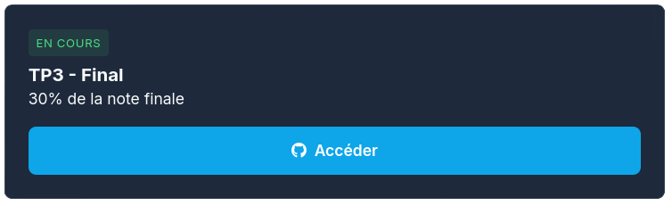
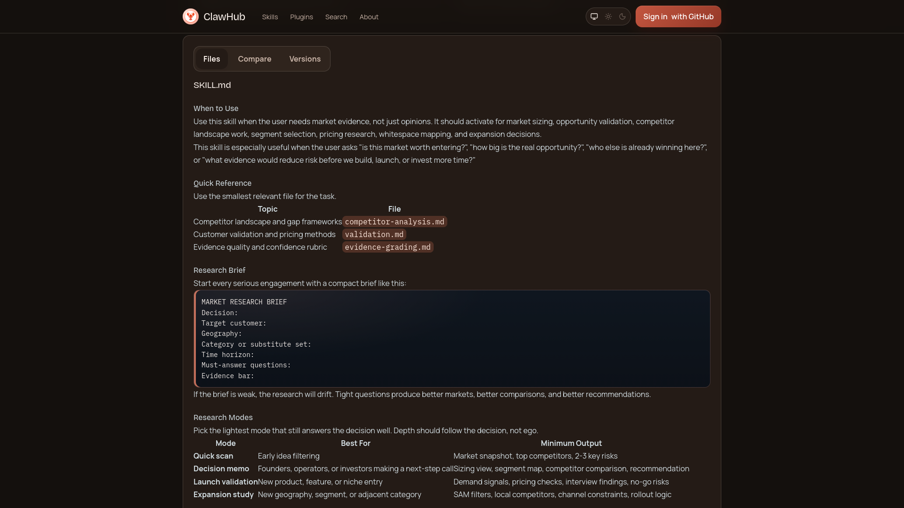

## Course Structure

## Course Structure

## Course Structure

## Assignment 3

{.absolute top=250 right=150}

## {background-image="img/llm_text.png"}

# Agentic AI

## What is an Agent?

::: {.r-stack}

{.absolute top=320 right=800 .fragment}

{.absolute top=350 right=-100 .fragment}

{.absolute top=-100 right=-200 style="transform: rotate(-180deg);" width="40%" .fragment}

:::

## What is an Agent?

::: {.r-stack}

{.absolute top=200 right=-100 .fragment}

{.absolute top=250 right=600 .fragment width="70%"}

:::

## What is an Agent?

An agent is an autonomous entity mandated to act in the world to produce an effect on behalf of an objective or a principal.

- **Delegation**

- **Autonomy**

- **Effectiveness** 

## So?

Agentic AI is a way to have a LLM perform actions.

### How? 

LLMs only generate text?

## So?

Agentic AI is a way to have a LLM perform actions.

### How?

## LLM - Text Generation

## LLM - Taking Actions

## Tools

::::{.columns}

:::{.column width="50%"}

### Terminal

- Claude Code
- Codex
- Gemini-cli
- OpenCode
- Crush

:::

:::{.column width="50%"}

### IDE/UI

- Cursor
- GitHub Copilot
- Claude Desktop / Cowork
- Etc. 

:::

::::

# MCP

::: {.r-stack}

{.absolute top=320 right=800 .fragment}

{.absolute top=350 right=400 .fragment}

{.absolute top=200 right=300 .fragment}

{.absolute top=-100 right=200 .fragment}

{.absolute top=100 right=600}

:::

## What is an MCP? {background="black"}

{.absolute top=200 right=100 width="110%"}

# 

## 

##

##

## 

## What Can We Do with Agents?

- Automated data collection 

- Data cleaning (Tidy Data) 

- Simulation of social data?

- Do you have any ideas?

# Installing OpenClaw?
