## Introduction {.smaller}

- **Images as social data**
  - Cultural, political, and emotional impact

- **Course outline**
  1. History of image analysis
  2. The deep learning turn
  3. Automation methods
  4. Practical applications
  
- **Objective**: Master automated image analysis at scale

## Why analyze images?

- Profusion of images in our daily lives
- Cultural, social, and political construction
- The question of the "truth" of the image
- Impact on our awareness and emotions

## The contemporary context

- Digital life = thousands of daily images
- Globalization of visual distribution
- The visual as a social force
- "Pictorial turn" of culture

## Which images to study?

- Masterpieces vs. media images
- Evaluation criteria: social, political, historical context
- Variable perception across cultures
- Elitism vs. visual democratization

## Origins of image analysis

- Art history (15th-16th centuries)
- Analysis of the Beautiful and the Good
- High culture vs. popular culture
- Universalizing humanist tradition

## Evolution: 1920s-1930s

- Aby Warburg: breaking down boundaries between cultures and mediums
- Carl Einstein: critique of colonial prejudice
- Leveling of popular images and fine arts
- Interest in "minor" arts and industrial objects

## Disciplinary crisis (1960-1970)

- May 68, civil rights, decolonization
- Decompartmentalization of disciplines
- Birth of cultural studies (Stuart Hall)
- Henri Zerner: images anchored in social history

## New approaches (since 1970)

- Semiotics, anthropology, postcolonial studies
- Laura Mulvey: concept of the "Male Gaze"
- Contextualization of the image
- The image as transformer and reproducer

## Visual Studies

- Crisis of the visual (Nicholas Mirzoeff); How to analyze representation in the midst of overabundance?
- Focus: action produced by the image vs. the object itself
- Analysis of production, reception, and circulation of images
- Plural visual experience

## Iconic example

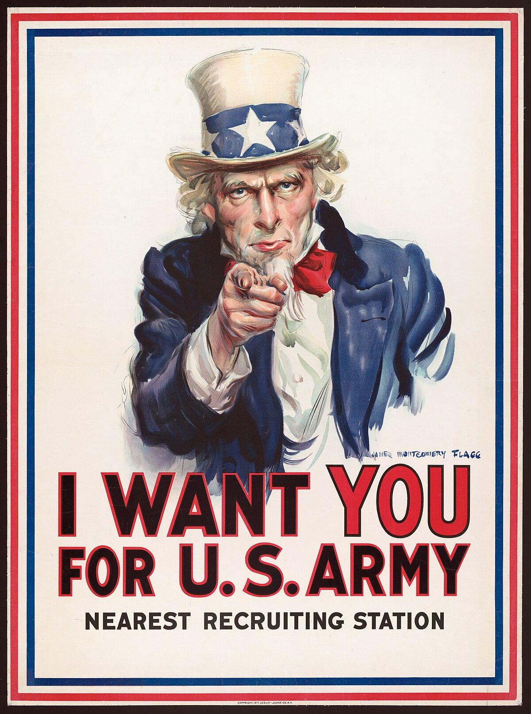{fig-align="centered"}

## Iconic example

- Uncle Sam poster (World War I)
- Impact on the American political subconscious
- Large-scale visual device
- End of American isolationism

## Importance of image analysis

> "Understanding that images are neither absolute truths nor absolute lies, but constructions that are simultaneously copies, partial reconstructions, simulations, illusions, and fantasies of reality"  
> [@slavkova17]

## The case of marketing

- Advertisements: multidimensionality of analysis
- Brands are constructed by images
- Qualitative and quantitative approaches
- Cross-cultural comparative studies
- Representations and social constructions

## Examples of traditional quantitative analysis {.smaller}

- Comparative study (Seventeen magazine):
  - 263 advertisements (USA vs. Japan)
  - Representation of young girls: 70% in Japan vs. 43% in the USA

- Product/service comparison:
  - 471 advertisements analyzed
  - Services: appeal more to emotion than products
- Source: @tissier-desbordes04

## Traditional analysis methods

- **Qualitative analysis**: narratives, meaning, interpretation
- **Quantitative analysis**: frequency, measurement, comparison
- **Content analysis**: categorization, coding
- Mixed methods: triangulation of approaches
  
## Towards automated methods

- Processing of large image corpora
- Visual big data
- Artificial intelligence and image recognition
- New perspectives for the social sciences

## The era of visual big data
- Instagram: 75+ million images per day (2018)
- Impossibility of manual analysis at this scale
- Necessity of new methods
- Democratization of analysis tools

## Deep learning revolution (2012)

- [ImageNet](https://www.image-net.org/) competition: a decisive turning point
  - ImageNet: 14,197,122 annotated images for model training.
  - CAPTCHA
- Geoffrey Hinton's team: first victory using neural networks
- 60 million connections, 650,000 neurons over 8 layers
- Dramatic reduction in the error rate

## How deep learning works

- Transformation of an image into abstract representations
- Progressive extraction of features:
  - First layer: identification of edges
  - Intermediate layers: detection of corners and contours
  - Deep layers: recognition of object parts
- Ability to handle variations in appearance (light, angle, etc.)
- Convolutional Neural Networks (CNN)

## 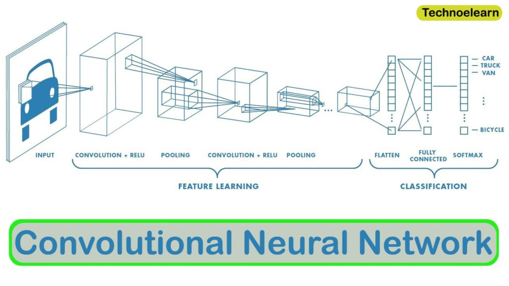

???

## 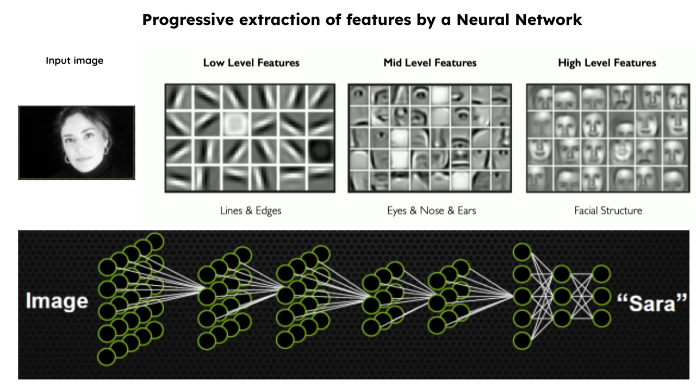

## Typical function of these algorithms 

- Object detection (object recognition)
- Object classification
- Facial recognition
- Facial analysis (attribute prediction)
- Visual sentiment analysis

## Analysis frameworks in the social sciences

- **Causal framework**:
  - Images as dependent variables (e.g., choice of images and ideology)
  - Images as independent variables (e.g., emotional impact and mobilization)
- **Indicator framework**:
  - Images as measures of a relationship of interest
  - E.g., representation of men/women in the media
- Source: [@williams_etal20]

## Applications in the social sciences

- Automated classification of objects and scenes
- Crowd estimation in demonstrations
- Media coverage analysis
- Detection of image manipulation
- Measurement of representation diversity

## Ethical issues

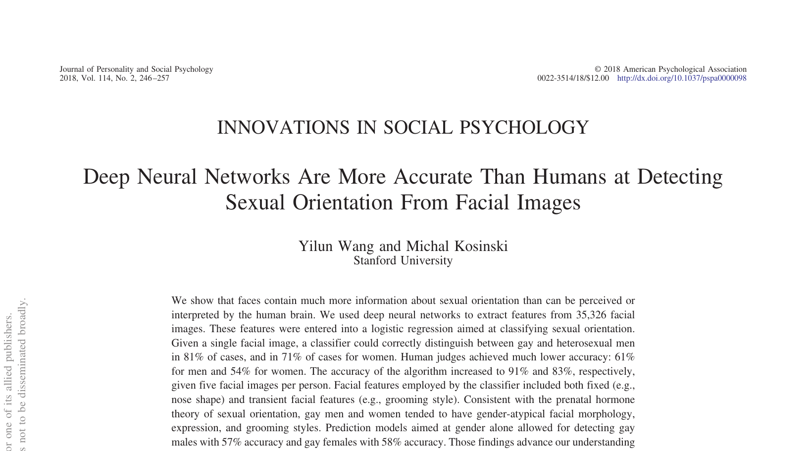

## Ethical issues

- The @wang_kosinski18 case: predicting sexual orientation
- Accuracy: 91% (men) and 83% (women)
- Privacy and surveillance issues
- Reproduction of social biases in algorithms

## Ethical issues

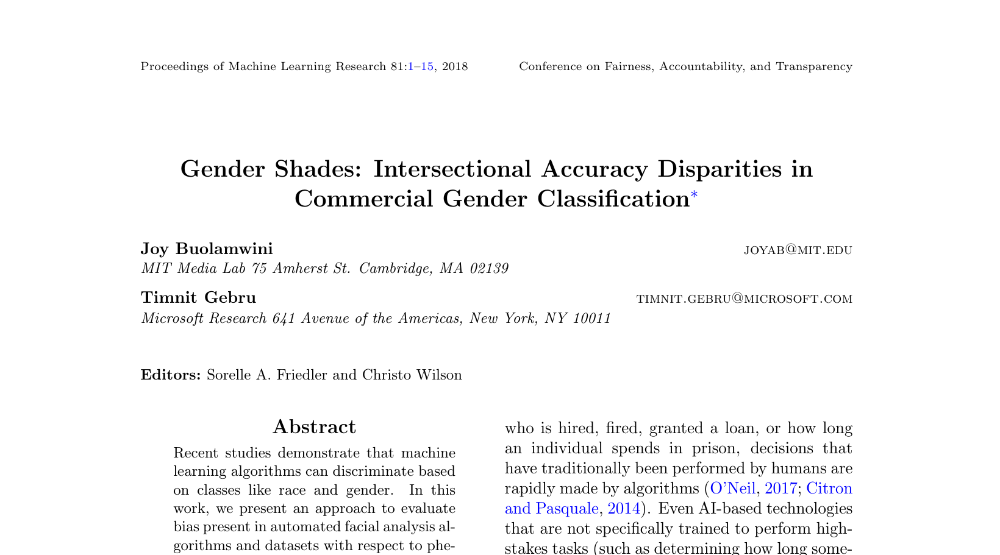

Source: [@buolamwini_gebru18a]

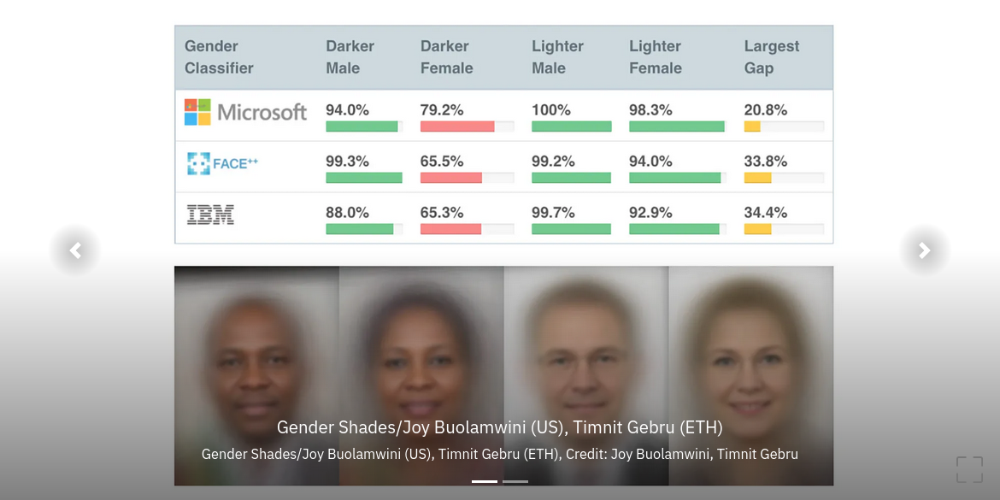

## Limitations of automation

- Turing test and artificial intelligence
- Difference between human and artificial intelligence
- Embodied learning vs. statistical learning
- Complementarity of qualitative and automated approaches

## Practical methodology

- Choice of tools according to research objectives
- Use of APIs (such as GPT Vision)
- Development of specific classifiers
- Human validation of automated results

## Research project {.smaller}

This course contains a practical demonstration based on real research analyzing media images concerning climate refugees in Quebec media.

- Objective: Analyze the visual representation of climate migrants
- 400+ images collected from three Quebec newspapers (2018-2023)
- Use of GPT-Vision to analyze image content
- Quantitative analysis of present visual elements

## {.plain background-color="#000000" background-transition="none"}

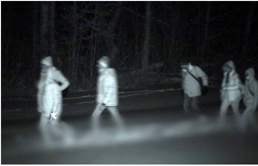{.r-stretch}

## {.plain background-color="#000000" background-transition="none"}

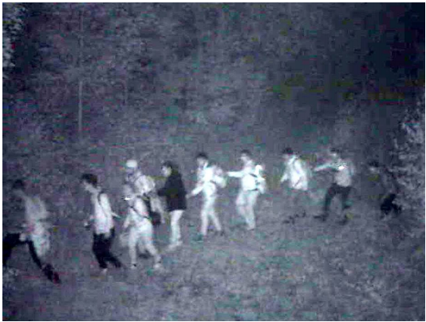{.r-stretch}

## {.plain background-color="#000000" background-transition="none"}

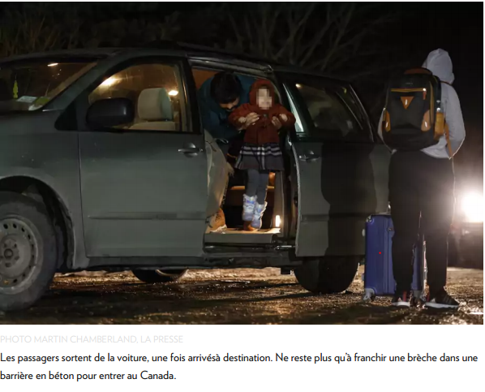{.r-stretch}

## {.plain background-color="#000000" background-transition="none"}

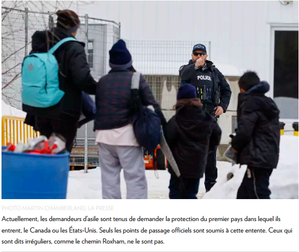{.r-stretch}


## {.plain background-color="#000000" background-transition="none"}

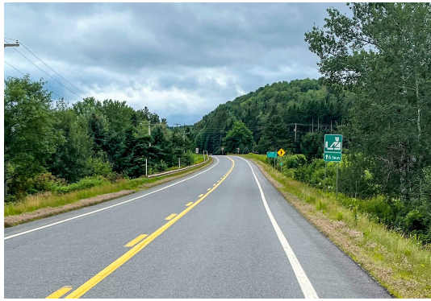{.r-stretch}

## {.plain background-color="#000000" background-transition="none"}

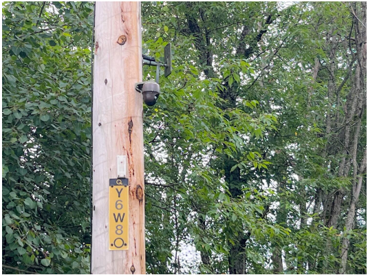{.r-stretch}

## Step 1: Data preparation {.smaller}

### Standardizing file names

- **Problem**: Heterogeneity of naming conventions
- **Solution**: Standardized system for all media files
- **Benefits**:
  - Consistent data organization
  - Facilitated automation of processing
  - Reduction of analysis errors
  - Traceability of sources

## Structured naming system (my recommendation)

- **Recommended structure**: `Source_Date_Number_Type.extension`

**Examples**:

- `JdeM_2023_02_27_01.png` → Journal de Montréal, February 27, 2023, image 1
- `LaPresse_2022_11_05_02_opinion.png` → La Presse, November 5, 2022, image 2, opinion article

## Automated metadata extraction

```r
df_images <- df_images %>%
  mutate(
    # Extract the media from the filename
    media = case_when(
      str_detect(chemin_image, "LeDevoir") ~ "LeDevoir",
      str_detect(chemin_image, "LaPresse") ~ "LaPresse",
      str_detect(chemin_image, "JdeM") ~ "JournalDeMontreal",
      TRUE ~ str_extract(nom_fichier, "^[A-Za-z]+(?=_\\d{4}_)")
    ),
    
    # Extract the date in YYYY_MM_DD format
    date_str = str_extract(nom_fichier, "\\d{4}_\\d{2}_\\d{2}"),
    date = case_when(
      !is.na(date_str) ~ ymd(gsub("_", "-", date_str)),
      TRUE ~ as.Date(NA)
    ),
    
    # Determine if it is an opinion article
    est_opinion = case_when(
      str_detect(chemin_image, "_opinion") ~ TRUE,
      str_detect(nom_fichier, "opinion") ~ TRUE,
      TRUE ~ FALSE
    )
  )
```

### Loading libraries

```r
# Loading necessary packages
library(tidyverse) # For data manipulation
library(writexl)   # For writing Excel files
library(lubridate) # For manipulating dates
```

## Step 1: File organization {.smaller}

### Exploring the image directory

```r
# Definition of the image folder
dossier_images <- "images"

# List all image files in the folder
chemins_images <- list.files(
  path = dossier_images,                 # Folder to scan
  pattern = "\\.(jpg|jpeg|png|PNG)$",    # Filter image files only
  recursive = TRUE,                      # Include subfolders
  full.names = TRUE                      # Get full paths
)

# Display the number of images found
cat("Number of images found:", length(chemins_images), "\n")
```

## Step 1: Dataframe creation {.smaller}

```r
# Creation of a dataframe with the image paths
df_images <- data.frame(
  image_id = paste0("img_", 1:length(chemins_images)),
  chemin_image = chemins_images,
  stringsAsFactors = FALSE
)
```

## Step 1: Metadata extraction {.smaller}

```R
# Extracting the media, date, and article type
df_images <- df_images %>%
  mutate(
    # Extracting the filename
    nom_fichier = basename(chemin_image),
    
    # Extracting the media
    media = case_when(
      str_detect(chemin_image, "LeDevoir") ~ "LeDevoir",
      str_detect(chemin_image, "LaPresse") ~ "LaPresse",
      str_detect(chemin_image, "JdeM") ~ "JournalDeMontreal",
      TRUE ~ str_extract(nom_fichier, "^[A-Za-z]+(?=_\\d{4}_)")
    ),
    
    # Extracting the date 
    date_str = str_extract(nom_fichier, "\\d{4}_\\d{2}_\\d{2}"),
    date = case_when(
      !is.na(date_str) ~ ymd(gsub("_", "-", date_str)),
      TRUE ~ as.Date(NA)
    ),
    
    # Determining if it is an opinion article
    est_opinion = case_when(
      str_detect(chemin_image, "_opinion") ~ TRUE,
      str_detect(nom_fichier, "opinion") ~ TRUE,
      TRUE ~ FALSE
    )
  ) %>%
  select(-nom_fichier, -date_str)
```

## Summary of image data {.smaller}

```R
# Summary by media outlet
df_images %>%
  group_by(media) %>%
  summarise(
    nombre = n(),
    opinions = sum(est_opinion, na.rm = TRUE),
    .groups = "drop"
  ) %>%
  arrange(desc(nombre))

# Summary by year
df_images %>%
  filter(!is.na(date)) %>%
  mutate(annee = year(date)) %>%
  group_by(annee) %>%
  summarise(total = n())
```

## Step 2: Preparing for analysis {.scrollable}

### Defining research questions 


|Type of analysis|Example prompt|Response format|
|--------------|----------------|-----------------|
|Image-text justification|"This image and text correspond to the content of a media article from Quebec. Is the selection of the image justified by the text?"|Binary (1=yes, 0=no)|
|General description|"In a migration context, describe this image from the content of a Quebec media article. Pay close attention to details."|Descriptive paragraph|
|Geographical identification|"This image comes from a Quebec media article. Does the image appear to have been taken at the border between Quebec and the United States?"|Binary (1=yes, 0=no)|
|Thematic analysis|"This image comes from a Quebec media article. What seems to be at the heart of this image: individuals and their emotions, the movement of people, the environment, or something else?"|Categorization + details|
|Cultural characteristics|"This image comes from a Quebec media article and may provide information related to migration. What discernible characteristics or elements indicate cultural or ethnic origins?"|Description or "NA"|
|Identification of specific elements|"This image comes from a Quebec media article. Are there cultural or religious symbols represented in the image?"|Binary (1=yes, 0=no)|
|Gendered representation analysis|"This image comes from a Quebec media article. Do you think the image depicts vulnerability in a gendered way?"|Binary (1=yes, 0=no)|
|Problem/solution analysis|"This image comes from a Quebec media article. If applicable, what problem or threat related to the theme of migration is presented, and what solution is suggested in the image?"|Analytical description|
|Multiple thematic categorization|"This image comes from a Quebec media article. Which themes are represented in the image?" [list of themes provided]|List of themes|

## Step 2: Preparing analysis tools {.smaller}

```r
#| echo: true
#| eval: false

# Function to analyze an image with GPT Vision
analyser_image <- function(chemin_image, prompt_texte) {
  # Check if the file exists and is an image
  if (file.exists(chemin_image) && 
      tolower(tools::file_ext(chemin_image)) %in% c("jpg", "jpeg", "png")) {
    cat("Analyzing image:", chemin_image, "\n")
    
    # In a real context, here we would call the GPT Vision API
    # Via the clellm::gpt_vision() package
    
    # Simulated response for demonstration
    reponse <- paste("Image analysis", basename(chemin_image),
                   "This image shows [simulated description for demonstration]")
    
    return(reponse)
  } else {
    return("ERROR: File not found or format not supported")
  }
}
```

## How gpt_vision() works {.smaller}

The `clellm` package provides the `gpt_vision()` function which:

1. **Takes as input**:
   - Path to an image (`image_path`)
   - Prompt to guide the analysis (`prompt`)
   - Token limit (`max_tokens`)
   - Model to use (`model="gpt-4o"`)

2. **How it works**:
   - Converts the image to Base64
   - Sends a request to the OpenAI API
   - Includes the image and prompt in the request
   - Retrieves and analyzes the response

3. **Returns**: The textual interpretation of the image by GPT

## Step 2: Data preparation {.smaller}

```r
#| echo: true
#| eval: false

# Defining the table of analysis prompts
prompts_analyse <- data.frame(
  question = c("description", "elements", "emotions", "symboles"),
  prompt = c(
    "Describe this image in detail.",
    "What visual elements are present in this image?",
    "What emotions seem to be expressed in this image?",
    "Are there cultural or political symbols in this image?"
  ),
  stringsAsFactors = FALSE
)

# Selecting a few images for demonstration
images_demo <- df_images %>% slice(1:3)

# Creating a dataframe to store results
resultats_demo <- data.frame(
  image_id = character(),
  question = character(),
  prompt = character(),
  reponse = character(),
  stringsAsFactors = FALSE
)
```

## Step 2: Analysis loop - part 1 {.smaller}

```r
#| echo: true
#| eval: false

# Main loop to analyze each image
for (i in 1:nrow(images_demo)) {
  # Retrieving image information
  image_id <- images_demo$image_id[i]
  chemin_image <- images_demo$chemin_image[i]
  
  # Progress information
  cat("Processing image", i, "/", nrow(images_demo), ":\n")
  cat("ID:", image_id, "\n")
  cat("Path:", chemin_image, "\n\n")
```

## Step 2: Analysis loop - part 2 {.smaller}

```r
#| echo: true
#| eval: false

  # For each prompt/question
  for (j in 1:nrow(prompts_analyse)) {
    # Retrieving the prompt
    question <- prompts_analyse$question[j]
    prompt <- prompts_analyse$prompt[j]
    
    # Information about current analysis
    cat("Question:", question, "\n")
    cat("Prompt:", prompt, "\n")
    
    # Analyzing the image with the current prompt
    reponse <- analyser_image(chemin_image, prompt)
```

## Step 2: Analysis loop - part 3 {.smaller}

```r
#| echo: true
#| eval: false

    # Adding the result to the dataframe
    resultats_demo <- rbind(resultats_demo, data.frame(
      image_id = image_id,
      question = question,
      prompt = prompt,
      reponse = reponse,
      stringsAsFactors = FALSE
    ))
    
    # Pause between API calls to avoid exceeding
    # API rate limits
    cat("Pause between analyses...\n")
    Sys.sleep(1)
  }
  
  # Show progress
  cat("Progress:", i, "/", nrow(images_demo), "images analyzed\n")
}
```

## Step 2: Saving results {.smaller}

```r
#| echo: true
#| eval: false

# Create results folder if it does not exist
if (!dir.exists("resultats")) {
  dir.create("resultats")
  cat("Folder 'resultats' created.\n")
}

# Saving results
write.csv(resultats_demo, "resultats/resultats_analyse.csv", row.names = FALSE)
write_xlsx(resultats_demo, "resultats/resultats_analyse.xlsx")

cat("Results have been saved!\n")
```

## Example of complete workflow {.smaller}

1. **Preparation**
   - Selection of images to analyze
   - Definition of custom prompts according to research questions

2. **Execution**
   - Systematic analysis of each image with each prompt
   - Structured storage of results

3. **Processing**
   - Qualitative and quantitative analysis of responses
   - Identification of trends and patterns

4. **Visualization**
   - Creation of charts based on the results obtained

## Advantages and limitations of the approach {.smaller}

**Advantages**:

- Large-scale analysis (hundreds/thousands of images)
- Consistent detection of visual elements
- Flexibility of research questions via prompts

**Limitations**:

- Dependency on the quality of the vision model
- Costs associated with APIs (OpenAI)
- Potential biases in image interpretation
- Need for human validation

## Ethical considerations

- Consent and privacy
- Algorithmic biases
- Contextual interpretation
- Choice of prompts and impact on results
- Limitations of computer vision models


## Questions?

Thank you for your attention!

## Contact

- Email: etienne.proulx.2@ulaval.ca

## Bibliography
